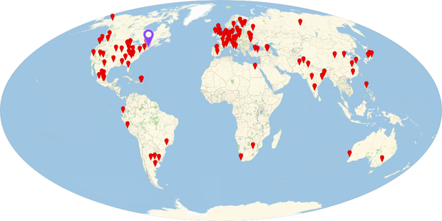
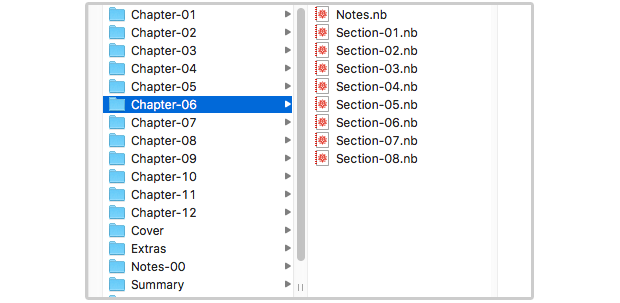
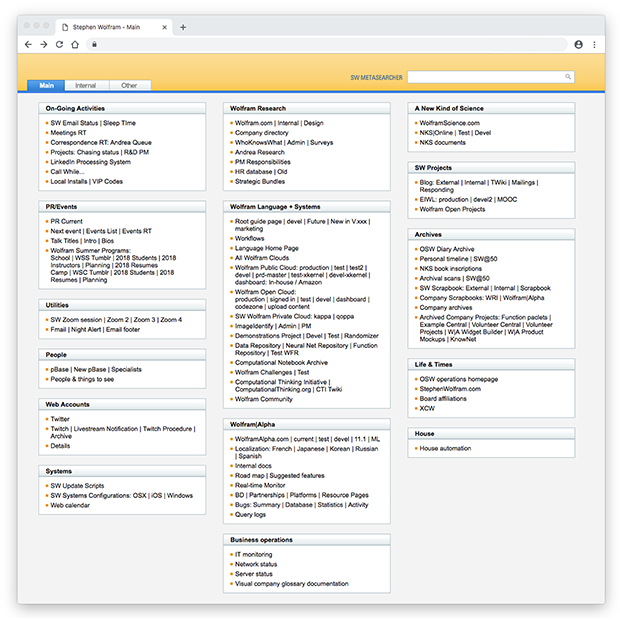
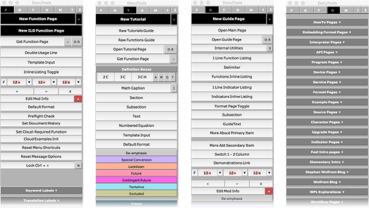
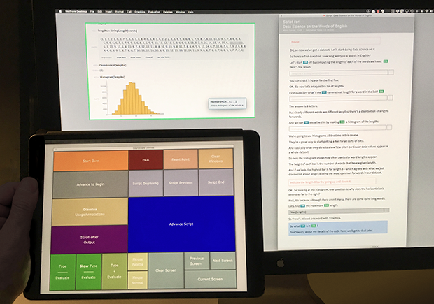
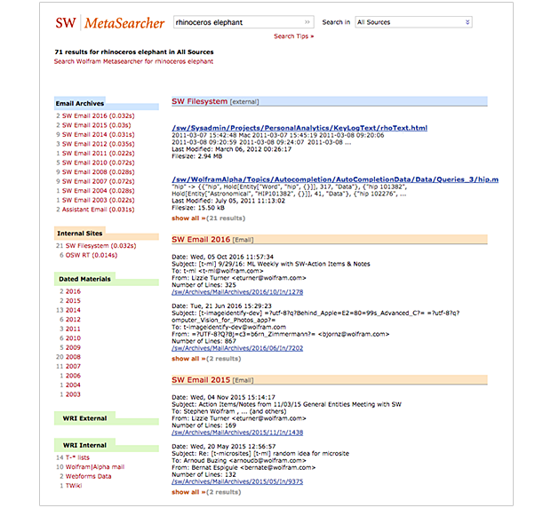
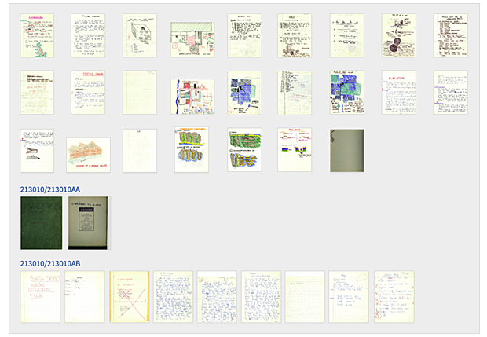
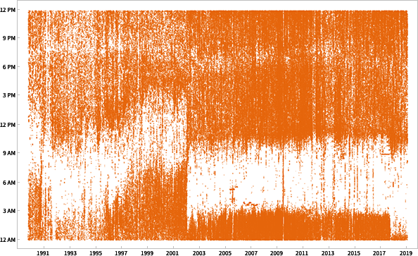
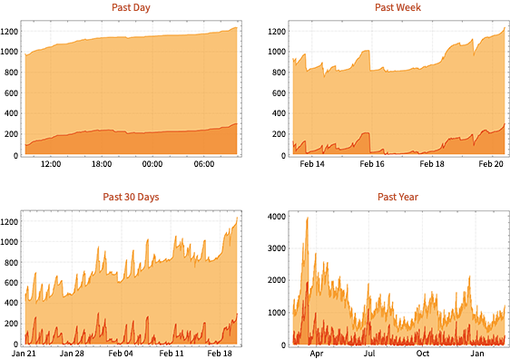

## Summary
[[StephenWolfram]] describes a decades-built [[PersonalInfrastructure|personal infrastructure]] that joins remote work, ergonomic workstations, portable kits, broad filesystem categories, custom authoring tools, searchable archives, people and book databases, and automated [[PersonalAnalytics|personal analytics]]. The unifying method is to structure, streamline, and automate recurring work while fitting systems to his own habits; the strongest examples turn passive records into retrieval, feedback, or reusable production workflows. The essay is a detailed first-person case study rather than comparative evidence that the system or any individual practice improves productivity for other people.

## Key Claims
- Personal infrastructure should reduce recurring friction by combining stable conventions, ergonomic defaults, automation, and tools shaped to the individual rather than treating productivity as one universal application or habit.
- Wolfram's remote-CEO setup favors screensharing and high-quality audio over always-on video, uses consistent public and private displays, and relies on a geographically distributed company organized around output rather than physical presence.
- File and project organization works best for him with a small number of broad, memorable categories, sequential filenames, and an `ARCHIVES` subfolder that removes inactive material from the working surface without deleting it.

- A personal homepage can compress entry into many systems by grouping current activities, research, projects, archives, people tools, utilities, and operational links around a shared search surface.

- Custom authoring environments can encode the structure and review states of recurring work: DocuTools supplies specialized page templates, future/experimental states, comments, and editing controls instead of leaving each document to be assembled manually.

- A scripted production workflow can coordinate speech, code entry, evaluation, screen recording, and control surfaces; the inspected setup separates the authored script, recorded notebook, and iPad palette so input can be inserted without moving focus away from the recording.

- Durable archives become an extension of memory when email, files, websites, databases, and OCR'd paper can be searched together and results retain temporal and source context.

- Search does not replace browseable context: scanned paper is also grouped by life period or project and presented as document thumbnails, allowing visual retrieval when handwriting cannot be recognized.

- Automatically collected personal data is most useful when it supports feedback and anomaly detection through long time series, dashboards, and daily reports rather than becoming an unreviewed archive.

- Low-friction capture determines what data persists: automatic keystroke, screen, step, heart-rate, medical, and environmental logging succeeded for him, while food logging repeatedly failed because manual entry remained too onerous.
- Long-lived systems depend on compatibility and preservation as much as novelty: Wolfram keeps decades of notebooks and files usable, maintains on-premise storage and off-site backups, and treats stable software formats as infrastructure.

## Key Quotes
> "structure, streamline and automate everything as much as possible" — the essay's operating principle, qualified by personal fit and current technical limits.

> "any flat surface represents a potential ‘stagnation point’" — a physical-design example of shaping defaults to prevent accumulation.

> "do what’s easy to do" — the rule behind successful automatic personal-data collection.

> "the organizational principles for my infrastructure have remained surprisingly constant" — on stable conventions underneath changing devices.

## Connections
- [[StephenWolfram]] — author and subject of the self-described infrastructure.
- [[PersonalInfrastructure]] — the integrated design of environments, conventions, tools, archives, and feedback loops.
- [[PersonalAnalytics]] — automatic collection and review of behavioral, communication, health, and environmental data.
- [[PersonalDataInfrastructure]] — the user-controlled storage, search, and reuse layer spanning email, files, paper archives, sensors, and databases.
- [[DigitalArchiveOrganization]] — broad categories, active/archive separation, sequential naming, OCR, temporal context, and browsing complement one another.
- [[PersonalTelemetryPipeline]] — automated measurements, history, dashboards, and reports form an acquire-to-feedback pipeline.
- [[PersonalProductivity]] — the motivating outcome, approached through reduced friction and repeatable systems.
- [[RemoteWork]] — the location-independent operating model supported by screensharing, audio, distributed staff, and consistent work surfaces.
- [[WolframLanguage]] — implementation substrate for search, authoring, automation, dashboards, and personal applications.
- [[WolframAlpha]] — product and knowledge engine reached through Wolfram's broader tool stack.

## Contradictions
- The essay reports one unusually resourced founder's evolving system and provides no controlled productivity comparison, cost accounting, or evidence that its many bespoke tools transfer to other roles, organizations, or budgets.
- The claimed resting-heart-rate improvement from outdoor walking is an observed personal association with alternative explanations, not evidence that outdoor computer work caused the change.
- Comprehensive logging, searchable communications, genome data, people databases, and long-term archives create privacy, security, consent, and retention risks that the essay does not systematically assess.
- Broad categories reduce filing ambiguity for Wolfram, but other archives may require access boundaries, formal retention policies, collaboration metadata, or narrower classification.
- The products, software versions, counts, and device choices are a 2019 snapshot; the durable contribution is the system-design pattern rather than the specific equipment list.
