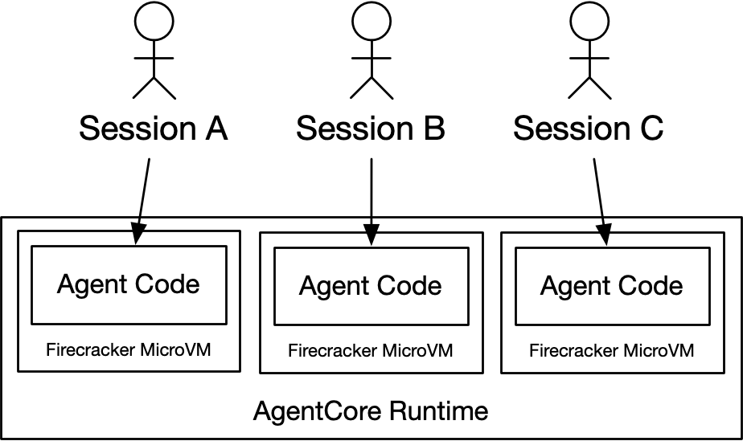
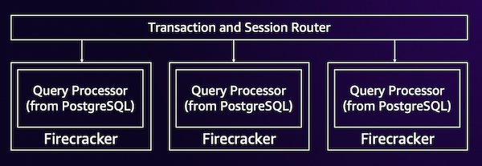
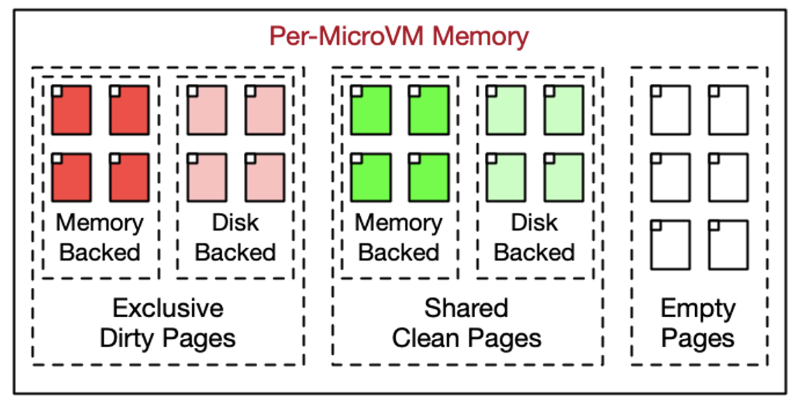

## Summary
[[MarcBrooker]] describes two [[AWS]] uses of [[Firecracker]] beyond the original [[AWS|AWS Lambda]] design: session-scoped execution in [[AmazonBedrockAgentCore]] and transaction processing in [[AuroraDSQL]]. The examples show how short-lived microVMs combine strong execution boundaries with variable resource allocation, snapshot cloning, shared clean memory pages, and deliberate lifetime limits. The article's broader systems lesson is that moving connection state, caching, and concurrency control outside disposable workers can replace fine-grained reclamation and garbage-collection machinery with simple age bounds.

## Key Claims
- [[AmazonBedrockAgentCore]] assigns each agent session its own [[Firecracker]] microVM for up to eight hours, then destroys it so code-level session state does not persist; cross-session state must pass through explicit memory or stateful tools.

- Firecracker's ability to vary CPU and memory in place helps AgentCore serve sessions ranging from milliseconds to hours and context ranging from none to gigabytes.
- [[AuroraDSQL]] runs each active SQL transaction in a PostgreSQL-derived query processor that handles one transaction at a time, while a router and external services own connection handling, caching, and concurrency control.

- [[VMSnapshotCloning]] restores a database-specific prepared query processor instead of repeatedly booting Linux and starting PostgreSQL, management agents, observability, and metadata loading.
- Cloned microVMs share unchanged clean memory pages while retaining private copies of written dirty pages, reducing memory demand without sharing writable state; shared pages may also reduce duplication in parts of the CPU cache hierarchy.

- Snapshot clones require restoration of per-instance uniqueness, including correct random-number behavior; cloning is not merely copying bytes and starting execution.
- [[BoundedLifetimeSimplification]] lets DSQL terminate query-processor VMs after a fixed age instead of continuously identifying and reclaiming cold Linux pages, and its five-minute transaction limit similarly lets the database discard MVCC versions older than the maximum live-reference window.

## Key Quotes
> "Simplicity, as always, is a system property." - on using architectural lifetime bounds rather than local reclamation bookkeeping.

> "when it's over the MicroVM is destroyed and all the session context is securely forgotten" - on AgentCore's session-scoped execution boundary.

## Connections
- [[Firecracker]] - microVM monitor providing the isolation, resource flexibility, snapshots, and cloning used in both systems.
- [[AmazonBedrockAgentCore]] - uses one disposable microVM per agent session.
- [[AuroraDSQL]] - uses isolated PostgreSQL-derived query processors for individual active transactions.
- [[SessionScopedMicroVMIsolation]] - makes session boundaries explicit and removes local code state at teardown.
- [[VMSnapshotCloning]] - converts initialized VM state into a reusable startup artifact with clean-page sharing.
- [[BoundedLifetimeSimplification]] - replaces some continuous cleanup mechanisms with maximum lifetime rules.
- [[SemanticIsolation]] - qualifies the session boundary: microVMs isolate code and local state, while external memory and stateful tools remain explicit separate channels.
- [[ServerlessComputing]] - Firecracker supports variable-duration, demand-created execution behind AWS managed services.

## Contradictions
- No direct contradiction was found. The article strengthens the existing [[Firecracker]] profile by adding production examples while preserving the earlier distinction between execution isolation and semantic control over external actions.
- Performance and efficiency claims are first-party and mostly unquantified: the article gives no startup latency, memory savings, cache benefit, density, cost, workload distribution, failure-rate, or comparative security measurements.
- Destroying a microVM removes its local state but does not by itself erase data already written to AgentCore Memory, stateful tools, logs, external services, or provider infrastructure.
- The DSQL discussion describes selected mechanisms rather than the complete service architecture, snapshot-security model, clone-uniqueness protocol, PostgreSQL compatibility boundary, or failure and recovery behavior.
