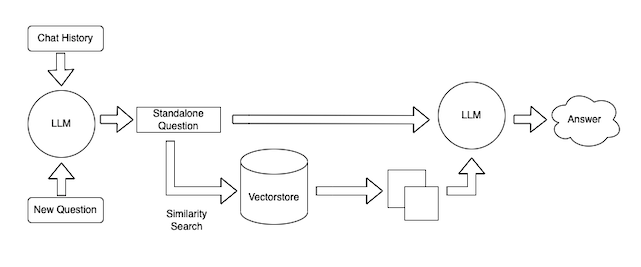

## 核心摘要

这篇文章是一份生成式AI应用早期的实践教程：它借助Replit上的示例项目，把外部文档处理成可检索的向量数据，再将检索结果与问题、对话历史一起交给语言模型。其可复用价值主要来自[检索增强生成的基本流水线]()，而不是已经过时的具体界面操作。

文章使用“私域数据ChatGPT”描述这种模式，但流程并不是重新训练ChatGPT。核心动作是把文档切片、生成Embedding、写入向量库，在提问时检索相关片段并注入模型上下文。

> **历史定位：** 原文处于GPT-4发布和LangChain早期发展的时间窗口。Replit样例、OpenAI密钥界面、模型知识截止时间、LangChain模块名称和融资数字都属于当时状态，不应直接当作2026年的部署说明。原始微信页可确认，但精确发布日期未从可访问页面独立核定；“约2023年3月”依据正文中的时间线索标注。

> **图片状态：** 本次图文Ingest完整读取并检查17个原始图片引用。精选3张能解释数据摄取、查询检索和应用技术栈的图片公开嵌入；其余14张多为操作界面、产品截图、增长图、推广图或往期文章封面，因知识增量不足而不嵌入，并非private处理。

## 两段式流水线

### 数据摄取

1. 导入文本或其他文档。
2. 把文档分成较小片段。
3. 为每个片段生成Embedding。
4. 将向量和对应片段写入向量数据库。

*原图清楚显示“Documents → Split into chunks → Create Embeddings → Vectorstore”。它说明索引准备阶段，不表示模型训练。*

原文还提出[文档切片的检索权衡]()：片段太小可能丢失必要上下文，片段太大则可能携带更多无关内容。文章没有给出实验数据或通用最优值，因此这应被理解为工程设计原则，而非经过比较验证的参数结论。

### 查询与回答

1. 将新问题与聊天历史交给一个LLM，形成独立问题。
2. 用独立问题对向量库执行相似度检索。
3. 取回相关文档片段。
4. 把片段送入另一个LLM生成回答。

*原图包含“Chat History”“New Question”“Standalone Question”“Similarity Search”“Vectorstore”“LLM”和“Answer”，表现查询改写、检索和回答生成之间的连接。*

这个图比教程里的按钮操作更耐久：模型、向量库和框架可以替换，但“准备可检索语料—按问题取回片段—将证据注入生成上下文”的结构仍然成立。

## LangChain在文章中的位置

文章将[LangChain]()视为大模型应用的中间框架层，负责封装模型调用、Prompt、工作流、对话记忆、向量存储和Agent等能力。作者认为这类框架试图缓解三类问题：连接外部数据、保留上下文以及调用外部工具。

*这张历史技术栈图把硬件、云、模型、优化、Framework/API和Application/UI并列展示；LangChain位于Framework/API区域。图中厂商位置反映当时作者使用的生态快照，不代表当前市场格局。*

## 可复用认识

- 外部知识问答通常依赖检索时注入上下文，而不是把每份文档重新训练进模型。
- 摄取阶段和查询阶段应分开理解：前者建立索引，后者检索并生成答案。
- Chunk大小同时影响上下文完整性和检索噪声，必须结合语料与任务评估。
- 框架的价值在于组合模型、检索、记忆和工具；具体框架并不等同于整体架构。
- 教程中的密钥创建、网页按钮和样例仓库属于短寿命操作信息，应重新查阅当前官方文档。

## 证据边界

本页依据输入Markdown正文、公开微信来源和全部17张原始配图整理。图片只用于描述其可见结构；它们不能独立证明系统回答质量、LangChain的市场地位或作者对“新软件范式”的预测。原文的融资、估值、产品流行度和“语言壁垒已经不存在”等陈述没有在本次Ingest中逐项外部核验，因此不编译为稳定事实。

## 来源

- 深思圈，[《零基础｜搭建基于私域数据的ChatGPT》](https://mp.weixin.qq.com/s/naiVMuXHAScRb_jSEJN3zg)，约2023年3月；精确发布日期未独立核定。
- 原文列出的LangChain教程、早期文档和视频链接，仅作为文章当时的参考材料记录，不作为当前安装说明。
