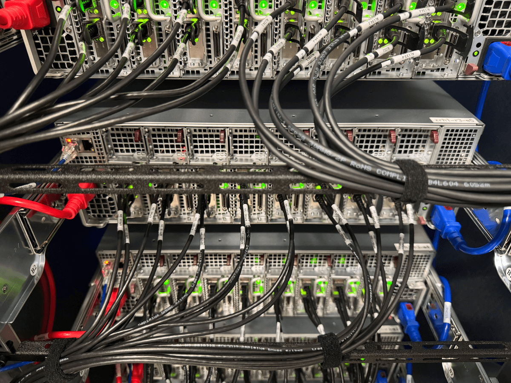
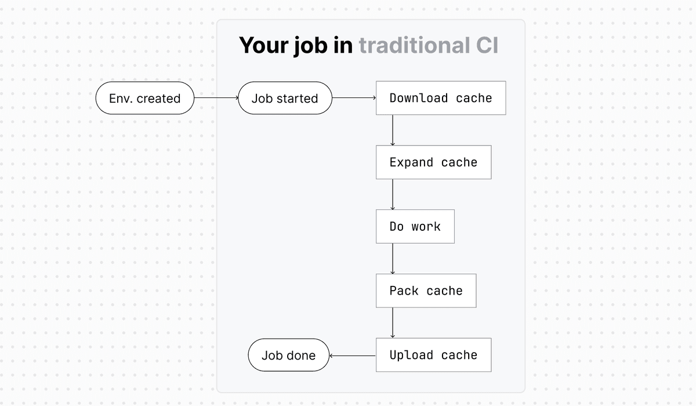
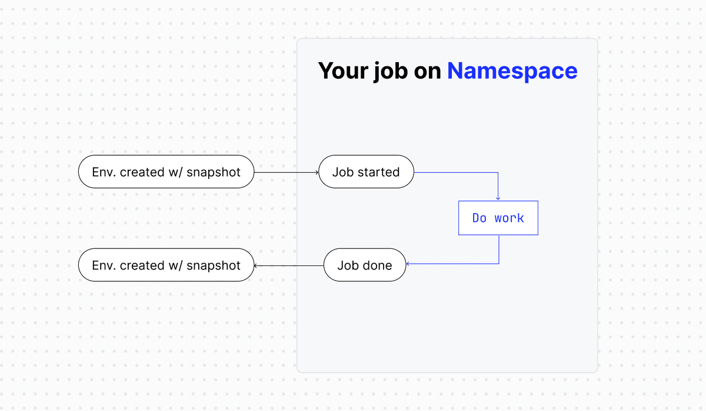

## Summary
[[Namespace]] explains why it moved more than 95% of its platform onto owned infrastructure after finding that hyperscaler and rented bare-metal offerings did not match the performance or economics of bursty build workloads. Its [[BuildOptimizedInfrastructure]] combines high-frequency CPUs, local NVMe, high-bandwidth networking, workload-specific rack design, power-first capacity planning, and advance procurement. The article's most concrete software-hardware integration is [[TopologyAwareBuildCaching]]: a scheduler places jobs where the required snapshot revision is already local, removing the archive transfer and expansion loop shown in traditional CI.

## Key Claims
- Production-oriented hyperscaler hardware often favors core density, separated storage, and steady utilization, while compilation and CI depend more heavily on fast individual cores, local I/O, and burst capacity.
- Namespace's racks combine current-generation compute-, memory-, and storage-optimized servers with two top-of-rack switches, an out-of-band management switch, abundant NVMe, and rack ratios sized to network capacity.
- High-frequency AMD EPYC CPUs, Apple Silicon for Linux ARM64, and Macs for Apple-platform work reflect a fastest-suitable-chip policy rather than a density-first policy.
- Traditional CI cache archives impose download, expansion, packing, and upload work around every job; Namespace instead attaches topology-aware cache snapshots just in time and schedules work near an existing revision.
- A standard Clos [[DataCenterNetworkFabric]] and controlled IP ranges support known inter-node capacity, data-aware placement, direct transit peering, and dedicated customer egress IPs.
- Owned hardware exchanges cloud elasticity for power budgeting, procurement lead times, demand forecasting, physical failure planning, and continuing network operations.

## Key Quotes
> "The hardware hyperscalers buy is optimized for a job we're not doing." — the article's workload-fit thesis.

> "We plan racks around power first." — the constraint that forced revision of early rack designs.

## Connections
- [[Namespace]] — company describing its transition from AWS and rented bare metal to a vertically integrated build platform.
- [[BuildOptimizedInfrastructure]] — joins workload shape to CPU, storage, network, rack-power, procurement, and operations choices.
- [[TopologyAwareBuildCaching]] — places ephemeral jobs near local cache snapshots to remove recurring archive transfers.
- [[DataCenterNetworkFabric]] — Clos topology and capacity-aware scheduling coordinate data movement across racks and nodes.
- [[CloudCostOptimization]] — direct hardware economics improve only when workload gains outweigh engineering, facility, network, and planning costs.
- [[AWS]] — initial `z1d.metal` platform whose unit economics did not meet Namespace's performance-price target.
- [[DigitalOcean]] — prior infrastructure experience attributed to a Namespace team member.

## Contradictions
- The performance gap, unit economics, service goals, and claim that owned infrastructure runs more than 95% of the platform are first-party statements without benchmarks, bills, utilization data, availability results, or matched hardware comparisons.
- The article generalizes hyperscaler and production workload characteristics; current instance catalogs include high-frequency, local-NVMe, bare-metal, and specialized options, and many builds can exploit parallelism or remote caching differently.
- The snapshot diagrams clarify removed job steps but do not disclose cache consistency, invalidation, replication, durability, cold-start, eviction, isolation, or scheduler-failure behavior.
- The rack photograph is representative rather than a labeled topology diagram and does not independently verify the stated switch, server-role, bandwidth, or redundancy design.
- The homelab photograph was inspected and omitted as contextual decoration; the production-rack photograph and both distinct CI flow diagrams were retained at their semantic positions.
