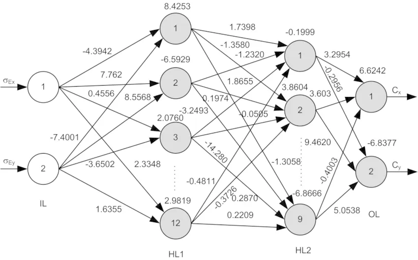
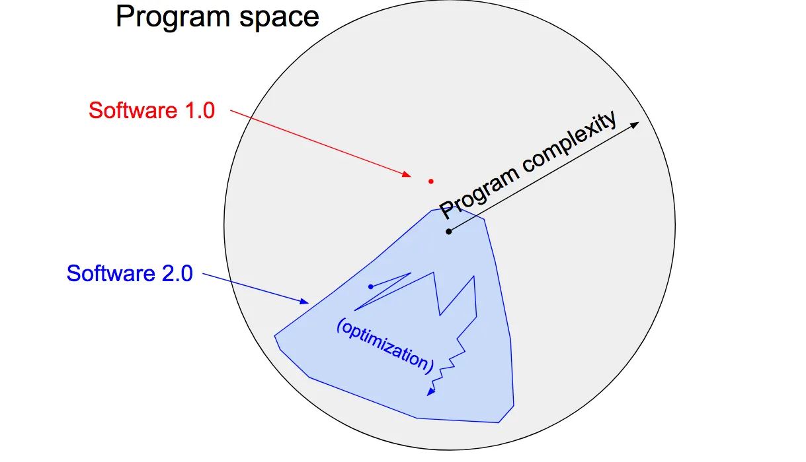
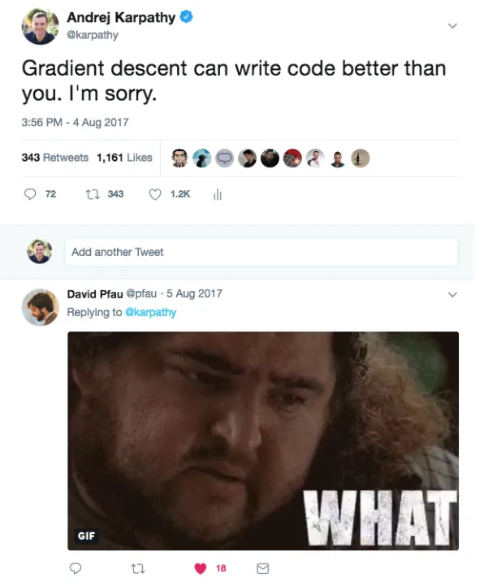

## Summary
[[AndrejKarpathy]] argues that [[NeuralNetwork|neural networks]] constitute a programming paradigm rather than merely another classifier: conventional software encodes behaviour in human-written instructions, while [[Software20|Software 2.0]] searches for weights that satisfy an evaluation criterion within an architecture-defined program space. In this account, datasets become a major part of the source code, [[NeuralNetworkTraining]] becomes compilation, and much day-to-day development moves toward collecting, labeling, cleaning, and inspecting examples. The paradigm had already improved vision, speech, translation, games, and early learned database components, but the source also stresses opacity, inherited bias, silent failure, and adversarial examples.

## Key Claims
- [[Software20|Software 2.0]] represents programs as learned neural-network weights: people specify examples or another behavioural objective, choose an architecture that bounds the search space, and let optimization find the detailed implementation.
- The source-code analogy has two main inputs - the dataset that defines desired behaviour and the architecture that supplies the program skeleton - while [[NeuralNetworkTraining]] acts like a compiler producing the trained network binary.
- When behaviour is easier to demonstrate or score than to express as explicit instructions, learned programs can displace hand-written components; the article cites visual and speech recognition, speech synthesis, translation, games, and learned database indexes.
- Neural-network computation is comparatively homogeneous and portable, often with constrained runtime and memory, and can be adapted across performance-quality tradeoffs by changing capacity and retraining.
- Differentiable learned modules can be optimized jointly rather than remaining fixed behind hand-designed interfaces, allowing components to adapt to the end-to-end objective.
- If datasets are source code, software-development tooling must expand toward example sourcing, labeling, cleaning, uncertainty review, error analysis, versioning, packaging, and deployment of learned artifacts.
- Learned programs trade legibility for performance: they can inherit hidden bias, fail silently or unintuitively, and remain vulnerable to adversarial inputs even when their aggregate accuracy is high.

The weighted-network diagram makes the representation change concrete: the detailed “code” is distributed across numerical connections rather than written as a sequence of human-readable instructions.

The program-space diagram shows architecture as a search boundary and optimization as a path through that restricted region, in contrast with directly selecting a program through conventional source code.

The post compresses the article's strongest claim: in suitable evaluated domains, optimization can discover a program that outperforms one a person could specify directly.

## Key Quotes
> "Neural networks are not just another classifier, they represent the beginning of a fundamental shift in how we develop software." - the article's definition of the paradigm shift.

> "Software 1.0 is code we write. Software 2.0 is code written by the optimization based on an evaluation criterion" - the core contrast between explicit instructions and searched programs.

> "repositories are datasets and commits are made up of additions and edits of the labels" - the proposed analogue for version control in the learned-software stack.

## Connections
- [[AndrejKarpathy]] - author who coined and developed the Software 2.0 framing in this essay.
- [[Software20]] - programming paradigm in which data, architecture, objectives, and optimization produce learned program weights.
- [[NeuralNetwork]] - representation used for the learned program and its comparatively homogeneous computation.
- [[NeuralNetworkTraining]] - optimization process likened to compiling behavioural specifications into a working binary.
- [[Backpropagation]] - makes search through a continuous differentiable program space practical.
- [[StochasticGradientDescent]] - optimization procedure used to search for useful weights.
- [[DeepLearning]] - broader family of layered learned systems behind the cited transition.
- [[SoftwareEngineering]] - established discipline whose tools and workflows the source argues must expand around datasets and learned artifacts.
- [[MachineLearningResearchEngineering]] - infrastructure and interface work needed to make the proposed development loop practical.
- [[AlgorithmicDecisionOpacity]] - related accountability problem when effective learned behaviour cannot be explained.

## Contradictions
- The article's constant-runtime, constant-memory, homogeneous-computation, and easy capacity-tuning claims describe typical feed-forward networks rather than every learned system; dynamic architectures, retrieval, sparse routing, autoregressive generation, and surrounding preprocessing or serving code can violate those simplifications.
- Removing half a network's channels does not guarantee exactly twice the end-to-end speed, and retraining does not guarantee a predictable quality loss; hardware utilization, memory traffic, input pipelines, and deployment overhead also matter.
- The essay generalizes from prominent 2017 successes and an early learned-index result. It does not provide a comparative adoption study, total-system cost analysis, or evidence that every task with a cheap evaluation criterion is best implemented as a neural network.
- Its AGI conclusion is a forecast rather than evidence, and the article does not establish that future general intelligence must use this representation.
