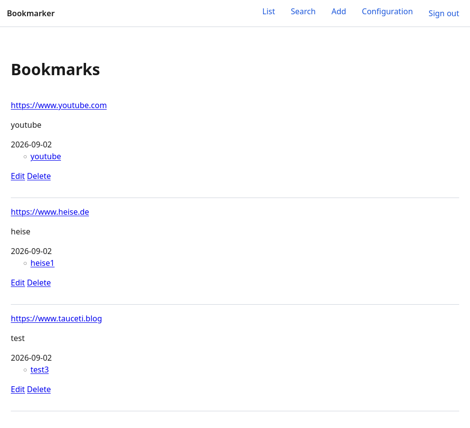
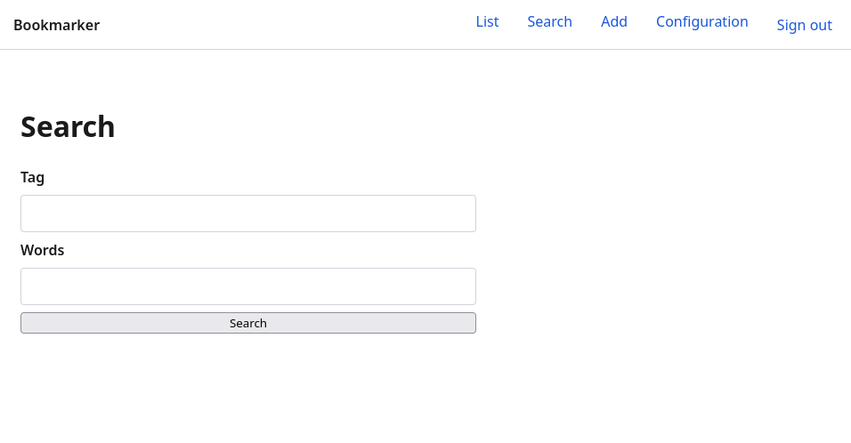
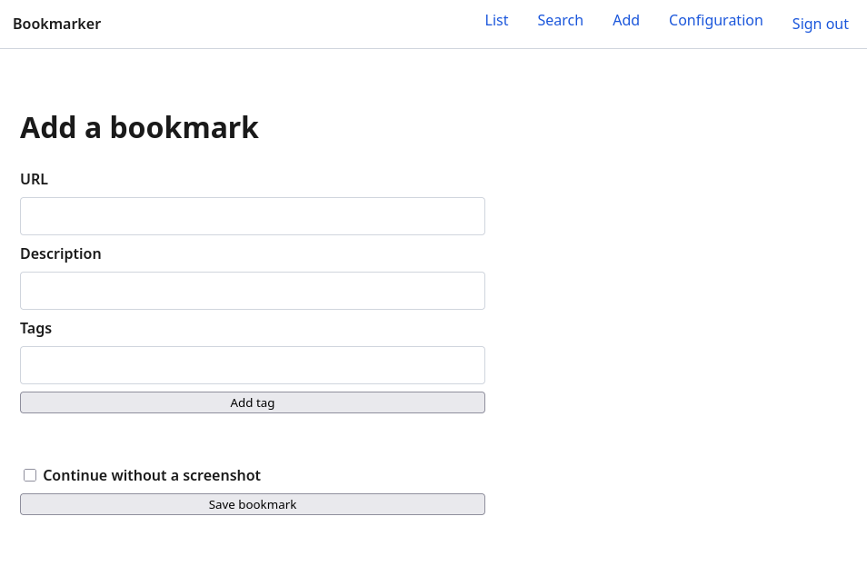
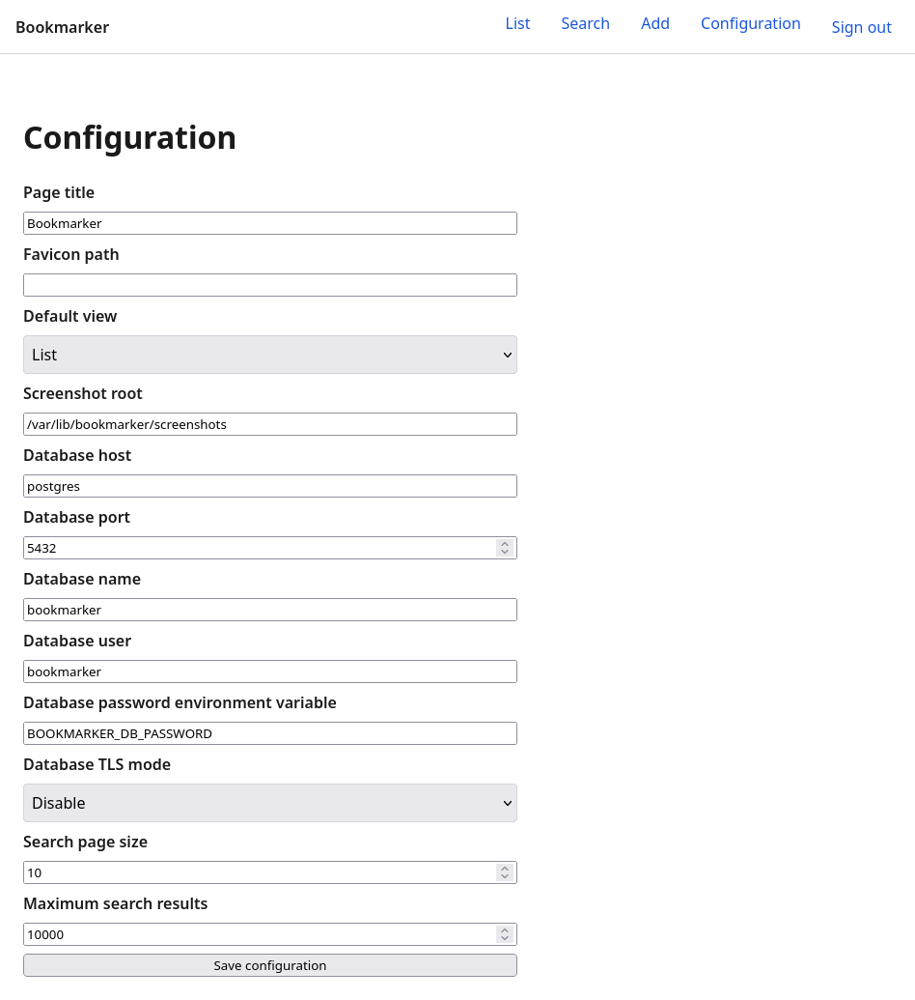

## Summary
This practitioner report follows [[GitHubSpecKit]] from constitution through specification, clarification, planning, task generation, analysis, implementation, and convergence while building [[LaMemoria]], a greenfield bookmark application. It finds that persistent specifications improve agent coordination, reviewability, and resumability for substantial feature work, but cost more time, tokens, and money than ordinary plan-and-agent loops and still leave behavioral, dependency, and UI defects that require human testing and debugging.

## Key Claims
- [[SpecDrivenAgentDevelopment]] is most useful when a project or feature is large enough to justify durable requirements, architecture constraints, user stories, acceptance scenarios, plans, and task state; small scripts and routine refactors may not repay the overhead.
- [[GitHubSpecKit]] separates non-functional governance in a constitution from functional requirements in `specify`, technical decisions in `plan`, implementation units in `tasks`, cross-artifact checks in `analyze`, code generation in `implement`, and code-to-spec reconciliation in `converge`.
- Iterative clarification and analysis exposed conflicts in secret storage, semantic versioning, test ordering, and success criteria before implementation, while convergence later found an incomplete test and two smaller gaps.
- File-backed specs and checked task lists let the author restart stalled agent sessions, begin fresh chats, vary models by phase, and continue from repository state rather than conversational memory.
- The workflow produced a reported 9,763 non-blank code lines and 2,360 documentation lines across 169 files, but the resulting application still used a stale Node.js version, missed the requested burger-menu behavior, shipped a non-working responsive menu button, and overwrote existing tags during editing.
- The four inspected screenshots show working list, search, add, and configuration surfaces, while also confirming the plain layout and top navigation that diverged from the requested burger menu.
- The author estimates a 20–30% token premium without concrete comparison data and reports consuming about 7,000 subscription credits for the initial specifications, code, and documentation; these are project-specific cost observations, not general benchmarks.

## Key Quotes
> "The specs are all in place. So the agent can just use all the information." — on starting implementation in a fresh conversation.

> "Only if the requirements change or a new feature should be implemented the whole Spec Kit loop is definitely needed." — on choosing between the full workflow and ordinary plan-and-agent work.

> "Overall, I still like Spec Kit" — the author's qualified conclusion after accounting for cost, bugs, and overhead.

## Product Evidence
The list view shows three saved bookmarks with descriptions, dates, tags, and edit/delete actions, while the header uses visible navigation links rather than the requested burger menu.

The search view provides separate tag and free-text fields.

The add view captures URL, description, and tags and allows saving without a screenshot.

The configuration view exposes page identity, storage, database, TLS, and search-limit settings, with the database password supplied through a named environment variable.

## Connections
- [[GitHubSpecKit]] — the workflow and command suite evaluated in the case study.
- [[LaMemoria]] — the greenfield bookmark application used as the implementation case.
- [[SpecDrivenAgentDevelopment]] — the article provides a full single-developer workflow and its cost, scale, and defect boundaries.
- [[VibeCoding]] — the author's earlier project improved after adding persistent agent instructions, motivating a more structured alternative from project start.
- [[AICodingPractice]] — model selection, fresh chats, phase-by-phase work, and ordinary plan-and-agent debugging are treated as complementary operating choices.
- [[SoftwareVerification]] — analysis and convergence catch artifact gaps, but runtime tests and human inspection remain necessary for behavior the documents or tests miss.
- [[GitHubCopilot]] — the Spec Kit integration and VS Code chat surface used in the reported workflow.
- [[GitHub]] — hosts Spec Kit and the La Memoria repository discussed by the source.

## Contradictions
- Qualifies any claim that executable specifications directly guarantee a correct implementation: the application remained usable but contained dependency, navigation, interaction, and tag-editing defects.
- Qualifies strict test-first assurances: the author says TDD was mandatory, yet convergence found an incomplete test and manual use found behavior outside effective coverage.
- Qualifies the idea that ordinary plan mode is equivalent to Spec Kit: the author sees overlap but argues that persistent artifacts, command stages, and explicit review make Spec Kit more detailed and harder to forget, at materially higher setup and token cost.
