## Summary
This practical guide explains [[DiffusionModelSampling]] as iterative latent-space denoising in which a solver follows a noise schedule from an initial random latent to a final image. It distinguishes deterministic solvers, stochastic or ancestral methods, schedule variants such as Karras, and specialized low-step methods, then compares their convergence, relative runtime, and BRISQUE score in one [[StableDiffusion]] image-generation experiment. The article recommends choosing a sampler for the desired trade-off rather than treating one method as universally best, with reproducibility, speed, perceptual quality, and model compatibility as separate criteria. Its named sampler inventory and defaults are a historical snapshot of [[AUTOMATIC1111]], and its single-image benchmark lacks enough methodological detail to establish general rankings.

## Key Claims
- A diffusion sampler repeatedly uses a model's noise estimate to move a noisy latent toward an image whose noise level matches the next point in a schedule.
- More steps reduce the size of each scheduled noise change and can reduce numerical truncation error, but benefits depend on the solver and may plateau or fail to converge.
- Deterministic solvers such as Euler can stabilize as steps increase, while ancestral and SDE variants inject noise and can keep changing; that diversity is useful for exploration but weakens step-count reproducibility.
- Solver order creates a direct cost trade-off: methods requiring two noise-model evaluations per step take roughly twice the runtime of one-evaluation methods in the article's test.
- The Karras schedule concentrates smaller noise reductions near the end, where fine detail is refined, but the observed benefit varies by sampler and step count.
- In the article's experiment, DPM++ 2M Karras and UniPC offer a practical speed/convergence balance, while DPM++ SDE Karras and DDIM score well on the selected no-reference quality metric despite weaker convergence.
- LCM sampling is model-specific: it uses a latent consistency model to predict a near-final image, then can add noise and denoise again for a small number of refinement steps.

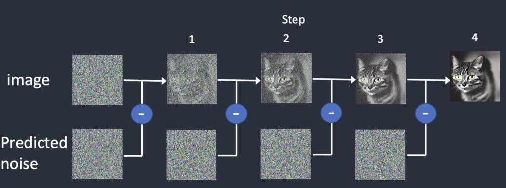

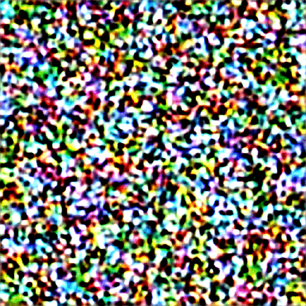

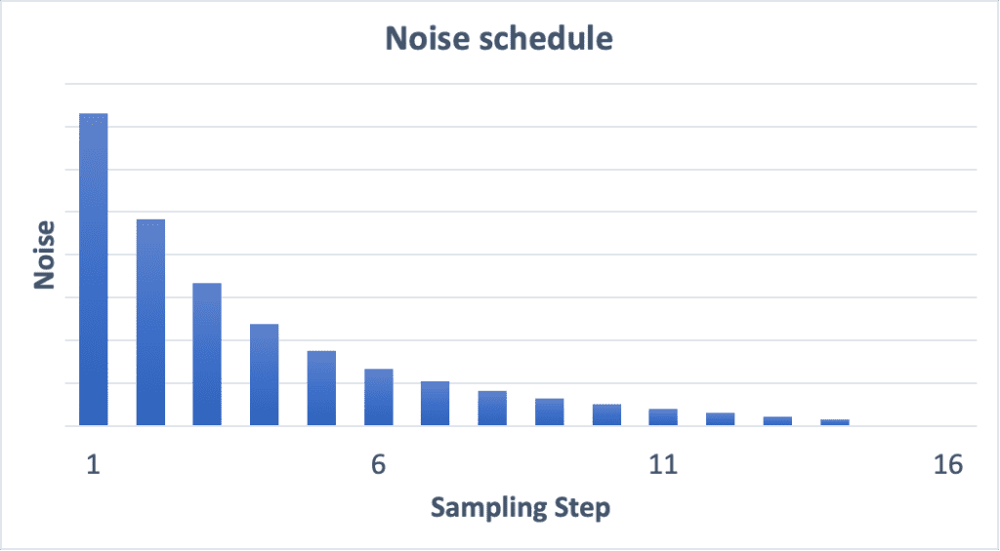

The PCA projections visualize the article's interpretation that early moves establish broad composition and later, shorter moves refine the result. They also show nearby trajectories from different seeds but widely separated endpoints after changing the prompt; because PCA compresses a 65,536-dimensional path to two axes, these are explanatory projections rather than complete geometric evidence.

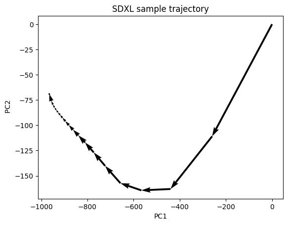

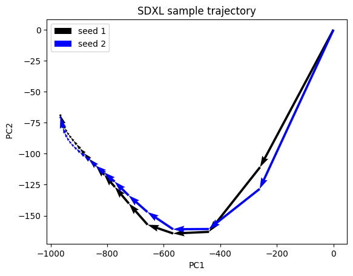

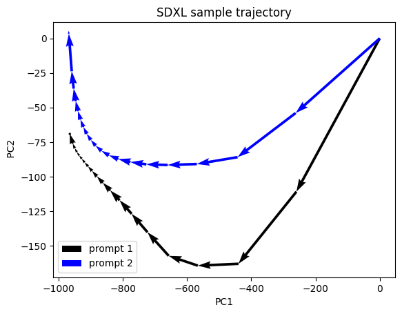

The paired animations show Euler ancestral continuing to vary from steps 2 through 40 while deterministic Euler settles toward one image.

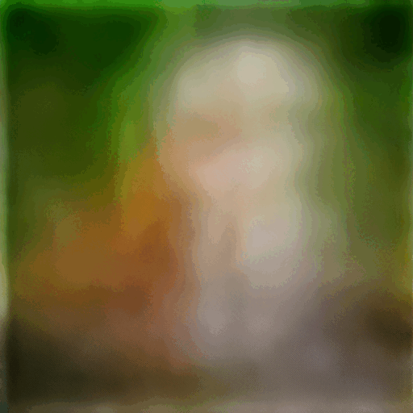

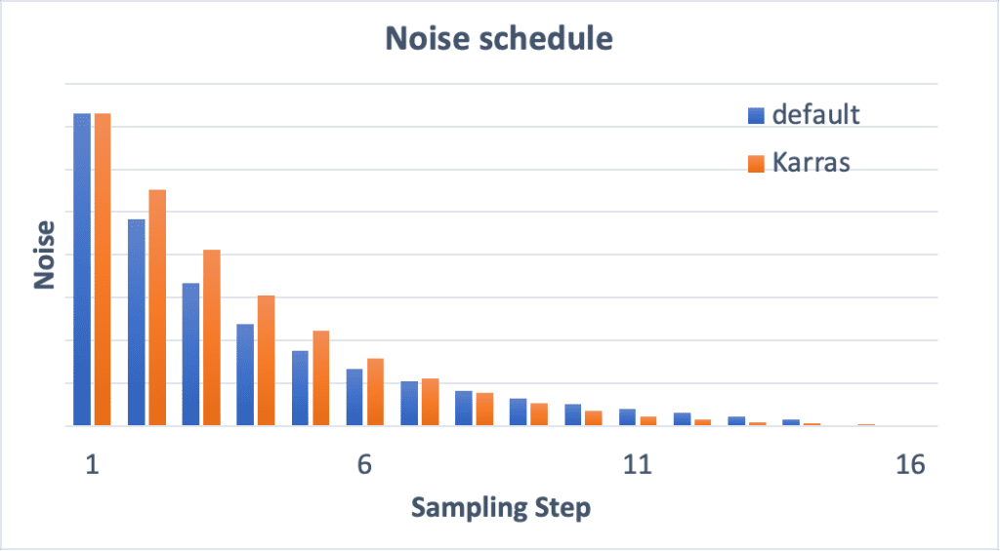

The convergence plots use distance from each sampler's 40-step output, with lower values treated as better. They show Heun converging quickly but costing more per step, poor stabilization for the ancestral group, weak DPM Fast results, competitive DPM2 variants, strong DPM++ 2M behavior, and slower UniPC convergence than Euler in this example.

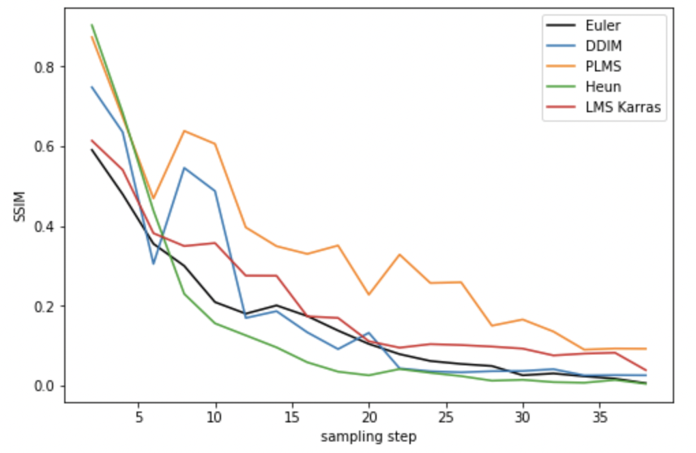

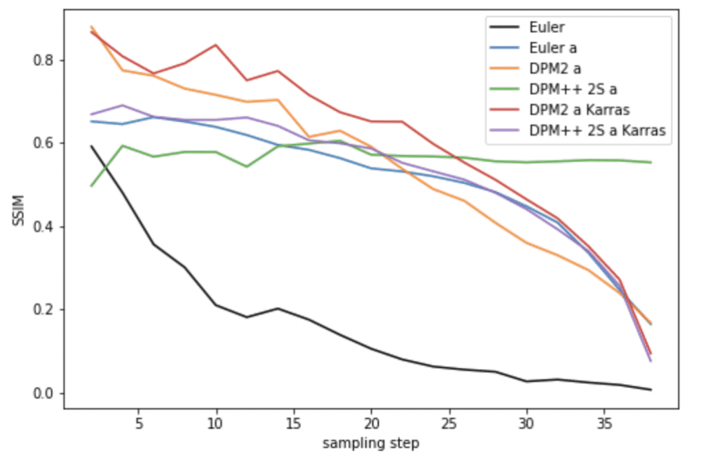

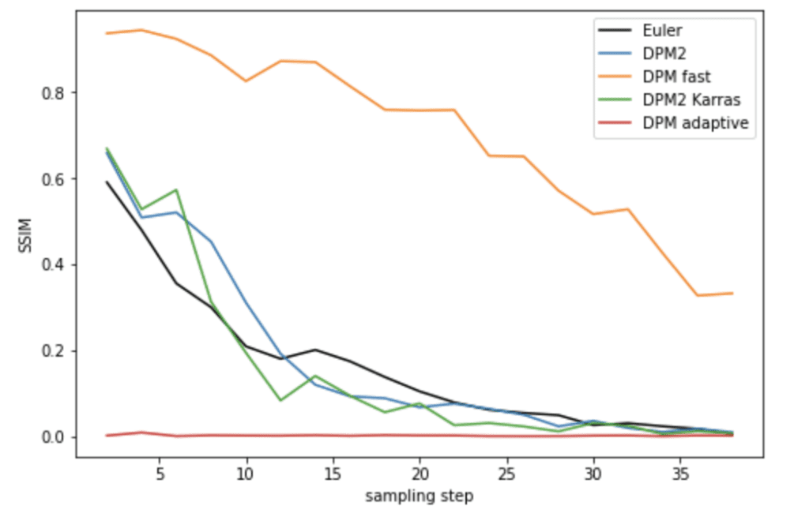

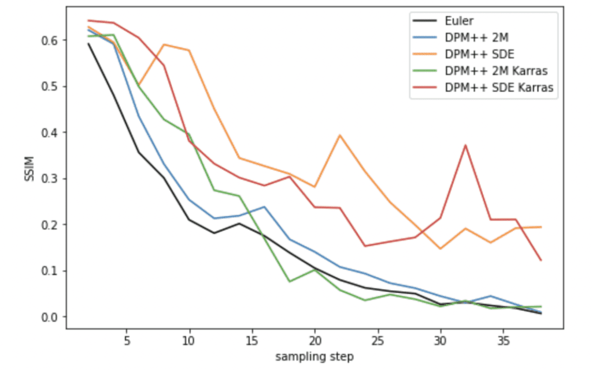

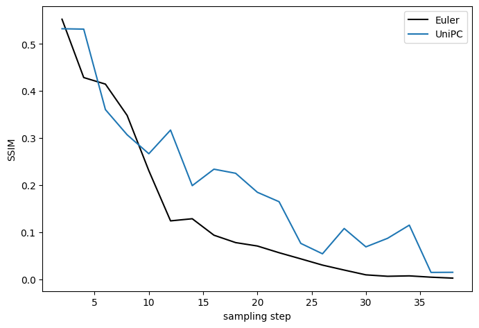

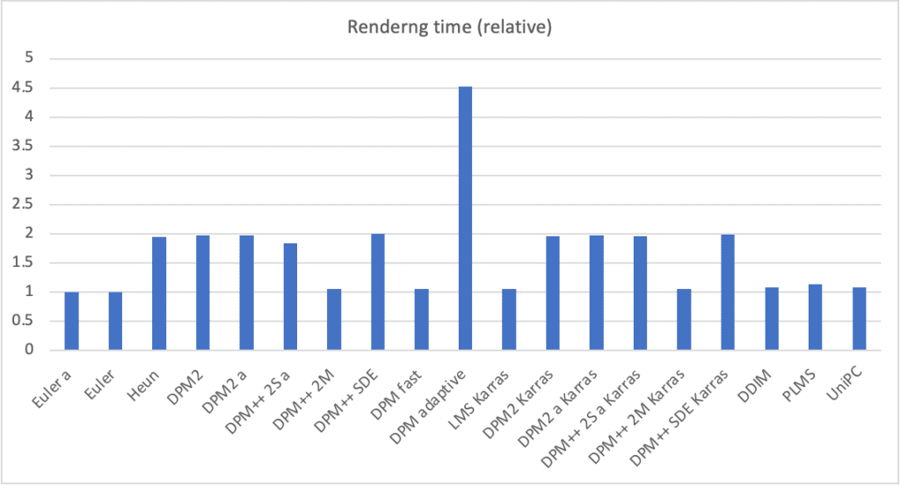

The quality plots report BRISQUE, where lower is treated as better. Within this one test, DDIM reaches low scores quickly, most ancestral variants become broadly competitive after the earliest steps, DPM2 slightly improves on Euler, DPM++ SDE variants record the lowest scores, and UniPC approaches Euler at higher step counts.

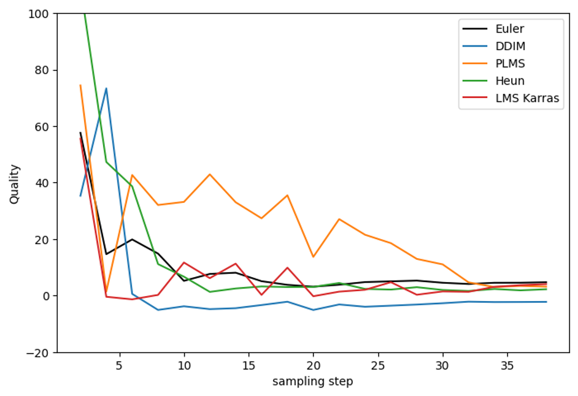

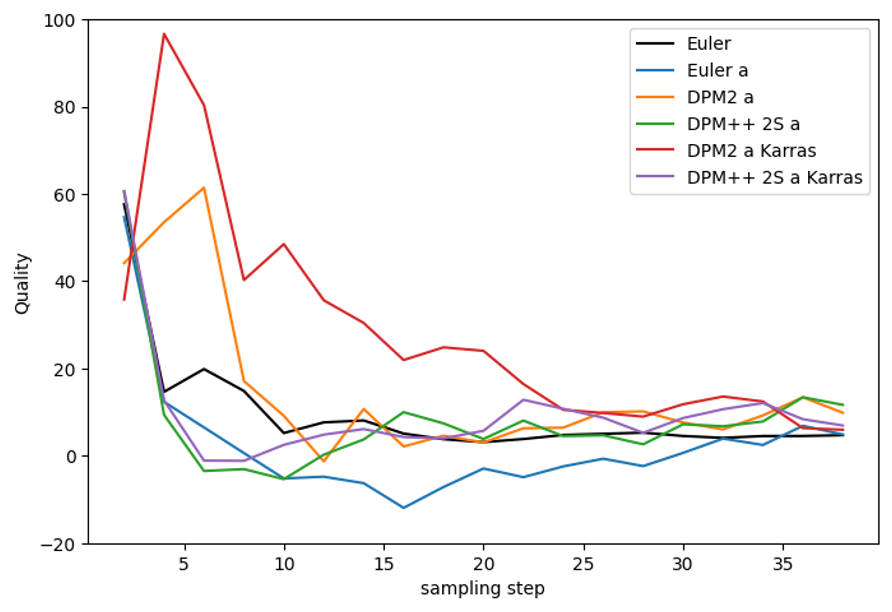

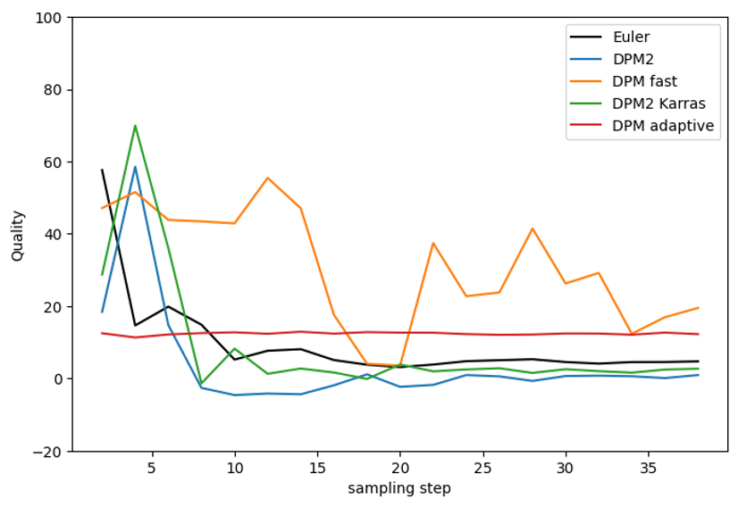

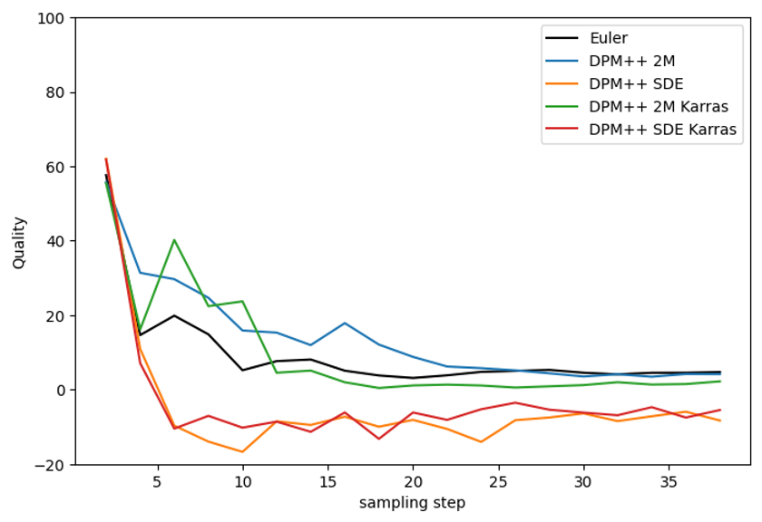

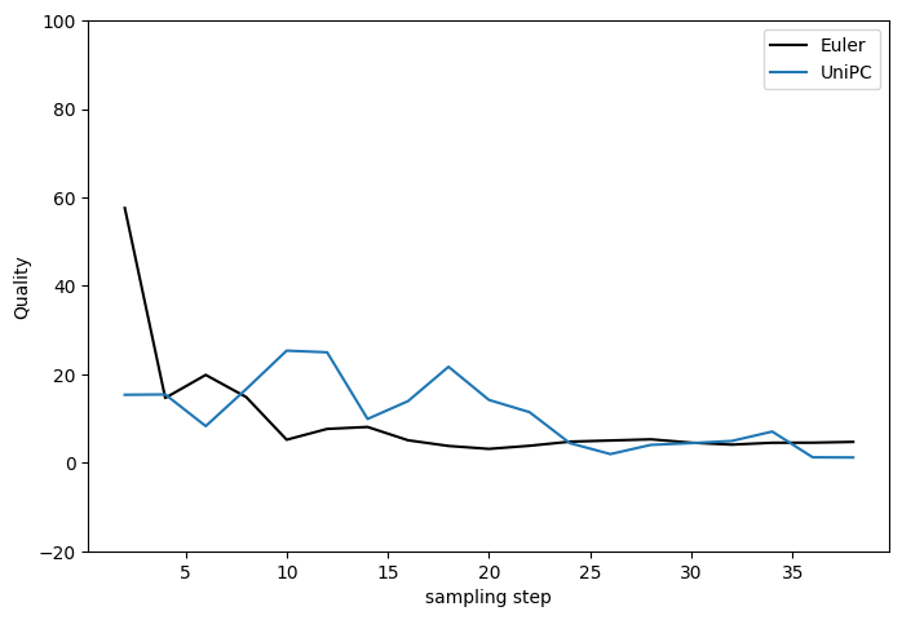

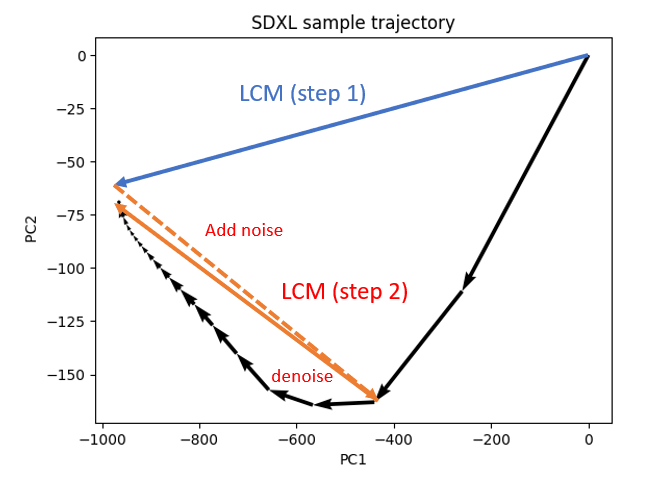

## Key Quotes
> "The sampler is responsible for carrying out the denoising steps." - the article's operational definition

> "For reproducibility, it is desirable to have the image converge." - motivation for preferring deterministic behavior when repeatability matters

## Connections
- [[DiffusionModelSampling]] - synthesizes the solver, schedule, convergence, cost, and model-compatibility trade-offs explained and tested here.
- [[StableDiffusion]] - supplies the latent diffusion model whose reverse process the samplers numerically traverse.
- [[AUTOMATIC1111]] - provides the historical user-facing sampler menu and naming conventions discussed by the guide.
- [[PrincipalComponentAnalysis]] - reduces the article's high-dimensional SDXL trajectories to explanatory two-dimensional plots.
- [[DeepLearning]] - supplies the learned noise predictor evaluated one or more times per sampling step.

## Contradictions
- No direct contradiction was found in the existing wiki. The article's practical rankings should not be generalized beyond its undocumented prompt, model, hardware, implementation version, seeds, and metric setup, and its 2023-era sampler list is not a current product inventory.
