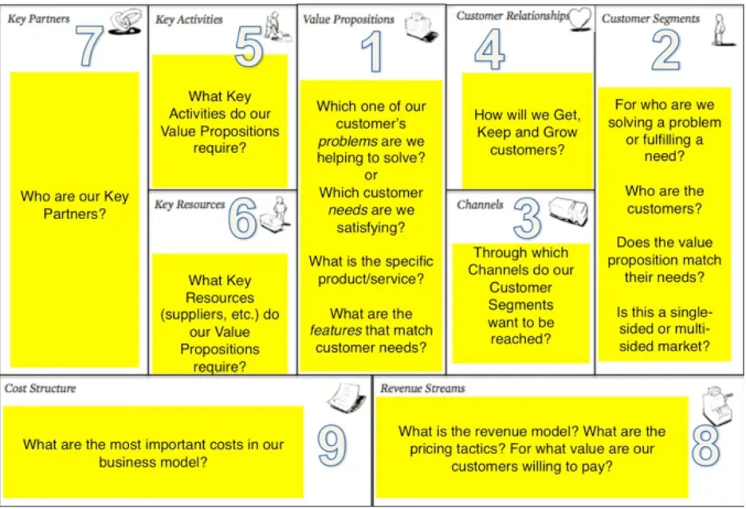
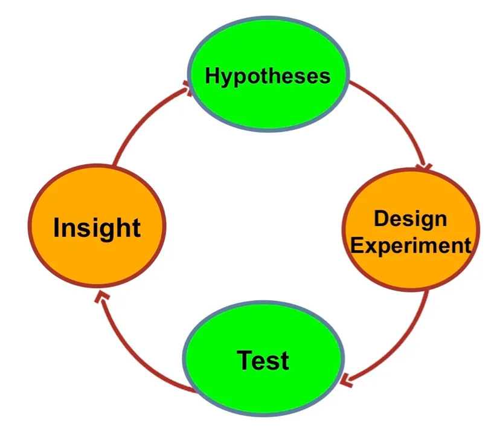
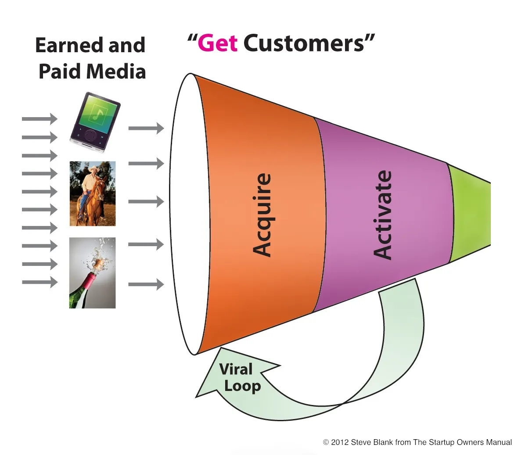
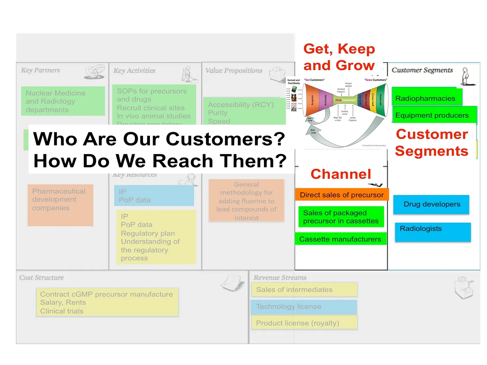
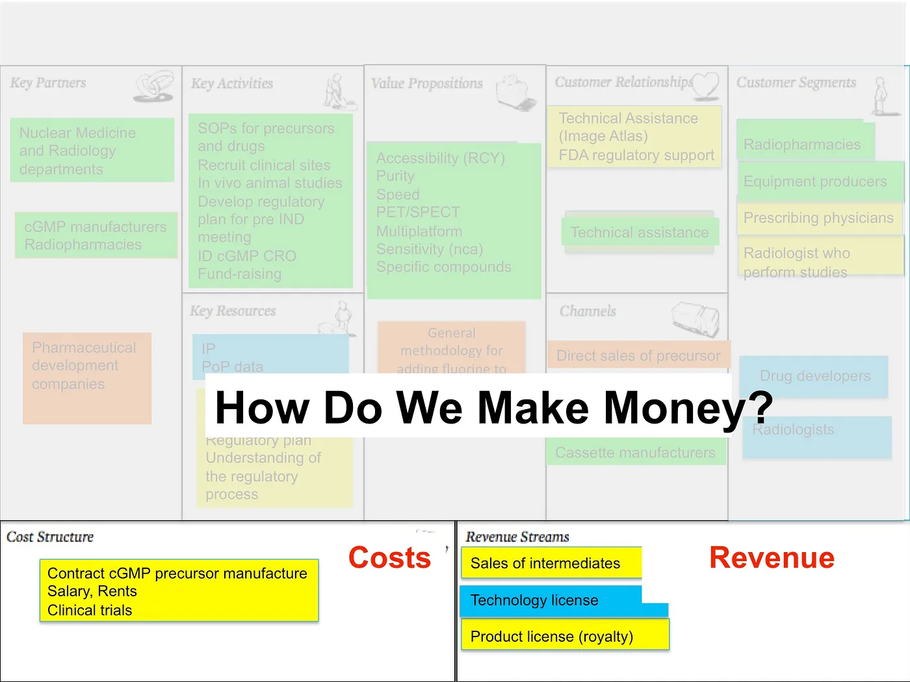

## Summary
[[SteveBlank]] argues that customer development is the pursuit of customer understanding, not obedience to every request. A startup must interpret interviews, surveys, A/B tests, activation, retention, and payment behavior against an explicit [[BusinessModelValidation|business model]]: the chosen customer segments, value proposition, market structure, revenue model, pricing tactics, and path to repeatable, scalable economics. The cautionary case is a consumer-web founder who acquired and activated free users but did not test whether they would stay, pay, or support the scale assumed by freemium.

## Key Claims
- Customer conversations and experiments should generate insight about a viable business, not merely a larger feature list or more satisfied free users.
- Acquisition and activation are only part of a business model; retention, payment, costs, and the relationship among users and payers must also be tested.
- A freemium tactic assumes that at least some users become payers, whereas an advertising or other multi-sided model may rely on a separate payer segment.
- Revenue model is the strategy for generating cash from each customer segment; pricing is one set of tactics for executing that strategy, and freemium is only one such tactic.
- Segment choice is strategic: startups should serve customers whose needs and economics support the intended short- and long-term model, and may need to decline customers who pull the product away from it.
- A repeatable experiment loop moves from hypotheses through test design and execution to insight, then revises the business model rather than optimizing an isolated metric indefinitely.

The canvas makes the article's system boundary explicit: customers and product features are coupled to channels, relationships, operating resources, costs, and revenue rather than forming a complete business by themselves.

The loop distinguishes collecting test results from producing insight that changes the next hypothesis.

The funnel visualizes the acquisition and activation work Satish completed, while the article emphasizes that traffic and activation alone do not establish retention, payment, or viable economics.

The example shows that a business can serve several segments through different channels, making segment choice and route-to-market part of one design problem.

The final canvas isolates the money question: customer relationships and useful features must connect to explicit revenue streams that cover the model's costs.

## Key Quotes
> "The goal of listening to customers is not to please every one of them." - on interpreting feedback through segment and business-model fit.

> "The idea of the tests he ran wasn't just to get data — it was to get insight." - on the purpose of customer-development experiments.

> "Pick the customer segments and pricing tactics that drive your business model" - the article's closing operating rule.

## Connections
- [[SteveBlank]] - author using a former student's freemium failure to clarify customer-development practice.
- [[StartupHypothesisTesting]] - experiments must test the whole commercial hypothesis and produce decisions, not isolated metric movement.
- [[FreemiumAcquisition]] - free adoption is qualified by retention, conversion, payer identity, and unit economics.
- [[ProductUserSegmentation]] - customer requests should be weighted by which segments the company can and intends to serve.
- [[BusinessModelValidation]] - integrates customer, product, channel, cost, revenue, and market-structure assumptions into one testable system.
- [[CustomerLedProductDevelopment]] - customer evidence remains essential, but stated feature requests are inputs rather than commands.
- [[ProductMarketFit]] - repeatable demand must include behavior and economics, not traffic or activation alone.

## Contradictions
- The article does not reject listening to customers; it qualifies literal request-following by requiring segment selection, behavioral evidence, and business-model coherence.
- Its unnamed consumer-web case supplies no product, cohort, conversion, retention, cost, or experiment details, so it illustrates a failure mode without establishing general freemium benchmarks.
- The claim that giving a product away is often a going-out-of-business strategy is directionally cautionary, not universal: free tiers can support advertising, network effects, lead generation, cross-subsidy, public goods, or later paid conversion when those mechanisms are tested.
- The business-model diagrams include a radiopharmaceutical example not explained in the article's prose; they demonstrate relationships among canvas components rather than evidence that this particular venture succeeded.
