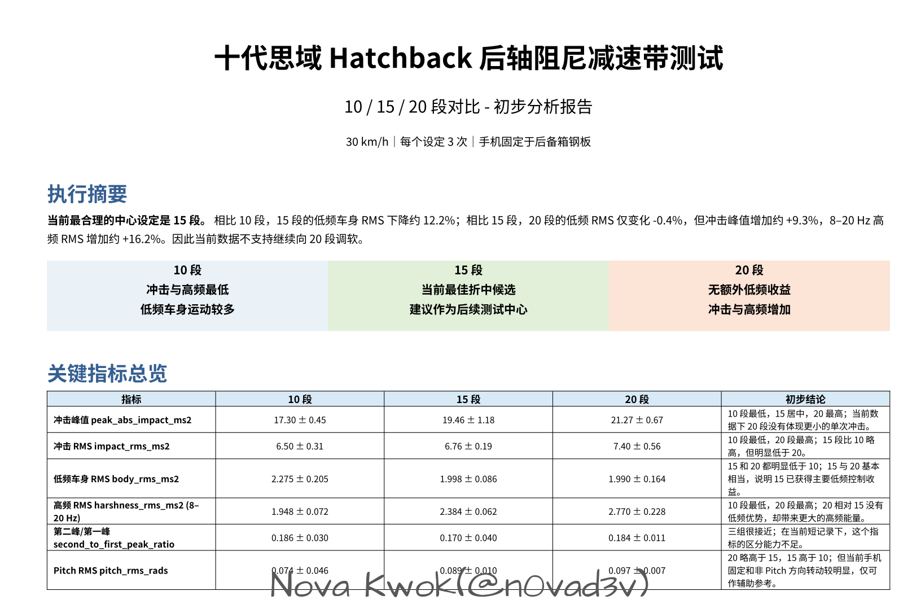
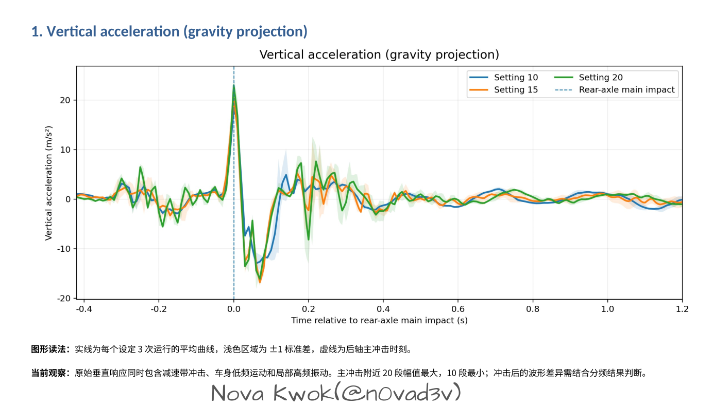
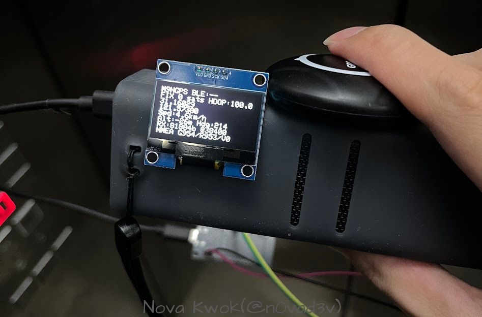
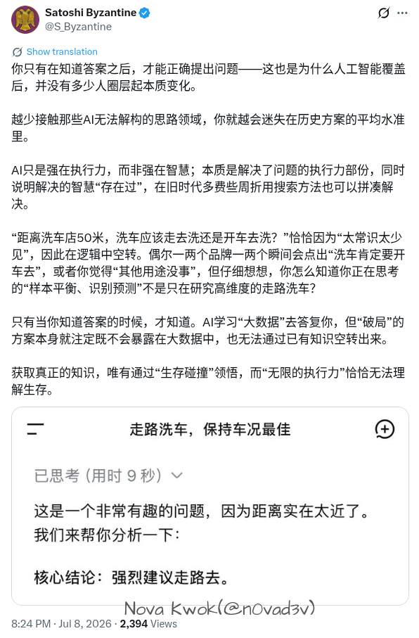

## Summary
[[NovaKwok]] distinguishes using AI to remove search, implementation, and unfamiliar-domain friction from surrendering problem definition, judgment, and validation. His suspension, sensor, DIY GPS, and track-testing examples support a [[TaskContingentAICollaboration|human-owned empirical loop]], while his development and consumer examples describe a reinforcing cycle between [[CognitiveOffloading]], lost context, and [[AutomationBias]]. The essay argues that AI can shift critical thinking toward verification and integration, but only if users keep building internal models, inspect primary evidence, and test outputs rather than treating fluent absence claims as proof.

## Key Claims
- AI is most useful as a labor-saving collaborator when the person defines the problem, chooses what evidence matters, and verifies the final result in the world.
- The author's car work pairs LLM-assisted research and coding with repeatable measurement: suspension settings were compared through phone-sensor runs, a 25 Hz GPS was built from M9N and ESP32 components, and a July 2026 track shakedown exposed braking-balance and full-throttle-shift issues.

- As coding agents compress the path from problem to polished plan and implementation, developers may lose the cross-domain context needed to recognize an incorrect diagnosis or an omitted table.
- [[AutomationBias]] can turn “no evidence of X was found” into “there is evidence that X does not exist,” especially when an agent's confident report discourages the user from checking contradictory observations or coverage gaps.
- [[CognitiveOffloading]] can become self-reinforcing: less retained context makes model errors harder to judge, weaker judgment increases deference, and increased deference encourages still more offloading.
- Consumer use has the same boundary risk when users ask models to make consequential decisions without understanding model scope, hallucination, or system integration; the pictured V2EX case reports an AI-generated insurance-payment QR code that led to a 1,620 CNY transfer and a dispute over where the code came from.

- The essay's preferred workflow begins with human decomposition, then uses AI for search, calculation, code, and organization, and closes with primary-source reading, measurement, and cross-checking so the user develops an internal model.
- Removing every form of cognitive friction is not automatically beneficial because decomposition, searching, reading, implementation struggle, and error correction can be the mechanisms through which learning occurs.

## Key Quotes
> “不是模型变得足够聪明，而是人在某个时间点已经失去了判断模型究竟聪不聪明的能力。” — on automation bias arising from weakened user judgment.

> “没有 evidence of X”悄悄变成了“evidence that there is no X”。 — on converting incomplete search into a false negative conclusion.

> “AI 最大的诱惑之一，是它可以消除认知摩擦；但过去很多我们讨厌的摩擦，本身恰恰就是学习发生的地方。” — on preserving effort that builds understanding.

## Connections
- [[NovaKwok]] - author grounding the argument in engineering, vehicle testing, and reflective writing.
- [[CognitiveOffloading]] - central mechanism by which search, decomposition, judgment, and verification can migrate from person to model.
- [[AutomationBias]] - deference loop that becomes harder to resist as the user retains less domain context.
- [[TaskContingentAICollaboration]] - distinguishes delegable execution from human-owned framing and validation.
- [[MentalModels]] - internal representations are needed to notice missing evidence, wrong diagnoses, and invalid conclusions.
- [[HumanCodeResponsibility]] - production access, acceptance, and consequences remain human responsibilities even when an agent performs the investigation.
- [[SoftwareVerification]] - measurement, primary-source checking, and real-world trials are the proposed safeguards against fluent but wrong output.
- [[ActiveLearning]] - decomposition and evidence gathering keep AI use connected to capability development rather than answer consumption.

## Contradictions
- The essay qualifies strong AI-first or autonomy narratives: faster implementation and fewer human-in-the-loop steps increase throughput, but can also reduce the context and practice needed for competent review.
- The cited Microsoft survey reports self-described critical-thinking behavior across 319 knowledge workers and 936 GenAI examples; it supports an association between confidence and reported effort, not proof that AI use causes cognitive decline or that all shifted thinking is worse.
- The vehicle, database, Kubernetes, insurance, and educational examples are personal, hypothetical, or secondhand cases rather than comparative evidence. They establish plausible failure modes and one author's practice, not universal effects or prevalence.
- The dampening experiment uses three runs per setting at 30 km/h with a phone fixed to the trunk floor. The inspected summary and acceleration chart make the comparison legible but do not establish sensor calibration, route equivalence, statistical power, handling performance, safety, or transfer beyond this vehicle and setup.
