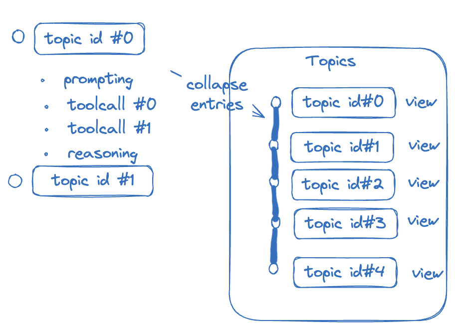
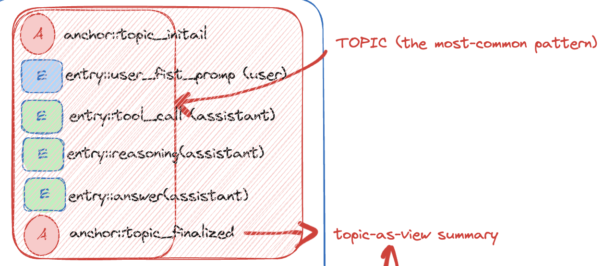
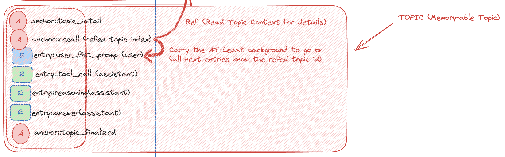
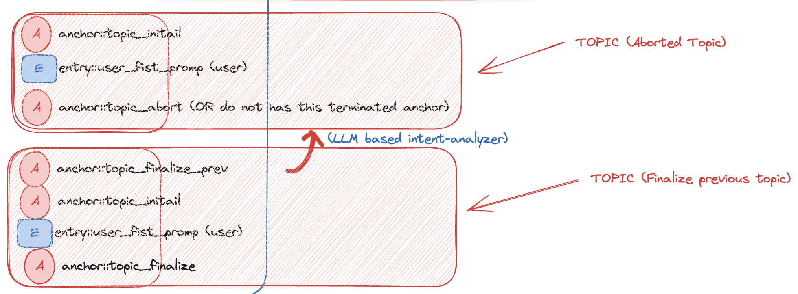

## Summary
[[PsiACE]] develops [[TapeAndAnchors]] from a context-management specification into a business-facing topic model for an enterprise knowledge-base agent. The proposed [[AgentTopicLifecycle]] treats a topic as a range of immutable Tape entries bounded by initial and finalized anchors, then uses lifecycle hooks for recall, recovery of unfinished topics, summaries, sharing, fact extraction, and cost accounting. The design keeps full interaction history available while exposing compact topic views and reusing local files, databases, object storage, vector retrieval, and observability infrastructure according to deployment needs.

## Key Claims
- Tape models each LLM session as append-only history: entries record user, model, and tool interactions; corrections are new entries rather than edits to prior history.
- Anchors mark compressed, recoverable states; views select entry sets; handoff advances an overloaded context window without deleting the original material.
- [[AgentTopicLifecycle]] adds a business-level boundary to Tape: `topic_initial` and `topic_finalized` anchors delimit the entries and anchors belonging to one topic.
- Topic metadata can store initial and final sequence indexes, summary, owner, and timestamps; monotonically increasing sequence numbers support range search and entry counts.
- Lifecycle hooks around topic initialization and finalization can insert recall, summaries, fact extraction, cost accounting, sharing, and cleanup behavior without changing Tape's core abstractions.
- A recall-enabled topic searches prior topic summaries, writes matches into a `recall_anchor`, and retains indexes for drilling back into original entries when needed.
- Memory need not be a separate subsystem when immutable entries, summaries, anchors, and indexed replay already provide temporal recall.

## Key Quotes
> "历史没有消失，也不会被凭空改写。" - Tape preserves earlier interaction records and represents later correction by appending new history.

> "Entry 和 Anchor 本身就提供了‘沿时间漫游’的能力，这就是记忆。" - The article's argument for memory as a native consequence of the context model.

> "Tape 是一套设计语言，不是某个固定产品。" - The abstraction is intended to support different storage systems and agent domains.

## Connections
- [[PsiACE]] - author extending Tape with the Topic abstraction for enterprise knowledge-base support.
- [[Bub]] - example implementation that shows how agents built from the Tape specification can vary by vertical domain.
- [[TapeAndAnchors]] - append-only context model underlying the proposed topic layer.
- [[AgentTopicLifecycle]] - source's main extension: bounded, hookable, recallable business topics over Tape entries.
- [[AgentMemory]] - qualified by the claim that indexed history and anchors can make recall native rather than a detached subsystem.
- [[LLMContextManagement]] - broader problem of selecting durable history for a finite active window.
- [[RetrievalAugmentedGeneration]] - proposed downstream mechanism for turning finalized topic conclusions into reusable facts.
- [[ModelContextProtocol]] - contrasted with a smaller, more controlled tool surface because large tool sets can increase cost and mis-selection.
- [[AgentSystemTransparency]] - topic ranges, action history, token accounting, and stored indexes make behavior and cost traceable.

The overview diagram shows sequential Tape segments collapsed into separately addressable topic views. Each view keeps a link to its underlying entries rather than replacing them with only a summary.

A common topic starts with `topic_initial`, contains user and assistant entries, and ends with `topic_finalized`, whose output can serve as the topic-as-view summary.

The memory-enabled flow inserts a recall anchor after initialization. It carries only enough background and an earlier topic index for later entries to continue or drill into the referenced range.

The aborted-topic diagram shows both an explicit abort anchor and a recovery route where `topic_finalize_prev` closes the previous range before the next `topic_initial`; it labels an LLM intent analyzer as one possible transition detector.

## Contradictions
- No direct contradiction was found. The source refines [[TapeAndAnchors]] by making entries, anchors, views, and handoff more concrete, and it qualifies [[AgentMemory]] by proposing native indexed replay and recall anchors instead of a separately maintained memory service.
- The article remains a design proposal rather than a benchmarked implementation. Concurrency control, conflicting documents, topic-boundary accuracy, access control, retention and deletion requirements, recall quality, and the cost of hook execution remain unresolved.
