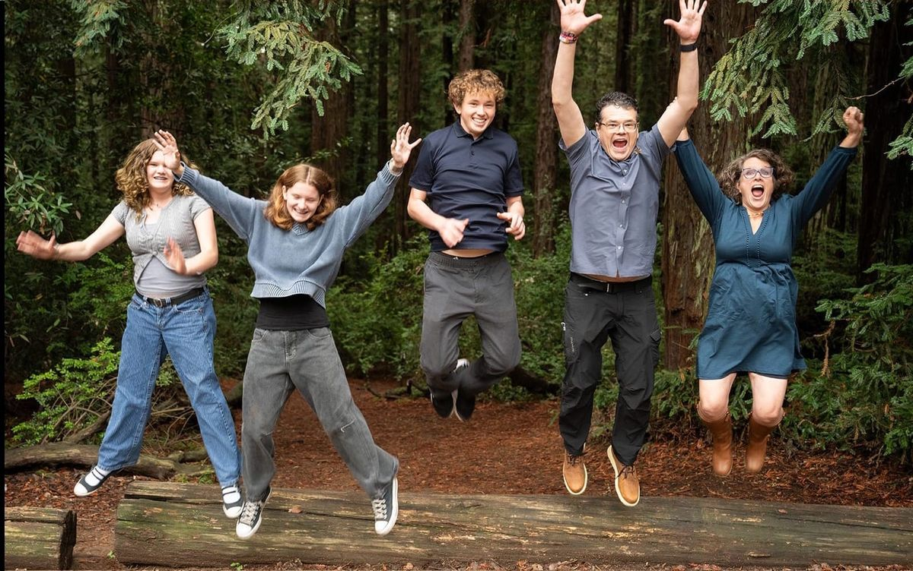
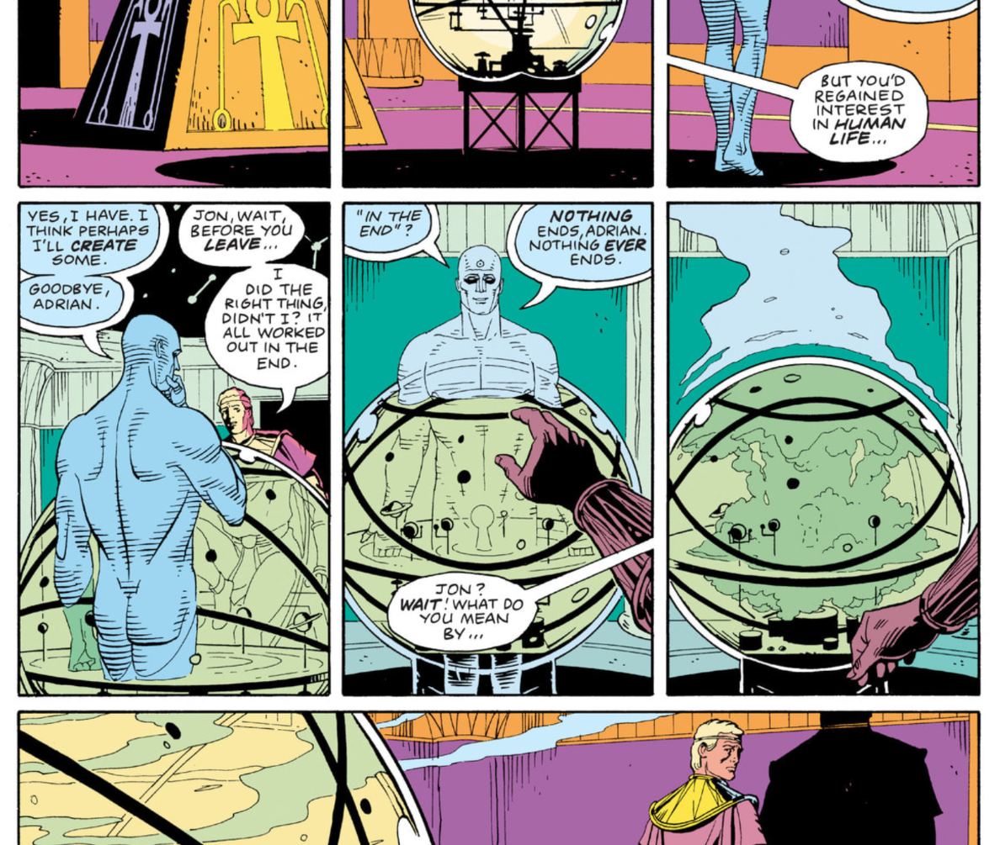

## Summary
[[JeffAtwood]] links the death of his father and their final visit during a rural guaranteed-minimum-income study to a broader argument about inheritance, gratitude, and community stewardship. He credits [[StackOverflow]] contributors with creating the high-quality Creative Commons programming corpus on which coding-capable LLMs depend, then warns AI companies against weakening the human community that creates and maintains such knowledge. The essay combines a personal claim that relationships and experiences endure beyond loss with an institutional claim that accumulated public knowledge requires continuing respect for its contributors.

## Key Claims
- Atwood says Mercer County, West Virginia, was moved to the front of a rural guaranteed-minimum-income study because his father was nearing death, making the October 2025 visit their last meeting.
- He frames grief through continuity: experiences with his father, including their final trip, remain part of what he gained rather than becoming wholly lost.

- The retained Watchmen panel visually supplies the essay's "nothing ever ends" motif, connecting bereavement with the persistence of relationships and consequences.

- Atwood attributes much of LLMs' coding ability to the curated Creative Commons programming Q&A corpus collectively built on [[StackOverflow]].
- He warns that AI companies may undermine their own future inputs if model-mediated answers hollow out the communities that produce public training data, corrections, and new knowledge.
- Product and platform leaders should treat the human community around a product as a primary value-producing constituency rather than an expendable input.

## Key Quotes
> "Nothing ever ends." - the Watchmen motif Atwood uses to frame loss and continuing consequence.

> "Do not, for any reason, under any circumstances, kill the goose that lays the golden eggs" - advice to protect the contributor community.

## Connections
- [[JeffAtwood]] - author connecting family legacy, philanthropy, and responsibility to contributor communities.
- [[StackOverflow]] - contributor-built programming corpus presented as foundational input to coding-capable LLMs.
- [[PublicKnowledgeCommons]] - the essay's warning concerns consuming shared knowledge without sustaining its human production and renewal.
- [[ForumCommunityDesign]] - contributor respect and community continuity are treated as product responsibilities, not incidental benefits.

## Contradictions
- The claim that LLMs could not code without Stack Overflow is emphatic advocacy, not a demonstrated counterfactual; the essay provides no training-corpus disclosures, ablation studies, model comparisons, or contribution trends.
- The source does not establish that LLM use necessarily hollows out public communities, nor does it measure whether attribution, routing, AI-assisted contribution, licensing, or compensation could mitigate the risk.
- The article mentions a rural guaranteed-minimum-income study, a $50 million plan through the linked preview, and Atwood's third startup, but does not provide enough program design, evaluation, funding, or outcome evidence to assess them.

## Image Notes
All four effective images were inspected. The Coding Horror avatar and generic Ghost link icon were decorative and omitted. The linked group photograph and Watchmen panel were retained because they support the article's relationship-continuity and "nothing ever ends" arguments.
