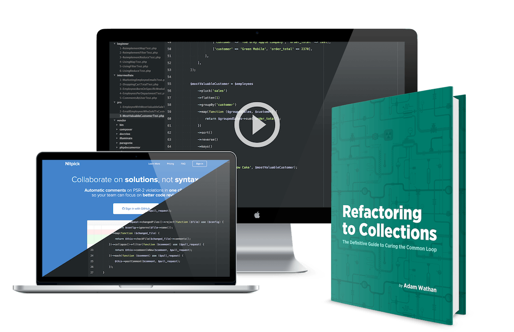
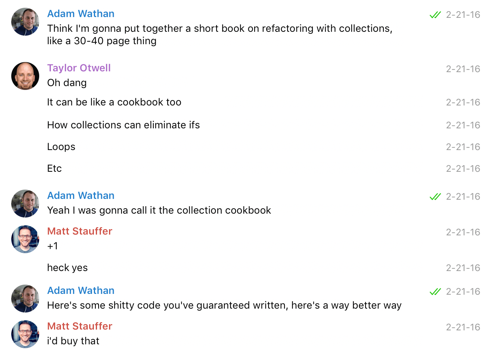
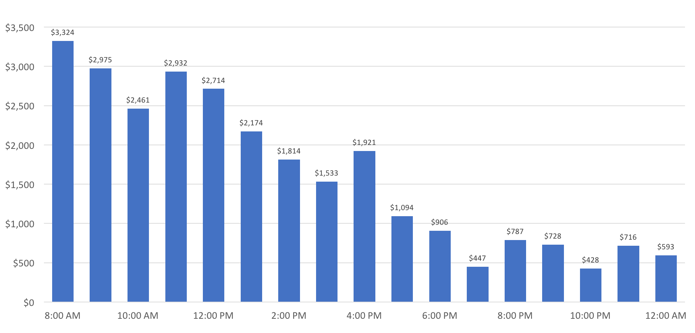
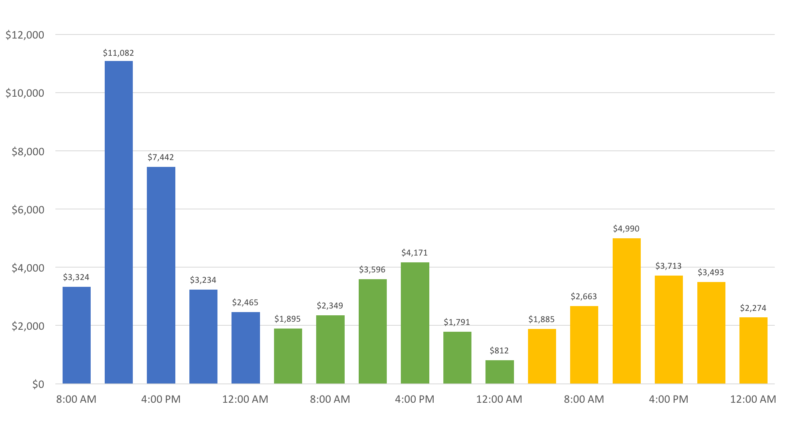

## Summary
[[AdamWathan]] reconstructs how a deliberately small book idea grew into [[RefactoringToCollections]], a book, exercise, screencast, and source-code bundle that generated a reported $61,392 during a three-day launch sale. The case links small initial scope, public progress, free samples, an email list, explicit deadlines, a launch sequence, and [[ProductBundling]] to a transition from employment into full-time independent work. Its detailed figures are first-party results from one successful launch, and the retained charts do not fully reconcile with the prose totals.

## Key Claims
- Starting with a proposed 30-40 page, low-priced “tripwire” product reduced the psychological barrier that had blocked larger book ideas, even though the final product expanded substantially.

- [[AudienceFirstProductLaunch]] began before the product was finished: a landing page, blog audience, Twitter updates, sample chapters, a public launch date, and a free screencast grew the relevant email list from roughly 400 people to 1,506 launch recipients.
- Public promises acted as a commitment device for Wathan, while progress updates and samples produced encouragement, preorder requests, feedback, and launch anticipation.
- The three-day launch used a 25% deadline, a launch announcement, a non-buyer follow-up with testimonials and a free screencast, and a final-day reminder; the reported daily revenue was $28,299, $14,614, and $18,479.

- Three differentiated tiers let buyers evaluate the offer as more than a PDF: $29 for the book and exercises, $59 with screencasts, and $135 with a production Laravel project.
- The package breakdown reports 905 sales and $61,392 in revenue, or a $67.84 average selling price; charging every buyer $29 would have produced $26,245, so the author attributes more than half the launch revenue to higher tiers.
- Wathan reports that the launch gave him confidence to leave his job two weeks later; the product crossed $100,000 in under three months and reached $138,835 after eleven months, with $1,000-$2,000 in monthly revenue at the article's 2017 snapshot.

## Key Quotes
> "It would help you get some experience launching something and make a bigger project feel a lot more doable." - the advice that prompted the small initial product.

> "Make it easy to evaluate your product as its own unique offering, not just another eBook." - on packaging the book with exercises, video, and source code.

## Connections
- [[AdamWathan]] - author and creator reporting the product's development, launch, and career consequences.
- [[RefactoringToCollections]] - the digital book and training bundle at the center of the case.
- [[AudienceFirstProductLaunch]] - landing page, samples, progress updates, launch email sequence, and deadline-based offer formed the launch system.
- [[BuildInPublic]] - Wathan shared examples and progress to attract feedback, motivation, and prospective buyers.
- [[ProductBundling]] - screencasts, exercises, and a production codebase created three differentiated packages above the standalone book price.
- [[IndependentCreator]] - the launch became evidence supporting Wathan's move from employment to full-time product work.
- [[ConvertKit]] - email collection and purchaser segmentation supported the pre-launch and follow-up sequence.

## Contradictions
- No direct contradiction with existing wiki claims was found; the case strengthens the wiki's qualified view that public building and independent-creator transitions depend on distribution, financial evidence, and contextual advantages rather than motivation alone.
- The retained launch-day chart bars sum to $27,547, not the prose's $28,299; this may exclude pre-announcement sales, but the source does not explain the boundary.
- The retained three-day chart bars sum to $61,179 rather than $61,392, and its color-group totals do not exactly match the prose's daily figures. The package revenue figures do sum to $61,392, so the source contains an unresolved chart-versus-text discrepancy rather than a single consistently reported hourly series.
