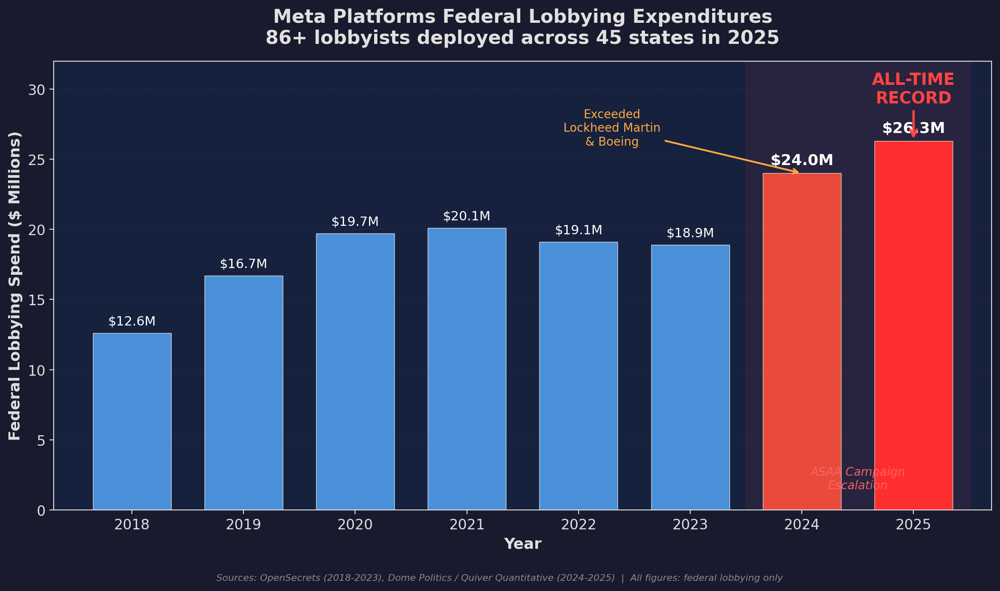

## Summary
This advocacy essay argues that recent online age-assurance laws use child safety to justify identity and surveillance infrastructure while shifting compliance risk onto operating-system vendors and smaller providers. It criticizes self-declared OS age brackets as ineffective and centralized age data or ID-and-face checks as privacy, anonymity, security, competition, and free-expression risks. The author favors parent and child education, parental controls, and zero-knowledge proofs that establish an age threshold without disclosing full identity, while the article's lobbying motives and policy effects remain allegations and projections rather than demonstrated causal findings.

## Key Claims
- California AB 1043 and laws or proposals in other jurisdictions are presented as a broad shift toward platform- or device-mediated age assurance rather than isolated website age gates.
- The author alleges that [[Facebook|Meta]] supports these laws to transfer compliance exposure, raise entry barriers, reduce anonymity, collect more data, and normalize digital-identity infrastructure; the article does not establish those motives.
- OS-level self-declaration may add sensitive age data and compliance machinery without reliably establishing that a child supplied a truthful age.
- Assigning verification duties to OS providers can externalize costs and liability onto free and open-source maintainers and can cause jurisdiction-specific rules to spread through globally distributed software.
- Government-ID and face-based verification can connect legal identity to online activity, creating breach, misuse, access, and chilling-effect risks for people who depend on anonymity.
- Zero-knowledge proofs can reveal an age predicate such as “over 18” without disclosing a name or document number, but still require trustworthy credential issuance and careful implementation.
- Education, guidance, and device-level parental controls are proposed as complements or alternatives to blanket access blocks; the source supplies no comparative outcome evidence for them.

## Key Quotes
> “ZKP allows users to produce cryptographic proof about their claims without revealing additional information.” — on selective-disclosure age proofs

> “Provide guidance rather than blockage.” — on education as an alternative to access bans

## Connections
- [[OnlineAgeVerification]] — policy and technical trade-offs synthesized from the essay.
- [[Facebook]] — Meta is the essay's principal lobbying and incentive target.
- [[ElectronicFrontierFoundation]] — advocacy organization cited for criticism, youth perspectives, imagery, and campaigning.
- [[ComplianceArchitecture]] — locating age checks at the OS layer reallocates evidence, liability, and implementation work.
- [[CryptographicIdentity]] — zero-knowledge proofs are proposed as a way to prove an age predicate without disclosing full identity.
- [[PrivacyProtectionResourceInequality]] — verification burdens and loss of anonymous access can fall unevenly on people with fewer documents, alternatives, or support.
- [[DigitalCompulsionRegulation]] — adjacent child-protection policy that targets product mechanics rather than identity-gated access.

## Contradictions
- No direct contradiction is established. The essay extends [[Facebook]]'s existing privacy, data-processing, and platform-power tensions into age-assurance lobbying, but its chart measures total federal lobbying rather than age-verification spending and does not establish who caused any law or why.
- The essay's claim that age-verification laws do not protect children is stronger than its evidence: it identifies bypasses and harms but supplies no comparative evaluation of child-safety outcomes across verification methods.
