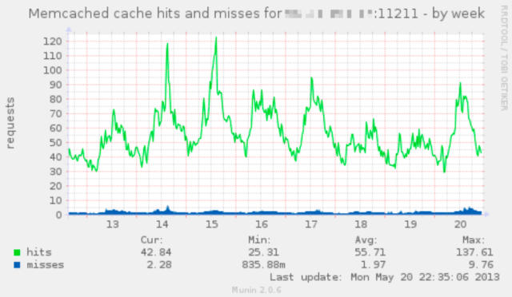

## Summary
Steven T. Wright traces [[LiveJournal]] from [[BradFitzpatrick]]'s dorm-room posting script into a ten-million-account blogging and social platform, then through acquisitions, policy disputes, user distrust, competitive change, and an eventual Russian-centered afterlife. The retrospective argues that LiveJournal anticipated many later social-network features and created unusually strong private and pseudonymous communities, but its founders, volunteers, owners, and power users never found a shared product identity or sustainable way to change the service. Its evidence comes mainly from former insiders looking back, so it explains plausible interacting causes rather than proving a single counterfactual path to survival.

## Key Claims
- LiveJournal grew through rapid, behavior-led invention: comments, profile images, moods, music, friend groups, mobile posting, audio posts, and a friends page arose from what early users and builders wanted to do.
- The service created meaningful communities across physical distance, including affinity groups that users described as socially or emotionally essential.
- Organic growth outpaced operational and managerial capacity; a small programming-heavy staff and volunteer support structure repeatedly handled infrastructure, policy, and prioritization without mature project management.
- Longstanding promises, personalized support expectations, and consultation norms hardened into [[CommunityGovernanceDebt]], making advertising, policy clarification, and product change feel like betrayal to power users.
- The 2006 “Nipplegate” dispute showed how literal rules and malicious reporting could force inconsistent outcomes when a platform lacked nuanced community standards and trusted enforcement judgment.
- LiveJournal anticipated many features of Facebook and Twitter, but its dense controls, private culture, unclear story, and fear of backlash kept it from adapting to the more public, feed-centered social-media model.
- Ownership changes compounded the mismatch: [[SixApart]] struggled to commercialize the platform, SUP Media acquired it in 2007, U.S. staff were laid off in 2009, and server relocation to Russia prompted some users to move to [[Dreamwidth]].
- Fitzpatrick created memcached for LiveJournal in 2003; the retained Ars chart is a later illustrative server graph, not LiveJournal performance data, and shows weekly cache hits mostly around 25–95 requests while misses remain near 0–10.

## Key Quotes
> "We were the Linux of social media." - former employee Abe Hassan on LiveJournal's power, configurability, and usability problem

> "There was no trust in either direction." - [[Dreamwidth]] co-founder Denise Paolucci on the antagonism between power users and product decision-makers

## Connections
- [[LiveJournal]] - the pioneering blogging and social platform whose rise and decline the article reconstructs.
- [[BradFitzpatrick]] - founder who built the original posting script and early feature set before selling Danga to [[SixApart]].
- [[SixApart]] - acquired LiveJournal in 2005 and struggled to reconcile commercial needs with inherited user promises.
- [[Dreamwidth]] - community-oriented LiveJournal fork founded by former volunteers and employees that received users after later ownership and data-location changes.
- [[CommunityGovernanceDebt]] - accumulated promises, precedents, and distrust constrained later policy and business-model choices.
- [[EmergentProductIdentity]] - LiveJournal's community-shaped identity and private social practices diverged from later owners' commercialization goals and the public-feed model.
- [[PlatformAbuseResponse]] - “Nipplegate” illustrates the limits of rigid rules when reports are strategic and context matters.
- [[Facebook]] - its news feed changed privacy expectations and public social consumption while LiveJournal hesitated to ship a similar feature.
- [[Twitter]] - a later public network whose short updates and feature set echoed capabilities LiveJournal had developed earlier.

## Contradictions
- The article complicates product advice that treats power-user consultation as unambiguously beneficial: LiveJournal's participatory expectations created belonging and accountability, but also made necessary change harder when trust and decision rights were unclear.
- The claim that LiveJournal had nearly every later social feature does not show that feature possession alone could have produced Facebook- or Twitter-like growth; product framing, defaults, usability, network structure, capital, timing, and business model remained different.
- The decline narrative is retrospective and interview-led. It offers credible mechanisms but no comparative data showing whether advertising, a news feed, stricter moderation, different acquisition governance, or continued independence would have preserved the platform.
