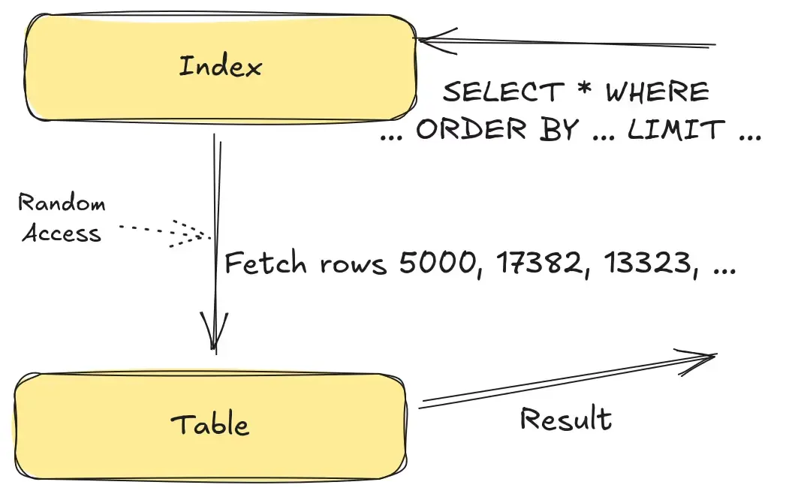
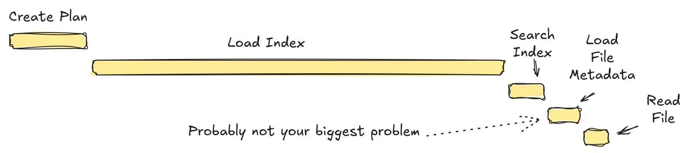
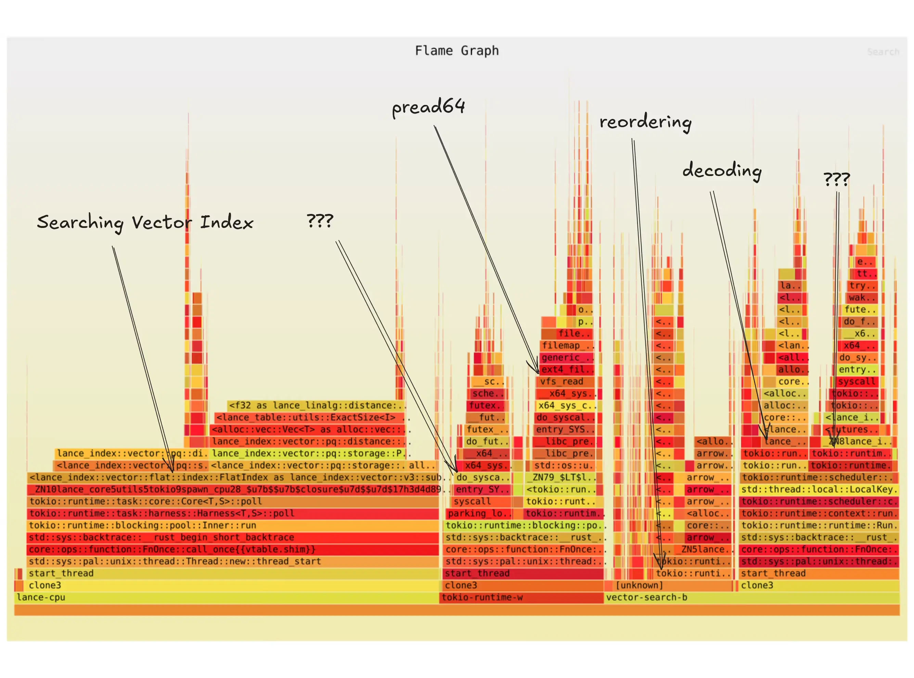
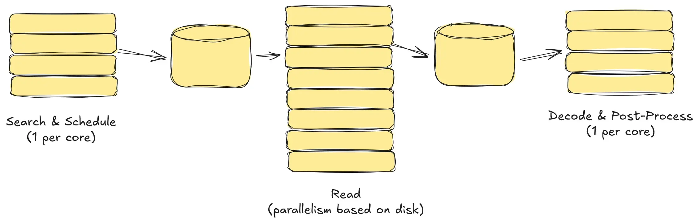
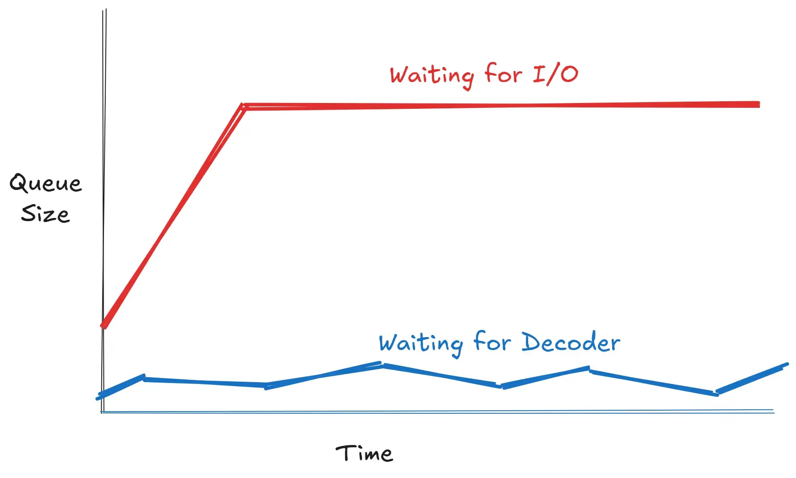
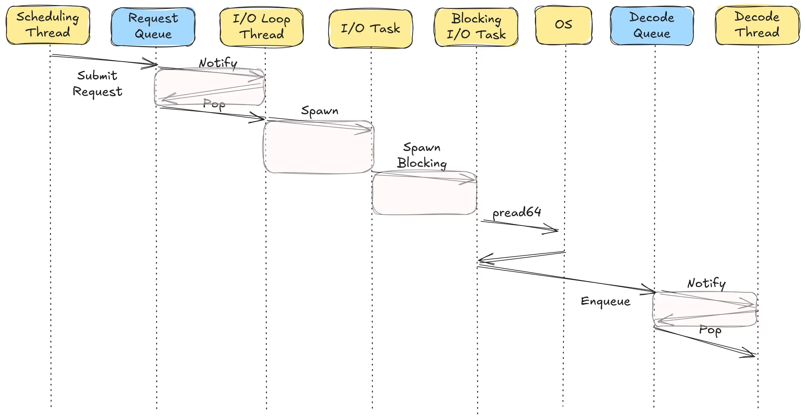
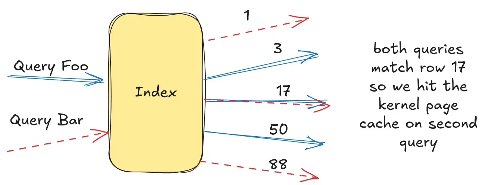
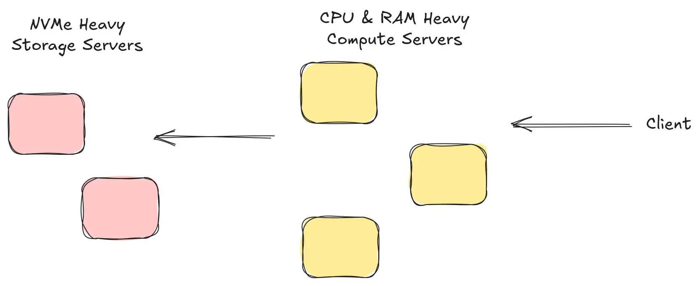

## Summary
[[LanceDB]] describes an end-to-end vector-search benchmark that turns a one-million-row-per-second target into 2,000 queries per second, each fetching 500 rows. The experiment argues that realistic [[StoragePerformanceBenchmarking]] must represent search workflows, hot metadata, both cached and uncached row data, batching, throughput, concurrency, and unique physical reads. On a 48-core AWS i8g.12xlarge with three NVMe drives, a lighter scheduler combined with per-thread `io_uring` reached a reported 3,800 queries per second and about 1.5 million measured read operations per second.

## Key Claims
- Random access in analytical storage is commonly a stage in search: an index returns row identifiers, then selected columns are fetched, decoded, and post-processed.

- A representative benchmark should keep index, table, and file metadata hot when that matches production, while separately testing row data with and without kernel-page-cache assistance.

- Throughput under multiple concurrent queries can expose synchronization and CPU-cache costs that single-operation latency misses; batching also amortizes scheduling and allocation overhead.
- The initial flame graph showed vector-index search as a major CPU cost and also exposed `pread64`, reordering, decoding, and runtime overhead.

- Instrumenting queues across search-and-schedule, read, and decode stages localized the principal bottleneck to the I/O pipeline: its input queue filled while the decoder queue stayed mostly empty.

- The original Tokio path fragmented each read across queues, runtime tasks, a blocking worker, one `pread64` call, and a decoder notification; reducing task boundaries made scheduler overhead materially smaller.

- A one-million-row dataset overstated physical IOPS because independent random queries often selected the same rows and the second access hit the page cache; increasing the dataset to ten million rows cut the apparent score from 2,100 to 950 queries per second before further optimization.

- `io_uring` alone did not improve the old scheduler, and the scheduler rework alone had limited effect; together, the per-thread design reportedly increased throughput from 600 to 3,800 queries per second and saturated three drives at about 1.5 million IOPS.
- The benchmark deliberately reduced `nprobes` from 20 to 1, sacrificing vector-search recall to isolate I/O; production high-recall search may require separating CPU-and-RAM-heavy query work from NVMe-heavy fetch work.

## Key Quotes
> "Single-read latency benchmarks are not a good proxy" - on evaluating random access as part of a concurrent end-to-end workflow.

> "Adding io_uring by itself didn't help performance at all." - on the interaction between kernel API and scheduler structure.

## Connections
- [[LanceDB]] - database and storage project whose scheduler, Lance format, and vector-search path were benchmarked.
- [[StoragePerformanceBenchmarking]] - workload-modeling and measurement discipline illustrated by the experiment.
- [[VectorDatabase]] - vector search supplies the end-to-end retrieval workload used to drive random row fetches.
- [[DatabaseEngineeringTradeoffs]] - hardware, concurrency, caching, recall, runtime design, and workload shape jointly determine performance.
- [[ApproximateNearestNeighborSearch]] - reducing `nprobes` isolates I/O but lowers recall.
- [[ServiceObservability]] - flame graphs, queue instrumentation, CPU counters, and `iostat` progressively localize and verify the bottleneck.
- [[AWS]] - the final test used an i8g.12xlarge with 48 logical cores and three local NVMe drives.

## Contradictions
- The claimed million-IOPS vector-search result is not a production-quality search result: `nprobes=1` intentionally reduces recall, and the article supplies no recall measurement for that run.
- Query throughput is not identical to physical IOPS. The experiment first inferred one million row fetches per second from 2,000 queries per second, then measured only about 600,000 IOPS because repeated rows hit the page cache.
- The final measurements are a first-party benchmark on one instance type, dataset shape, vector width, query mix, runtime, and unmerged implementation. They do not establish general superiority over other storage systems or predict cold, scan-heavy, cloud-object-storage, or CPU-heavy workloads.
