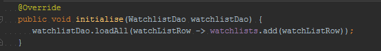
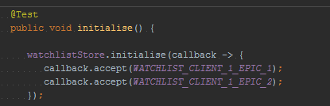
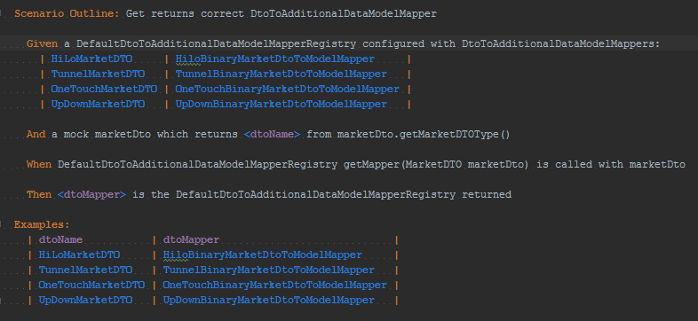
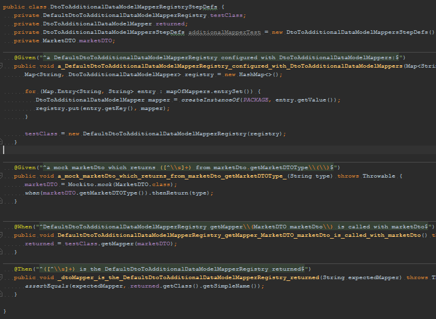
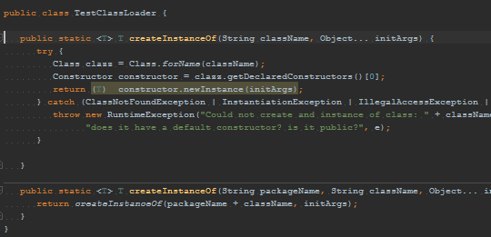
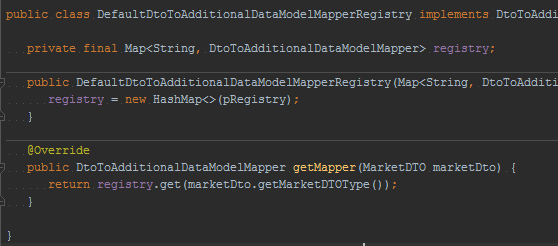

## Summary
[[DanLebrero]] argues that unit testing, TDD, BDD, Mockito, and Cucumber become counterproductive when teams apply them mechanically to satisfy universal rules rather than to gain useful confidence. Two code examples contrast trivial glue or map-lookup behavior with disproportionate test machinery, supporting [[ConfidenceBasedTesting]] while preserving a qualified role for pursuing 100% coverage once as an experiment in where the practice stops paying.

## Key Claims
- Obvious glue code with no branches, loops, or transformations may not warrant an isolated unit test when the check adds little confidence relative to its maintenance cost.
- A direct callback-based test can express the relevant behavior more simply than a mandated Mockito implementation.

- A Cucumber scenario, step definitions, mocking, reflection helper, and registry setup are excessive machinery for verifying a single map lookup.

- Blanket instructions to test every class or use one framework for every test can substitute rule compliance and tool mastery for judgment about behavior, risk, and cost.
- Tests that add little information still consume development time and create maintenance obligations for future developers.
- Practitioners may learn from enforcing 100% coverage and TDD on one project, but the lesson should be which tests are useful or counterproductive rather than that the extreme is a universal target.

## Key Quotes
> "You don't need to test that." - Lebrero's response to the first trivial glue-code example.

> "Stop and think." - the article's final rule for applying testing practices and tools.

## Connections
- [[DanLebrero]] - author and practitioner supplying both workplace examples and the qualified coverage argument.
- [[ConfidenceBasedTesting]] - the examples show why confidence gained should be weighed against implementation and maintenance cost.
- [[SoftwareVerification]] - broader verification remains valuable even when a particular unit test or framework adds little information.
- [[TestPyramid]] - the Cucumber example shows the cost of using high-level acceptance tooling for behavior that can be checked at a smaller boundary.
- [[InternalSoftwareQuality]] - low-information tests can become maintenance burden rather than durable protection for change.
- [[ExtremeProgramming]] - TDD is presented as a valuable practice whose benefits and costs still require judgment.

## Contradictions
- The article's rejection of 100% coverage as a standing target conflicts with [[notes-to-myself-on-software-engineering-featured-stories-medium]], which recommends full unit-test coverage as a practitioner heuristic. Neither source provides comparative defect, maintenance, or delivery outcomes that establish a universal threshold.
- The claim that obvious glue code need not be tested qualifies, rather than rejects, [[TestPyramid]]: fast unit tests remain useful when they cover meaningful behavior, but layer guidance alone does not prove that every class deserves a test.
