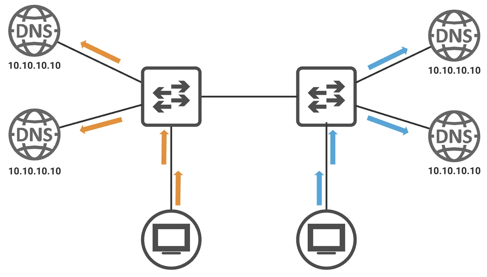

## Summary
[[TomBowles]] presents [[AnycastDNS]] as a way to expose multiple distributed DNS servers through one shared service address and let the routing system send each client to the best available instance. His [[Infoblox]] deployment reportedly simplified client configuration, shifted high availability and distribution away from inconsistent resolver behavior, enabled health-aware route withdrawal, and balanced requests more evenly. The retained diagram makes the topology concrete: two clients reach nearby servers through different routers while every server presents `10.10.10.10`; however, the article supplies no latency, convergence, availability, traffic-distribution, or attack-capacity measurements.

## Key Claims
- In a conventional multi-address DNS design, clients carry part of the high-availability and load-distribution policy, but operating systems may differ in how they order, retry, or limit configured resolvers.
- [[AnycastDNS]] lets multiple DNS servers advertise the same host route so network route selection sends a request toward the preferred instance without changing the client-visible address.
- One shared service address can simplify DHCP, static configuration, access-control lists, documentation, and migration compared with maintaining many resolver addresses.
- Health-aware route withdrawal can stop sending new requests to a DNS instance when its DNS process fails or is deliberately stopped for maintenance.
- Equal-cost multipath can distribute requests across eligible servers, although the source reports only that the prior four-server deployment was lopsided and provides no before-and-after counts.
- Geographic or topological distribution may localize some public-DNS attack traffic, but Anycast does not remove attack traffic or prove that an individual site has enough absorption capacity.
- The routing method is service-independent and can also front services such as NTP when their traffic and failure semantics fit the model.

## Key Quotes
> "The burden of HA and load balancing is placed directly on the client device." - on the conventional multi-resolver design problem.

> "Routing takes care of high availability and load balancing much better than client devices can." - the article's central operating claim.

## Connections
- [[TomBowles]] - practitioner-author describing his Anycast DNS adoption and reported operating experience.
- [[Infoblox]] - DNS platform used for the implementation and its service-health-aware routing behavior.
- [[AnycastDNS]] - the shared-address DNS architecture explained by the article.
- [[NetworkLoadBalancing]] - route selection and ECMP distribute requests without a client choosing among server addresses.
- [[ServiceHealthChecks]] - internal DNS-process health can govern whether a server continues advertising the service route.
- [[NetworkResilienceTradeoffs]] - route diversity and withdrawal improve some failure handling while adding routing-state and convergence dependencies.
- [[DDoSTrafficMonitoring]] - complements the article's mitigation claim by separating traffic observation and enforcement from Anycast distribution.

## Contradictions
- No direct contradiction was found. The article extends [[NetworkLoadBalancing]] with a route-based distribution model in which servers advertise one shared address rather than sitting behind a conventional forwarding load balancer.
- The source's DDoS statement is directionally compatible with distributed absorption, but it is not evidence that attacks affect only one site, migrate cleanly, or stay within site and backbone capacity.
