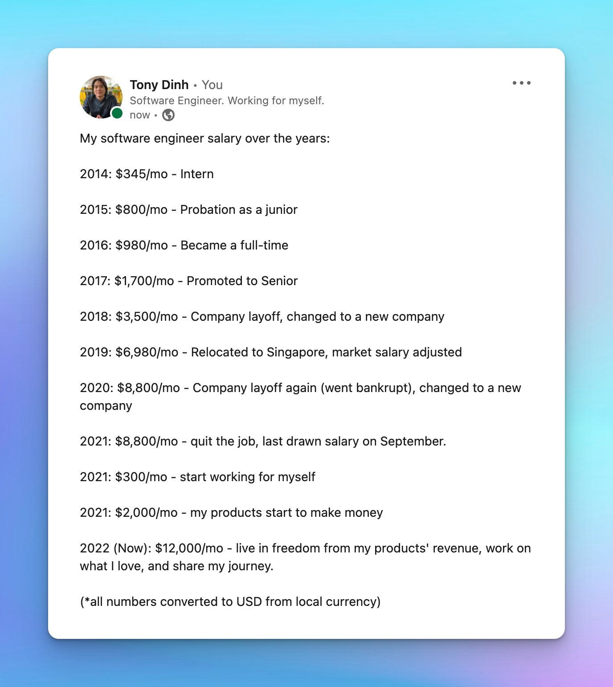
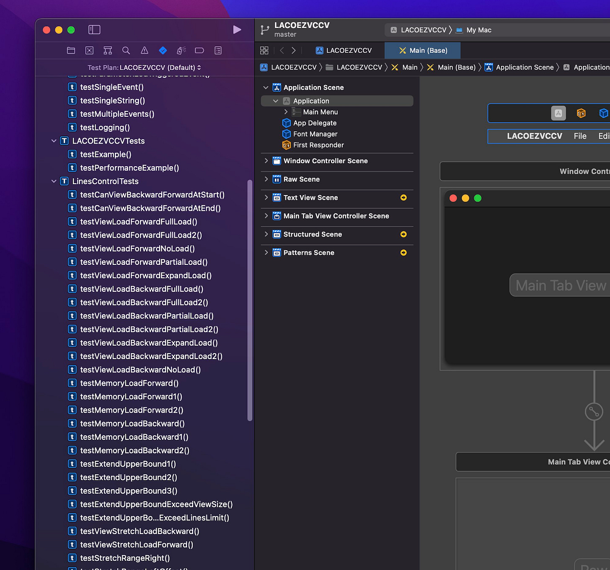
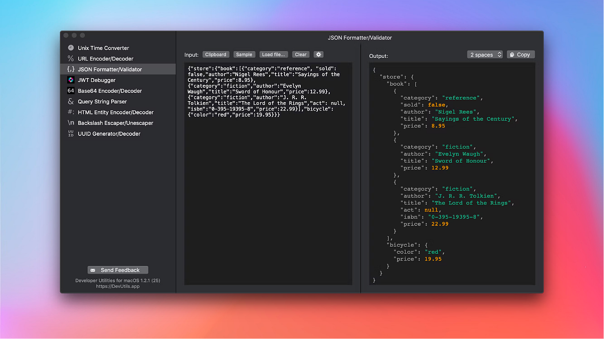
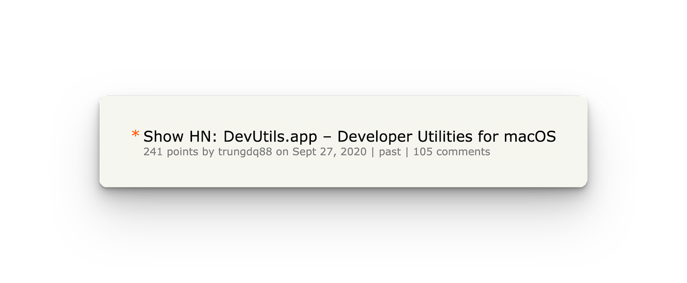
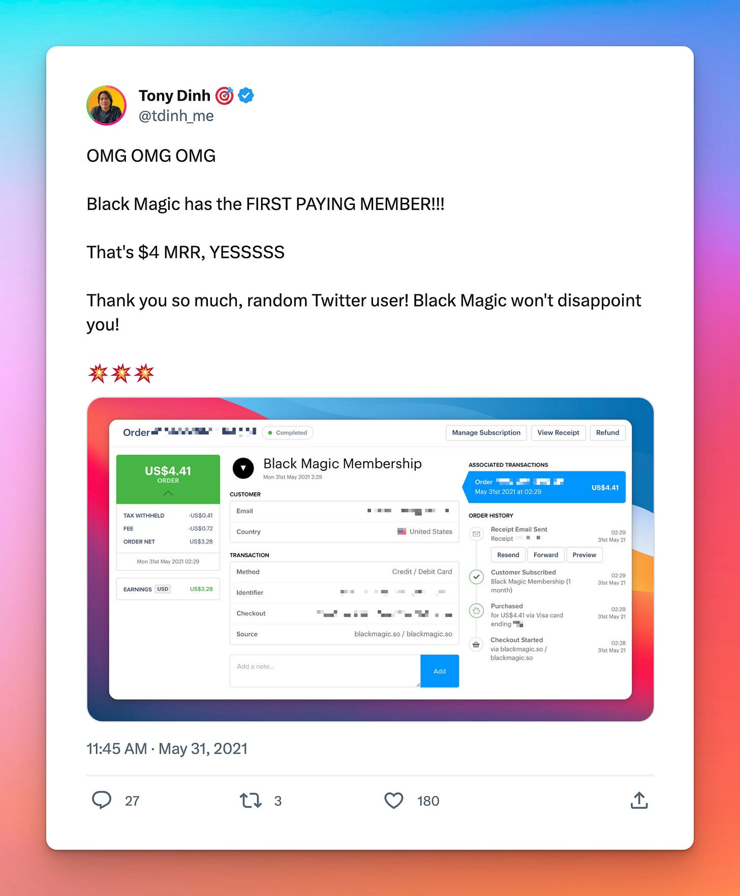
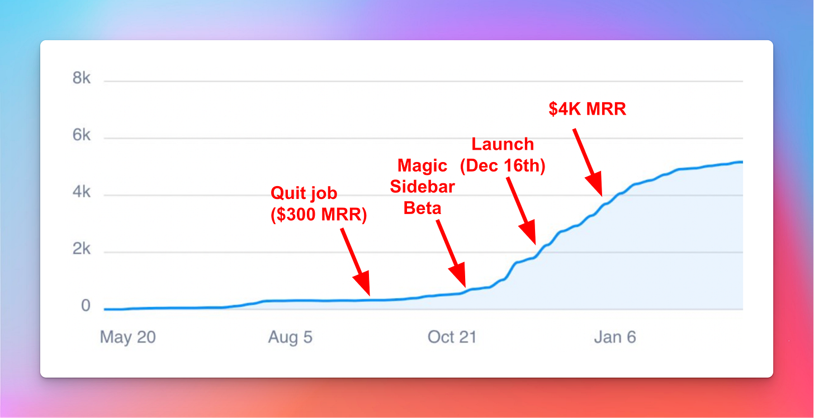
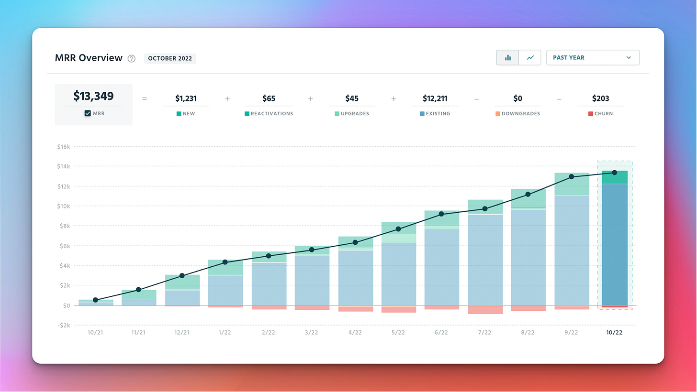
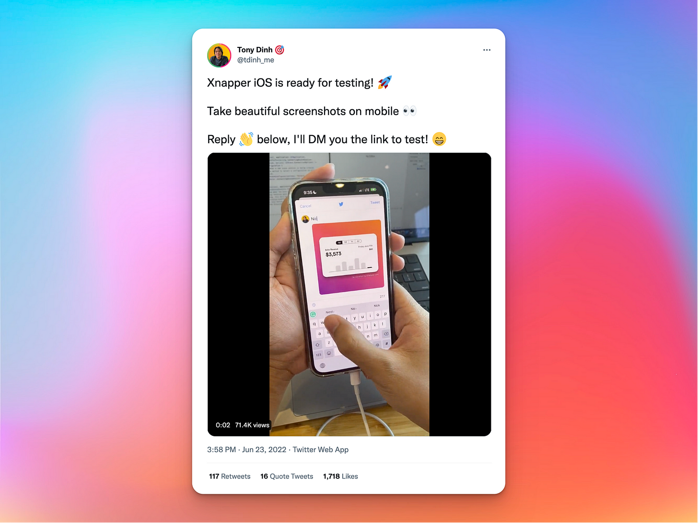
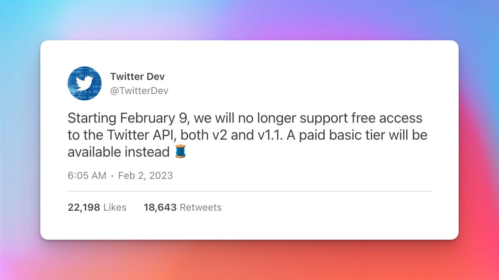
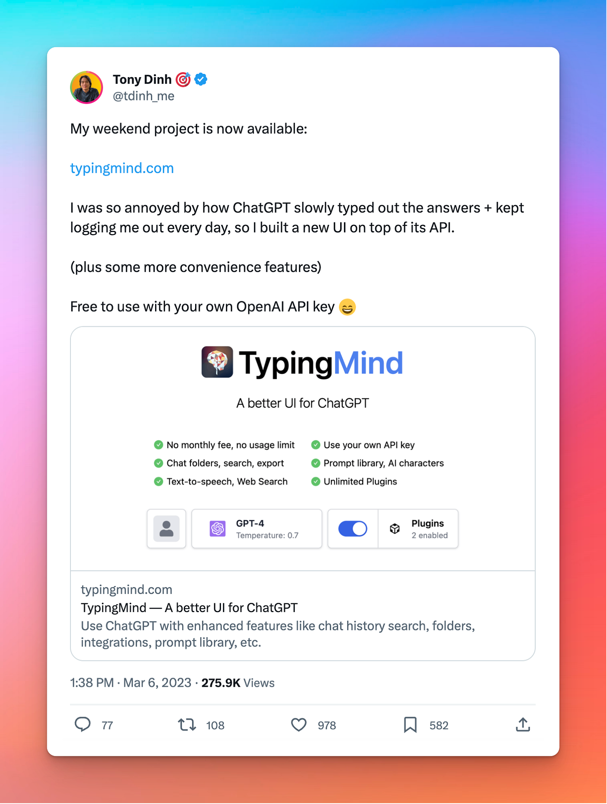

## Summary
[[TonyDinh]] recounts moving from seven years in software employment to a small-product business that he says reached about $45,000 in monthly revenue at roughly 90% profit within two years. The account links rapid shipping, public experiments, audience growth, customer-led pivots, and a portfolio spanning [[DevUtils]], [[BlackMagic]], [[Xnapper]], and [[TypingMind]], while also documenting platform dependency, overwork, loneliness, and the financial runway behind the transition. The retained screenshots materially establish the sequence of product experiments, public launches, revenue milestones, and the Twitter API policy change that forced the Black Magic exit.

## Key Claims
- Dinh's first six-month log-viewer project failed after he optimized architecture, features, UI, and test coverage before validating demand; he contrasts it with the first [[DevUtils]] version, built in about two weeks.

- Friends and coworkers supplied early product feedback, while a Hacker News launch produced DevUtils's first $9 sale and a Product Hunt launch produced another temporary traffic spike; these bursts did not create durable distribution on their own.

- Dinh says his Twitter audience grew when he stopped posting only product promotion and instead shared interesting coding experiments, engaged with others, wrote threads, and used humor; the audience later became a repeatable launch channel.
- [[BlackMagic]] began as a follower-count profile-ring experiment, gained its first $4 monthly subscriber, and changed from an engagement novelty into a painkiller after the Magic Sidebar exposed analytics and CRM value for large Twitter accounts.

- A multi-product portfolio let Dinh switch projects when bored, generate fresh public content, and reduce dependence on one revenue stream; the Xnapper iOS demo's 1,718 likes illustrates the audience-feedback loop but does not establish sales attribution.

- Platform dependency remained existential: after Twitter announced the end of free API access and Dinh says the usable tier was priced at $42,000 per month, he sold the $14,000-MRR Black Magic for $128,000.

- Dinh built and launched [[TypingMind]] within days of OpenAI's ChatGPT API release, reports $22,000 in first-week license revenue, and says the product averaged about $30,000 per month by the article date.

- The transition depended on two years of savings, a low-cost fallback in Vietnam, no dependents at the time, and existing generalist software skills; Dinh advises against quitting without stable revenue, substantial savings, and a backup plan.
- Dinh reports reducing his own work to about four hours per day and hiring one employee plus three freelancers, but identifies unstable markets, social isolation, and the cold-start burden as continuing costs of the model.

## Key Quotes
> "Ship early, ship small, ship frequently." - on building product-shipping capability through repeated releases.

> "Be patient and be prepared for luck." - on the limits of treating one successful path as a formula.

## Connections
- [[TonyDinh]] - author and solopreneur whose two-year retrospective supplies the case.
- [[DevUtils]] - first successful paid product and evidence that launch spikes need durable distribution.
- [[BlackMagic]] - recurring-revenue product that grew through a customer-value pivot and was sold after API pricing changed.
- [[Xnapper]] - third successful product, publicly tested against Dinh's audience.
- [[TypingMind]] - rapidly shipped ChatGPT client that became Dinh's primary revenue focus.
- [[BuildInPublic]] - public coding experiments, product demos, milestones, and customer response formed a feedback and distribution loop.
- [[SmallProductPortfolio]] - multiple products diversified income, supplied creative variety, and reduced single-product risk.
- [[PersonalBranding]] - Dinh's Twitter audience became a reusable but platform-dependent launch asset.
- [[BootstrappedSaaS]] - Black Magic illustrates recurring software revenue without outside funding, alongside platform concentration risk.
- [[PlatformDistributionDependence]] - Twitter supplied both audience access and the API dependency that threatened Black Magic.

## Contradictions
- The source qualifies strong-focus arguments in [[SmallProductPortfolio]] by reporting that switching among products reduced boredom and revenue concentration; it does not measure the opportunity cost or support burden against a single-product counterfactual.
- The story is a first-person survivor retrospective. Revenue, profit, hours, audience attribution, and sale figures are self-reported, and the account does not provide audited costs, churn, cohort retention, product-level margins, or failed-founder base rates.
- Dinh explicitly rejects treating his path as the only or best method; unusually broad technical skills, savings, low living costs, timing, public visibility, and luck constrain generalization.
