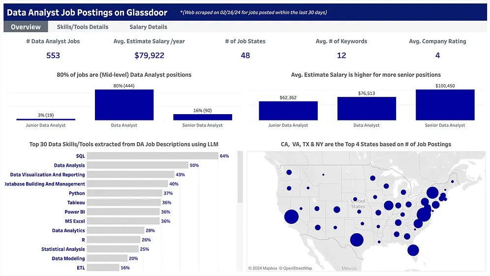
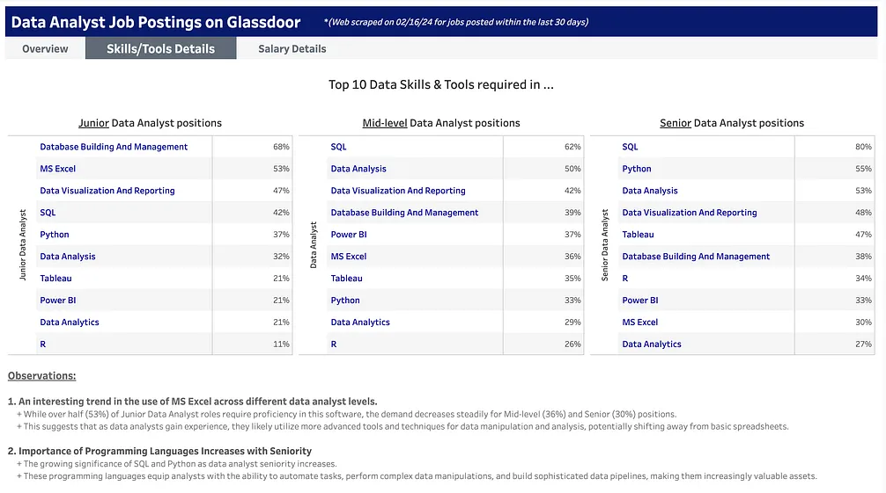

## Summary
[[TrucPhan]] presents a proof of concept that scrapes data-analyst listings from Glassdoor, cleans and filters them, asks [[Gemini]] to extract data-related skills into JSON-like lists, and visualizes the resulting dataset in Tableau. The retained dashboards report a 553-posting snapshot in which SQL appears in 64% of descriptions, the average extracted list contains 12 keywords, and skill prevalence and estimated salary vary by the author's job-title categories. The workflow demonstrates a bounded [[LLMStructuredExtraction]] use case, but it supplies no labeled extraction evaluation, scrape-completeness measure, or uncertainty around the market estimates.

## Key Claims
- Selenium automation collected company, title, description, location, salary estimate, and rating fields from Glassdoor listings, after repeatedly loading more results and dismissing login popups.
- Cleaning removed fully empty rows and duplicates, imputed categorical values as `Unknown` and numeric values with the mean, normalized salary and location fields, and narrowed titles through keyword rules.
- A task-specific prompt asked Gemini to extract data skills, tools, and programming languages; post-processing handled empty lists and malformed JSON before analysis.
- The overview dashboard identifies SQL (64%), data analysis (50%), data visualization and reporting (43%), and database building and management (40%) as the four most frequent extracted categories among 553 postings; the average description produced 12 keywords.
- The detailed dashboard reports SQL rising from 42% of junior listings to 62% of generic data-analyst listings and 80% of senior listings, while Python rises from 37% to 55% and Excel falls from 53% to 30% across the same title groups.
- The overview reports an average estimated annual salary of $79,922, with title-group averages of $62,362 for junior, $76,513 for generic data analyst, and $100,450 for senior listings.
- The dashboard is a time-bounded Glassdoor snapshot: it says the jobs were scraped on 2024-02-16 and posted within the preceding 30 days, with California, Virginia, Texas, and New York having the most listings.

## Key Quotes
> "We crafted a specific prompt instructing the LLM (Gemini) to identify and format data-related skills, tools, and programming languages from job descriptions." - on constraining the extraction task.

> "Our LLM, Gemini, successfully extracted an average of 12 data-related keywords from each job description." - the reported extraction volume, which is not an accuracy measure.

## Connections
- [[TrucPhan]] - author and practitioner who built the scraping, extraction, cleaning, and visualization workflow.
- [[LLMStructuredExtraction]] - Gemini converts unstructured job descriptions into skill lists for downstream aggregation.
- [[LLMDataAnalysis]] - the model performs a bounded transformation inside a larger deterministic analysis pipeline.
- [[Gemini]] - model accessed through an API to extract data-related skills, tools, and languages.
- [[Python]] - implementation environment for Selenium scraping, DataFrame cleaning, API calls, and dataset construction.
- [[LargeScaleWebScraping]] - the source illustrates browser-driven acquisition, although it does not document anti-bot resilience or coverage.

## Contradictions
- No labeled sample, precision, recall, taxonomy-consistency check, inter-rater comparison, model version, prompt text, or reproducible extraction audit is reported. An average of 12 keywords measures output volume, not correctness.
- The dashboard contains 553 postings from one platform and a 30-day collection window, so it cannot establish the broader or enduring US data-analyst market without coverage and representativeness evidence.
- The prose calls 80% of postings "mid-level" roles requiring three to five years of experience, while the overview chart labels that 80% group only as "Data Analyst" and separately groups junior and senior titles. The retained visual does not show an experience field supporting the stronger interpretation.
- Mean-imputing missing numeric values can compress salary variation, and title filtering plus keyword-based seniority categories can exclude relevant roles or misclassify them; the source reports no sensitivity analysis.
- The retained dashboards show percentages and averages but no raw per-skill counts, confidence intervals, missingness rates, salary-estimate provenance, or downloadable audit trail inside the archived article.
