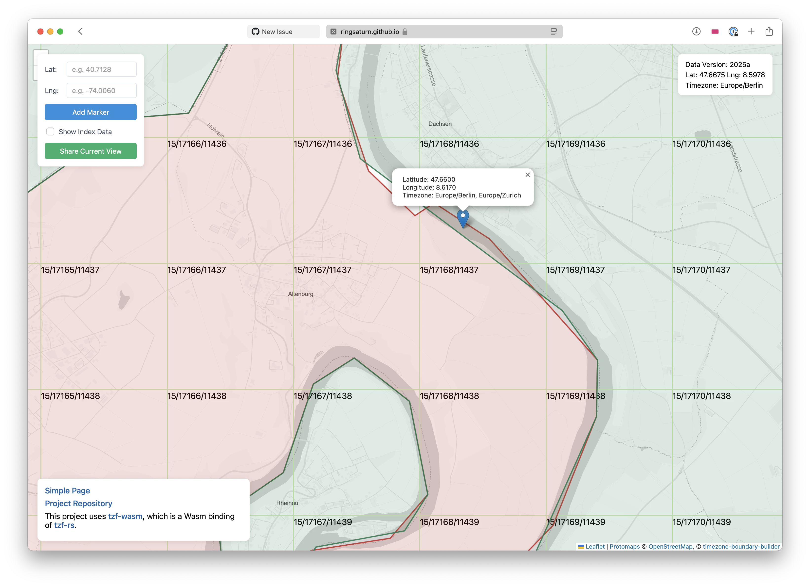
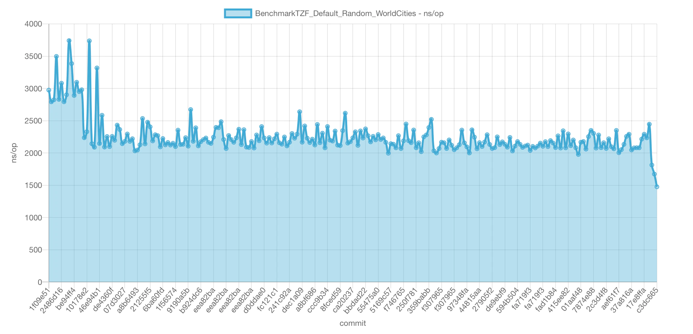
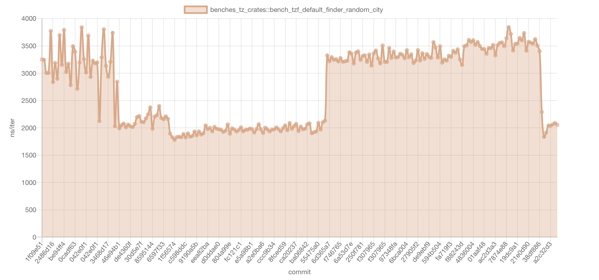
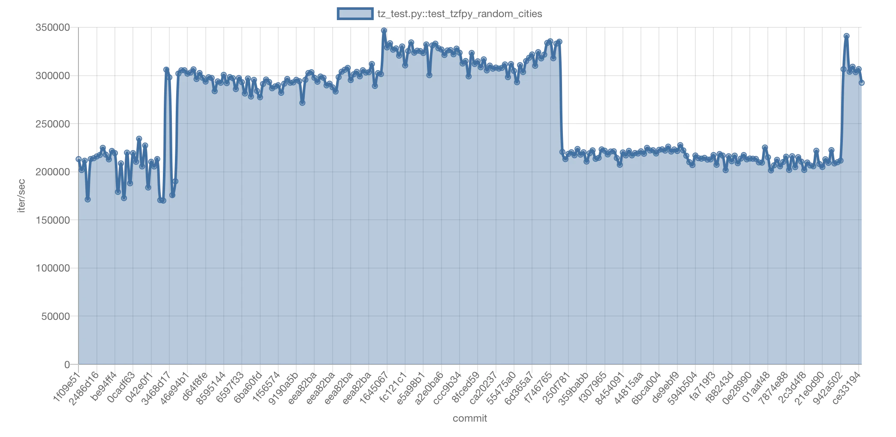

## Summary
[[Ringsaturn]] describes a 2026 update to [[Tzf]] that makes polygon simplification topology-aware, deduplicates and polyline-encodes shared boundaries, and adds YStripes plus a 1°×1° GridIndex to accelerate point-in-polygon lookup. The reported result is much smaller distributed data and microsecond-scale Go and Rust queries, bought with substantial memory use and supported only by first-party local and continuous benchmarks. The inspected visuals directly show the old gap/overlap defect, the reverse-directed shared-edge recognition workflow, and performance histories whose abrupt level changes require commit-level interpretation.

## Key Claims
- Independently applying [[RamerDouglasPeuckerAlgorithm]] to adjacent polygons can move their nominally shared boundaries differently, creating gaps and overlaps.
- [[TopologyAwarePolygonSimplification]] first identifies reverse-directed edge chains shared by different rings, simplifies the shared geometry once, and reuses it on both sides.
- Storing a shared boundary once and polyline-encoding it reportedly reduces the uncompressed full-precision dataset from about 90 MB to 17 MB and its zipped form from about 50 MB to 10 MB; the topology-simplified dataset is about 5.4 MB.
- Full precision still reportedly needs roughly 500 MB at runtime and is not planned for the Python binding, while the simplified data needs roughly 100 MB, making memory, speed, and boundary accuracy an explicit tradeoff.
- [[PointInPolygonIndexing]] uses YStripes to reduce line-segment traversal inside a polygon and GridIndex to reduce a fallback search across about 444 time zones to usually one to three candidates.
- On an Apple M3 Max, GridIndex reportedly improves the measured fallback scenarios by 2.0–3.9×, while YStripes raises Rust memory use but reduces the listed topology-simplified Finder median from 6.5402 µs without an index to 1.2296 µs.
- Go, Rust, Python, and Swift reuse the generated data, but version and release timing differ: the source says tzfpy GridIndex support awaits the next dataset release.

The defect screenshot places differing red and green simplified borders near latitude 47.66 and longitude 8.617, where the UI returns both `Europe/Berlin` and `Europe/Zurich`; it visually supports the topology failure rather than only naming it.

The workflow collects each ring's directed edges, canonicalizes an edge as the sorted endpoint pair, matches the same key in opposite directions, and marks it shared only when it appears in two different rings. The diagram also distinguishes an adjacent ring that shares only a vertex from a true shared boundary.

## Key Quotes
> "先识别共享边界，再对共享边界进行简化，最后把简化后的边界替换回两侧多边形。" - on preserving agreement between neighboring polygons.

> "内存占用、处理速度、数据精度需要一起权衡。" - on the system's explicit engineering tradeoff.

## Connections
- [[Tzf]] - the timezone lookup project family receiving the new data format and indexes.
- [[Ringsaturn]] - project maintainer and source author reporting the implementation and benchmarks.
- [[TopologyAwarePolygonSimplification]] - the shared-boundary method that prevents simplification-created seams.
- [[PointInPolygonIndexing]] - the layered YStripes and GridIndex acceleration strategy.
- [[RamerDouglasPeuckerAlgorithm]] - the earlier independently applied simplifier whose topology limitation motivates the change.

## Contradictions
- The source does not contradict the existing RDP trajectory example, but it materially qualifies it: visual shape preservation for one polyline does not guarantee coverage consistency when neighboring polygons are simplified independently.

## Benchmark Evidence

The Go series is mostly near 2,000–2,400 ns/op after noisier early measurements, with the last points falling toward roughly 1,500 ns/op.

The Rust history has distinct plateaus near 3,200, 2,000, 3,300–3,600, and again about 2,000 ns/iter rather than one monotonic improvement.

The Python history likewise moves between broad plateaus near 200,000–225,000 and 290,000–335,000 iter/sec. None of the three charts labels releases or experimental changes, so they document regressions and improvements over commits but do not by themselves attribute them to topology, YStripes, or GridIndex.
