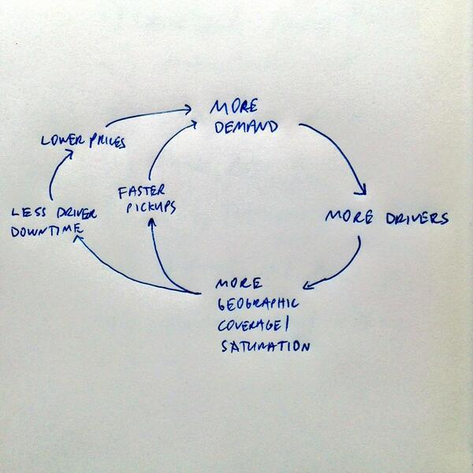
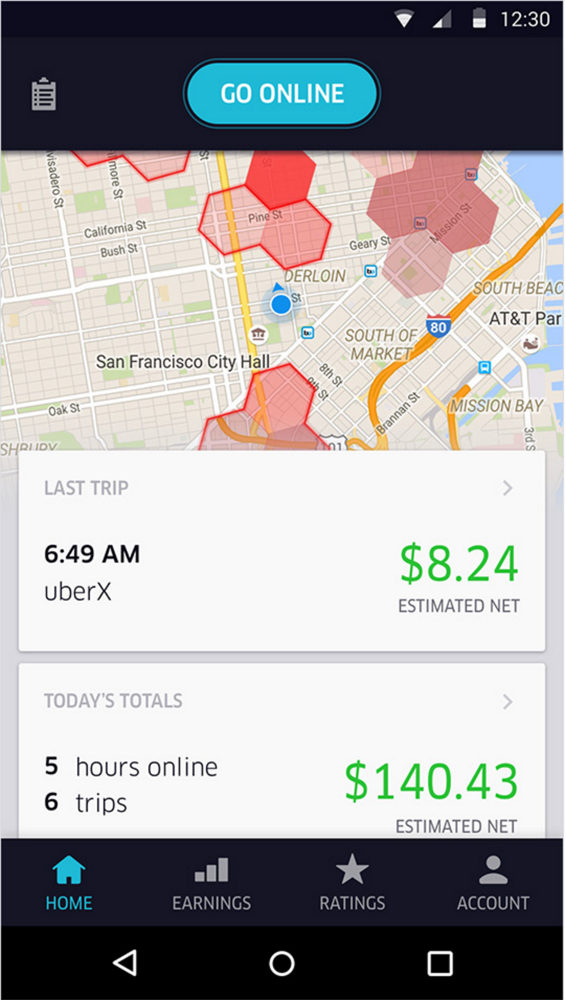
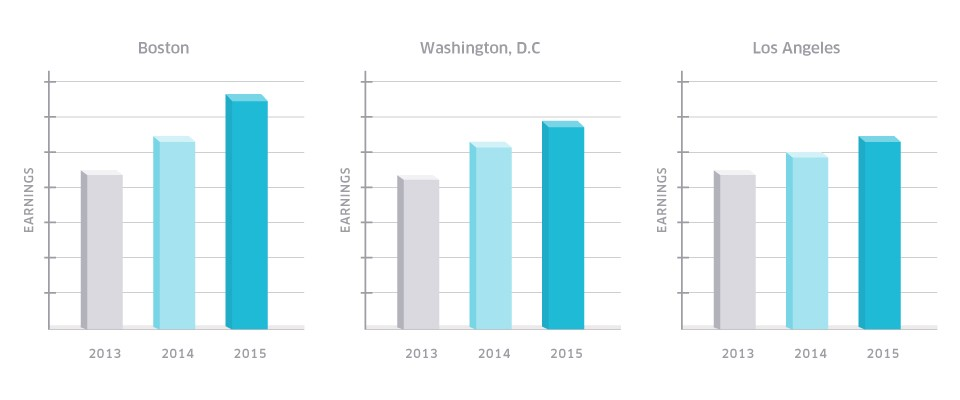

## Summary
[[AndrewChen]] presents [[Uber]] not as one global market but as hundreds of hyperlocal, two-sided rider-driver markets whose liquidity improves through shorter pickup times, wider coverage, and higher driver utilization. The article argues that driver acquisition, surge pricing, and fare cuts can reinforce this [[MarketplaceLiquidity]] flywheel, while its first-party and directional evidence does not establish sustainable driver earnings, causal effects, or profitable [[SubsidizedUnitEconomics]].

## Key Claims
- Uber's rider experience may feel like one product, but operationally it is a collection of local markets that must match supply and demand in the same place and time.
- The attributed [[BillGurley]] model links greater local participation to shorter pickup times, wider service coverage, and more paid trips per driver-hour.
- David Sacks's flywheel adds a proposed price loop: denser demand and supply produce faster pickups and less driver downtime, which can support lower prices and more demand.

- Drivers are the constrained supply side in this account; the article reports 1.1 million active drivers globally, more than 400,000 in the United States taking at least four monthly trips, and only about 40% still active one year after their first trip.
- Hyperlocal surge pricing is presented as a balancing mechanism that directs drivers toward high-demand areas, rather than only as a higher rider price.

- Fare cuts are presented as the reverse balancing mechanism: lower rider prices can increase trip demand and driver utilization, provided more trips per hour outweigh lower earnings per trip.
- Uber's published charts show directionally rising driver earnings in Boston, Washington, D.C., and Los Angeles from 2013 to 2015, but omit numeric axes and do not isolate the effect of fare cuts, guarantees, market growth, or selection.

## Key Quotes
> "a vast collection of hundreds of hyperlocal marketplaces" - Chen's operational description of Uber.

> "more demand and more supply make the economical traveling-salesman type problem easier to solve" - the article's utilization mechanism.

## Connections
- [[AndrewChen]] - author interpreting lessons from his driver-growth role at Uber.
- [[Uber]] - company whose local rider-driver markets supply the case.
- [[BillGurley]] - credited with pickup time, coverage density, and utilization as the three network-effect mechanisms.
- [[MarketplaceLiquidity]] - the article's central reinforcing supply-demand mechanism.
- [[MarketplaceColdStart]] - each city must first achieve enough local supply and demand before the flywheel can strengthen.
- [[MarketplaceTrust]] - complements liquidity by helping unfamiliar riders and drivers transact once a match exists.
- [[SubsidizedUnitEconomics]] - qualifies the claim that fare cuts and scale necessarily produce durable economic value.

## Contradictions
- The article's optimistic claim that lower fares can raise driver earnings through utilization conflicts with [[can-uber-ever-deliver-part-one-understanding-ubers-bleak-operating-economics-naked-capitalism]], which attributes Uber's 2012-2016 economics to investor subsidy and driver-pay compression. The sources measure different things and neither isolates a durable causal effect.
- The driver, earnings, and labor statistics are quoted from Uber-affiliated or cited secondary material rather than independently established in this article. “Active” includes drivers completing at least four monthly trips, and the reported one-year retention figure indicates substantial supply churn.
- Surge can recruit supply to a high-demand area, but the source itself acknowledges legitimate cases for disabling it and does not evaluate rider welfare, emergency conditions, driver repositioning costs, gaming, equity, regulation, or alternative allocation rules.
- The earnings chart has no numeric y-axis, sample definition, uncertainty, inflation adjustment, hours denominator, or counterfactual. It supports only the visual statement that the displayed bars rise over time.

## Image Notes
The valid local flywheel image was opened and retained. The second local `.jpg` embed was actually unrelated Snapinsta HTML and could not be interpreted as image evidence; the canonical article page was therefore checked, and its driver-app surge map and earnings chart were recovered, opened, and retained at their semantic positions under descriptive filenames.
