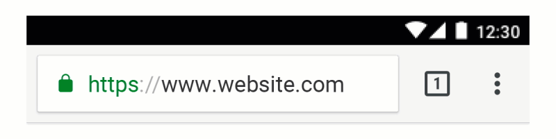
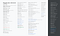
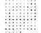
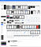
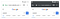
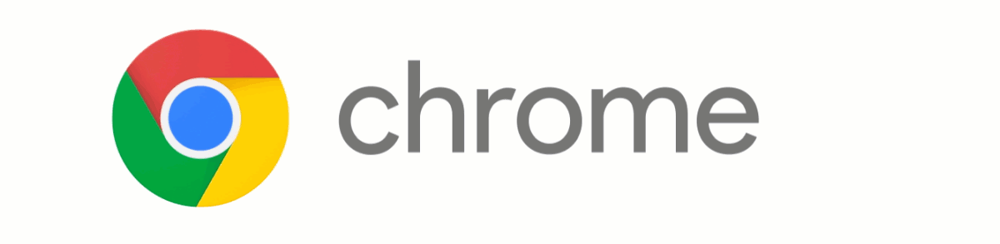
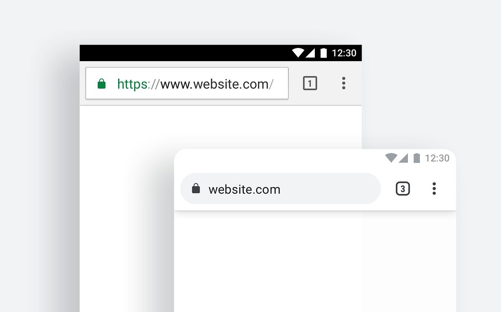

## Summary
[[HannahLee]]'s first-person account of [[Chrome]]'s 2018 mobile redesign argues that a seemingly simple omnibox was a system with thousands of platform, language, density, color, accessibility, and interaction permutations. The team audited years of design and engineering debt, reduced 95 greys to eight, classified hundreds of icon states, built a code-grounded component sticker sheet, and used a stable rounded omnibox to reduce visual change while expressing Chrome's brand. The retained images make the inventory, state transitions, touch-target tradeoffs, divergent concepts, and final light/dark result visible.

## Key Claims
- Chrome's original omnibox joined address and search entry to reduce cognitive overhead, while the later redesign questioned whether an almost invisible browser could remain distinctive and trustworthy when deceptive third parties imitated it.
- Supporting more than six Android versions, 40 languages, font fallback, arbitrary toolbar colors, accessibility contrast, pixel densities, device capacities, and manufacturers produced more than 2,000 static omnibox permutations and more than 20,000 when interaction was included.

- A code-level audit found hundreds of text variants, including more than 95 greys; contextual review over roughly half a year reduced the required palette to eight rather than mechanically replacing colors.

- The icon audit covered 115 base icons and more than 400 variants once selected, pressed, disabled, and right-to-left states were included.

- A lasting redesign required process and system changes: engineers and designers built shared components from the code library and represented them in Chrome's first sticker sheet.

- Keeping surfaces stable across toolbar states reduced the visual changes users had to notice and remember; subtracting text, icons, color, and shadow exposed which pixels contributed structural noise.

- Touch geometry and visual rhythm could conflict: enlarging the narrow three-dot menu's target improved tappability but created uneven spacing, so the team departed slightly from the Material specification.

- The final rounded shape emerged after many alternatives failed across white pages, Incognito mode, icon weight, engineering cost, and brand meaning.

- The pill-shaped omnibox echoed Chrome's circular geometry and a fingertip, reduced transition-animation complexity through shape consistency, and was rated in reported user studies as friendlier, more innovative, and more intelligent without losing perceived speed or trustworthiness.

## Key Quotes
> "to protect the sacred space between the user and the content - not to seek attention." - Lee's original view of Chrome's restrained interface role.

> "We removed every pixel of visual noise" - on treating perceptual processing speed as a redesign objective.

> "It was literally the shape of our brand." - on the rounded form chosen for the omnibox.

## Connections
- [[HannahLee]] - author and Chrome designer describing the redesign.
- [[Chrome]] - browser and mobile interface whose 2018 redesign is the subject.
- [[ProductRedesign]] - the case moved from a visible refresh to inventory, process, component, and interaction work.
- [[DesignOperations]] - a code-grounded component library and sticker sheet linked design specifications to implementation.
- [[CognitiveOverheadInProductDesign]] - stable geometry and removal of visual noise were intended to reduce moment-to-moment processing.
- [[MaterialDesign]] - supplied components and specifications that Chrome sometimes had to customize for its permutation and touch-target constraints.
- [[Google]] - company and brand context for Chrome's colors, standards, and engineering collaboration.

## Contradictions
- No direct contradiction was found. The source qualifies “content, not chrome” by arguing that invisibility can conflict with security, distinctiveness, discoverability, and trust.
- The reported permutation counts, palette reduction, size improvements, and user-study judgments come from a first-party retrospective without underlying inventories, study design, sample details, effect sizes, or independently verified outcomes.
- The image capture includes low-resolution thumbnails and animated GIFs. Every effective local image was opened; duplicates, logos used only as decoration, historical illustrations already restated in prose, and redundant tiny interface snapshots were omitted, while 18 evidence-bearing images were retained once each.
