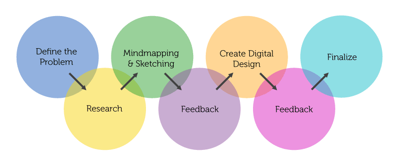
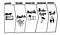

## Summary
[[JonathanCourtney]] argues from [[AJSmart]]'s consulting experience that lengthy research before making anything can become product procrastination, because the most actionable evidence often arrives only when people use a realistic prototype. He presents [[DesignSprint]] as a faster path from explicit assumptions to a high-fidelity prototype and behavioral testing, while preserving up-front research for ambiguous, consequential problem spaces such as hospital emergency-room redesign.

## Key Claims
- Two to four weeks of interviews, personas, empathy maps, and documentation can delay the harder decision to make and expose a concrete product hypothesis.
- In AJ&Smart's projects, the first user tests produced more actionable evidence than the preceding research artifacts, which often stopped influencing the work.
- A five-day Design Sprint can replace a six-to-eight-week design package when the problem is sufficiently bounded, even if the team begins without a brief, benchmarking, or prior research.
- Both research-first and prototype-first processes begin with assumptions; realistic use reveals what customers understand, value, or reject.
- Up-front research remains appropriate when the team does not yet understand which problem it should solve or when the context demands deeper discovery.

The conventional process diagram places research before sketching and digital design, with feedback loops arriving only after intermediate artifacts. Courtney's alternative compresses the route to behavioral evidence by making a realistic prototype earlier.

## Key Quotes
> "the useful data came from the first user tests, not the research." — on the consulting pattern that led AJ&Smart to change its process.

> "in both cases we are just making assumptions." — on why research documents do not remove the need to test a product hypothesis behaviorally.

## Connections
- [[JonathanCourtney]] — author and AJ&Smart founding partner describing the firm's process change.
- [[AJSmart]] — consultancy whose research-heavy package was replaced by Design Sprints.
- [[JakeKnapp]] — practitioner whose writing introduced Courtney to the GV Design Sprint process.
- [[GV]] — organization credited with developing the Design Sprint approach discussed in the article.
- [[DesignSprint]] — bounded process for moving rapidly from assumptions to a realistic prototype and user test.
- [[PrototypeFirstProductDiscovery]] — the article's broader claim that tangible interaction can produce useful evidence sooner than extensive documentation.
- [[UserTesting]] — the behavioral evidence Courtney values over personas and research artifacts.
- [[UserResearchPatternThreshold]] — contrasting guidance that recommends substantial interviews early in product development.

## Contradictions
- Contrasts with [[7-ways-to-use-the-rule-of-threes-to-build-great-products]] on research timing: that source recommends heavy interviews at the beginning of product development, while Courtney treats intensive up-front research as wasteful for most bounded product work.
- Qualifies [[usability-101-introduction-to-usability]], which includes field research before design as part of an iterative usability lifecycle; both sources agree on early repeated prototype testing, but they assign different default value to discovery before a tangible design exists.
