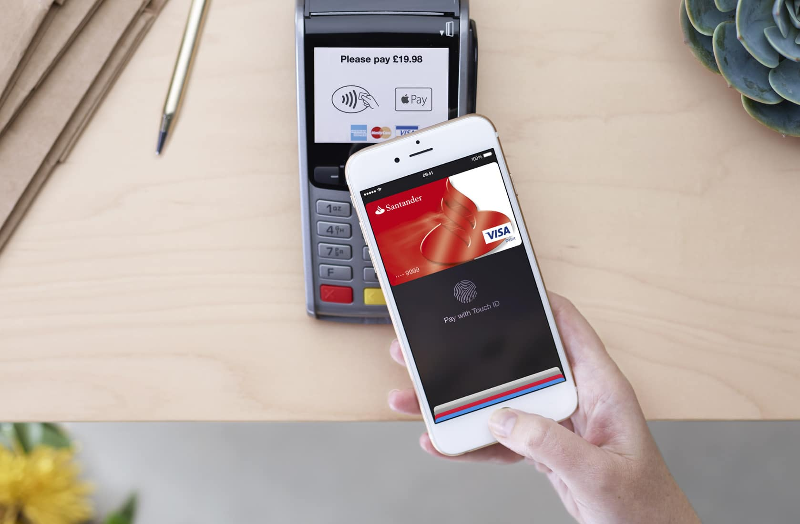
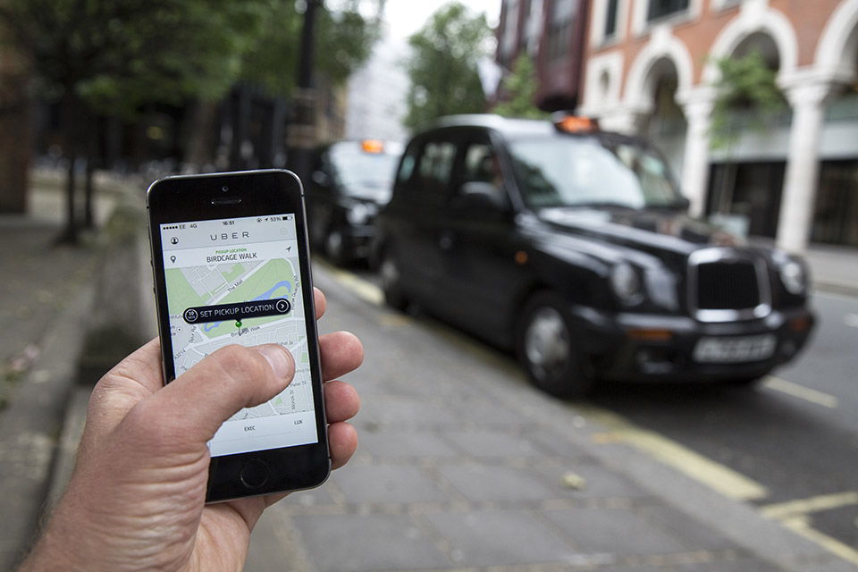

## Summary
This design essay argues that people approach websites and apps as tools for accomplishing outside goals, not as destinations deserving attention for their own sake. It presents ease and short task completion as competitive advantages, using Apple Pay in the contactless-card UK market and [[Uber]]'s ride flow to show that relative effort matters more than novelty or branding. Its strongest prescription is [[UtilityOrientedUX]]: minimize the burden and duration of the interaction instead of maximizing engagement by default.

## Key Claims
- Users generally choose the option that reaches their goal with the least perceived effort, although price can sometimes outweigh ease.
- People usually care about the result enabled by a website or app rather than the interface itself.
- A technically novel interaction loses when it requires more steps than an already-familiar alternative, as the source argues for Apple Pay versus UK contactless cards.
- [[Uber]] gained an experience advantage by combining ride request, dispatch, payment, tipping, and receipts into a short flow.
- Simpler experiences can displace established competitors even without superior branding because they reduce the user's total task burden.
- Product teams overestimate how much attention customers will give their offering because insiders spend far more time thinking about it than customers do.
- Digital products should often behave like utilities: minimize time and effort required to finish the user's task rather than maximizing engagement as an end in itself.

The Apple Pay photograph shows a phone using Touch ID beside a UK contactless terminal that also accepts cards. It supports the article's comparison between two payment paths but does not establish which one users prefer or how adoption later developed.

The Uber photograph shows the app's map and pickup-location action in the same street setting as a conventional taxi, visually grounding the source's comparison of app-mediated and traditional ride acquisition.

## Key Quotes
> "They are tools for a goal." - on why users enter digital products.

> "Instead of trying to maximise your engagement with users, minimise it!" - on treating task completion rather than attention as the design objective.

## Connections
- [[UtilityOrientedUX]] - captures the essay's central prescription to optimize for completion of the user's outside goal.
- [[ProductFlowFriction]] - extra actions consume user effort and can make a novel path worse than an established alternative.
- [[Usability]] - ease, efficiency, and task completion are presented as sources of competitive advantage.
- [[CognitiveOverheadInProductDesign]] - the essay's low-effort rule is qualified by evidence elsewhere that some visible action can improve comprehension and trust.
- [[Uber]] - principal positive example of consolidating ride acquisition and transaction work into a simpler flow.
- [[ProductEngagementLadder]] - provides a counterpoint: deeper engagement is useful when it develops optional skill after first value rather than delaying the initial goal.

## Contradictions
- The categorical claim that users “always” choose the easiest option conflicts with [[CognitiveOverheadInProductDesign]], where an extra button, familiar checkpoint, or visible delay can reduce total mental burden and increase trust. The more defensible synthesis is to minimize total user effort while preserving steps that create necessary control, comprehension, safety, or value.
- The article's Apple Pay and market-displacement examples are historical practitioner assertions without adoption data, controlled comparisons, or a publication date in the captured file; they should not be treated as current market measurements or universal causal proof.
