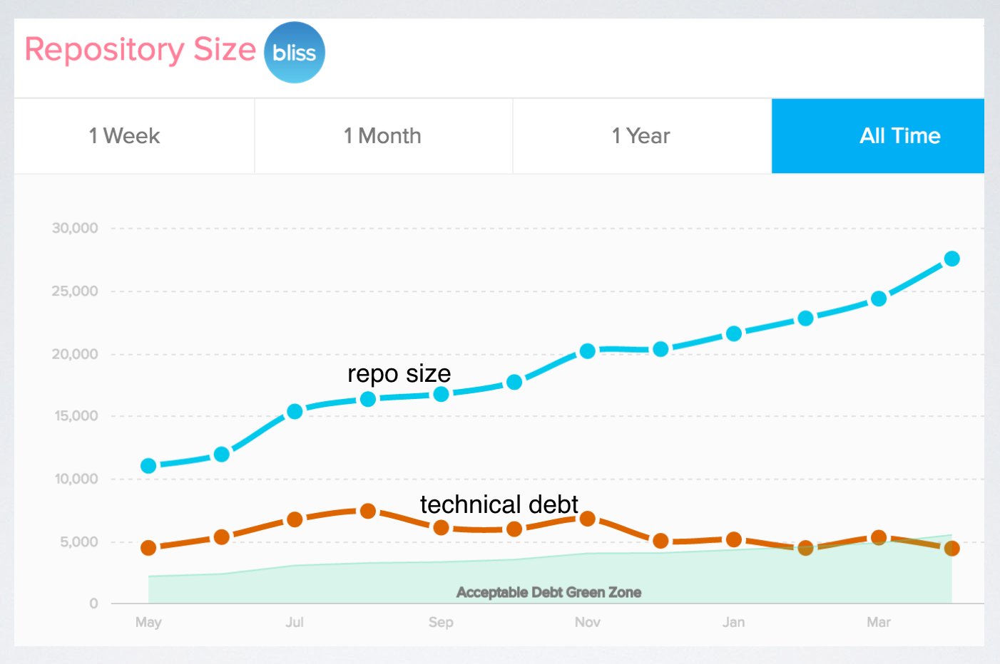

## Summary
Brian York uses Bliss's repository history to argue that codebase size and technical-debt trends can preserve a narrative of a startup's changing priorities. Bliss consciously accepted more debt while testing whether it could win paying customers, shipped less during fundraising, and then used new capital and engineering hires to grow the codebase while bringing debt into a range the team considered sustainable. The article treats debt as a managed tradeoff rather than something that can or should be eliminated, but its 20% target and chart are a founder's account rather than a general benchmark.

## Key Claims
- Tracking repository size beside technical debt can reveal product, fundraising, hiring, and maintenance phases in a startup's history.
- Early-stage teams may rationally accept debt when fast feature delivery is needed to test customer demand and growth.
- Bliss's code output flattened while its founders were fundraising, illustrating how company activity can appear in repository trends.
- Before adding developers, the founders judged the existing debt level unsustainable and wanted a more consistent codebase that new hires could enter quickly.
- After hiring two engineers, Bliss increased repository size while holding debt near what the team called an acceptable zone.
- Technical debt cannot realistically be reduced to zero; the practical goal is a level stakeholders can tolerate without imposing excessive future refactoring cost.

## Key Quotes
> "No company ever gets to 0% technical debt." - York rejects perfection as an efficient maintenance target.

> "Does your technical debt tell a story?" - the article's invitation to interpret debt longitudinally.

## Connections
- [[BrianYork]] - author and Bliss co-founder narrating the company's codebase history.
- [[Bliss]] - startup whose repository and debt trends provide the case study.
- [[TechnicalDebtTracking]] - the practice of measuring debt over time and interpreting it in business context.
- [[ProductMarketFit]] - early customer and growth validation was prioritized over a fully polished codebase.
- [[StartupScaling]] - capital, hiring, and a larger engineering team changed the company's preferred debt posture.
- [[StartupHiringAtScale]] - codebase consistency was treated as preparation for onboarding new developers.

The chart shows repository size rising from roughly 11,000 to 27,500 units across May to April. Technical debt rises from about 4,500 to a summer peak near 7,500, declines and briefly rises again around November, then finishes near 4,500 as the chart's expanding acceptable-debt zone reaches roughly 5,500. It has no explicit y-axis unit for either series, and the green zone is presented as Bliss's own tolerance rather than an external standard.

The stage image supplies the recognizable "move fast and break things" startup philosophy behind the early tradeoff, while the article's later phase adds the constraint that speed must eventually be balanced with maintainability and team growth.

## Contradictions
- No direct contradiction identified. The article broadens [[TechnicalDebtTracking]] from recording individual liabilities to monitoring aggregate trends, while its 20% figure remains a Bliss-specific comfort level rather than a universal threshold.
