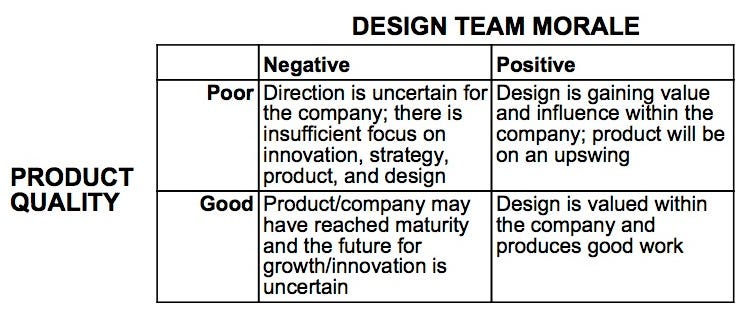

## Summary
[[IreneAu]] argues that current product quality is a lagging signal of a company's relationship with design, while design-team morale can reveal whether future work is likely to improve or deteriorate. Her [[DesignHealthIndicators]] matrix combines the two signals to distinguish unclear or underpowered organizations, hopeful turnarounds, mature but stagnating or overloaded teams, and healthy teams facing scale challenges. The essay advises designers to choose the challenge that fits them and asks CEOs to diagnose vision, authority, staffing, process, craft, iteration, and decision rights rather than judging design only by shipped interfaces.

## Key Claims
- Design-team morale is a leading indicator of design health because it reflects whether designers believe they have the direction, authority, capacity, and process needed to improve future products.
- Product quality is a lagging indicator because it embodies earlier strategy, scope, decisions, process, talent, and implementation across the organization.
- Negative morale plus poor quality points toward unclear vision, weak empowerment, and insufficient process; leadership should clarify direction and give design a close role in shaping it.
- Positive morale plus poor quality can indicate a pivot or recovery in progress, making the company a potentially high-leverage opportunity despite weak current output.
- Negative morale plus good quality can warn that a mature product is masking stagnation, uncertain growth, or designers spread too thin across internal demand.
- Positive morale plus good quality shifts the problem toward scaling coherence through principles, style guidance, reusable infrastructure, and cross-functional support.
- Designers evaluating employers should assess morale and product quality together, then decide whether the implied organizational challenge fits their temperament and desired work.
- CEOs should investigate designer pride, skill coverage, implementation fidelity, leadership status, capacity, craft standards, iteration, talent attraction, and decision-making rules.

## Key Quotes
> "Design team morale is a leading indicator for a company's design health." - on morale as an anticipatory signal.

> "Product quality is a lagging indicator for a company's design health" - on shipped work reflecting accumulated organizational choices.

## Connections
- [[IreneAu]] - author framing design-team morale as an organizational diagnostic.
- [[DesignHealthIndicators]] - paired morale-and-quality matrix developed by the essay.
- [[ProductLeadership]] - clear vision, executive alignment, and design influence are proposed as turnaround conditions.
- [[ModernProductTeamDesign]] - empowerment, capacity, process, and sustainable working conditions shape what teams can produce.
- [[DesignOperations]] - principles, style guides, reusable infrastructure, and process codification support coherence at scale.
- [[ProductDesignCareerLadder]] - designers are encouraged to evaluate the organizational challenge and growth environment behind a role, not only current product polish.

## Contradictions
- The matrix is a practitioner diagnostic, not validated evidence that morale predicts later product quality or that each quadrant has the causes the essay proposes.
- Morale can also be a lagging response to prior leadership and working conditions, while current product quality can sometimes reveal immediate defects; the leading-versus-lagging distinction is useful but not exclusive.
- A company-wide two-axis classification can hide differences among teams, products, roles, and employee groups, and reported morale may be shaped by survey design, fear, expectations, compensation, workload, or recent events.
