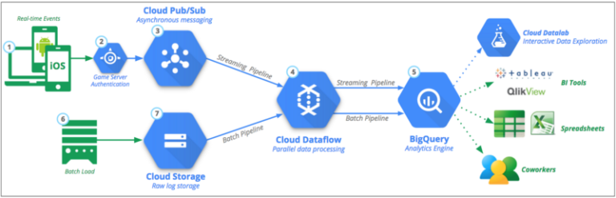
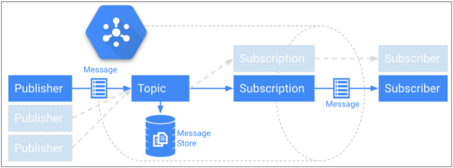
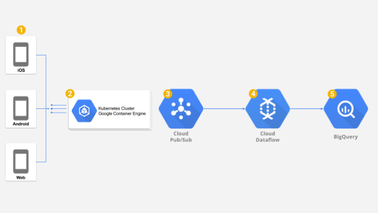
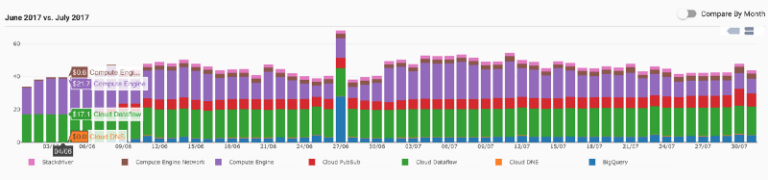

## Summary
[[VadimSolovey]] describes how [[DoiTInternational]] and [[JellyButtonGames]] replaced [[Mixpanel]] with a custom [[EventAnalyticsPipeline]] on Google Cloud for the mobile game Pirate Kings. The inspected diagrams show clients sending events through a geo-distributed [[GoogleKubernetesEngine]] ingestion tier into [[GoogleCloudPubSub]], then through streaming [[GoogleCloudDataflow]] transformations into [[BigQuery]] for near-real-time analysis; the 2017 case reports roughly 500 events per second, about $1,300 per month in listed GCP service costs, and projected savings above $240,000 per year.

## Key Claims
- High-volume product analytics can move from a packaged analytics vendor to a custom cloud pipeline when lower unit cost and greater transformation flexibility justify the engineering and operating burden.
- The latency-sensitive ingestion path should do little synchronous work: the Node.js backend adds metadata and publishes the payload to [[GoogleCloudPubSub]], leaving filtering, mapping, and aggregation to asynchronous streaming workers.
- A federated [[GoogleKubernetesEngine]] deployment in the United States and Europe, behind one geo-aware global HTTP/S load balancer, can reduce client latency while pod and node autoscaling adapt capacity.
- [[GoogleCloudPubSub]] decouples event receipt from processing and provides a persistent message buffer, while [[GoogleCloudDataflow]] performs near-real-time streaming ETL before loading [[BigQuery]].
- The July 2017 workload reportedly processed about 500 events per second for listed monthly service costs of roughly $500 Dataflow, $500 Container Engine, $200 Pub/Sub, and $100 BigQuery.
- The project took about five weeks from architecture and proof of concept through production testing, but the article does not quantify internal labor, maintenance, migration risk, or the former Mixpanel bill used to derive the savings headline.

## Key Quotes
> "No extra work is done here to maintain low latency." - on keeping the synchronous ingestion service thin.

> "The whole project took us about 5 weeks to complete." - on the implementation timeline from design through production traffic testing.

## Connections
- [[VadimSolovey]] - author of the infrastructure case study.
- [[DoiTInternational]] - cloud consultancy that designed and built the pipeline with Jelly Button.
- [[JellyButtonGames]] - game company and operator of the product-analytics workload.
- [[Mixpanel]] - packaged analytics service replaced in the reported cost-saving project.
- [[EventAnalyticsPipeline]] - end-to-end architecture for ingesting, buffering, transforming, storing, and querying events.
- [[GoogleKubernetesEngine]] - geo-distributed, autoscaled synchronous ingestion tier.
- [[Kubernetes]] - orchestration layer used for pod and node autoscaling in the ingestion service.
- [[GoogleCloudPubSub]] - durable asynchronous boundary between event receipt and transformation.
- [[GoogleCloudDataflow]] - streaming ETL layer for filtering, mapping, and aggregation.
- [[BigQuery]] - analytical storage and query destination.
- [[CloudCostOptimization]] - business motive and reported outcome of replacing Mixpanel.
- [[TechnologyStackComplexity]] - custom infrastructure lowers vendor spend while adding systems and operations responsibilities.

## Contradictions
- The source qualifies the wiki's Kubernetes-restraint material rather than directly refuting it: this workload had global latency, sustained throughput, autoscaling, and loss-intolerance requirements that made orchestration useful, whereas the contrary cases concern smaller or simpler workloads.
- The savings figure, throughput, delivery guarantees, and robustness claims are company-reported and date to 2017. The article gives no audited baseline, total cost of ownership, failure-rate data, or current pricing comparison, so the result should not be generalized as a present-day build-versus-buy rule.
