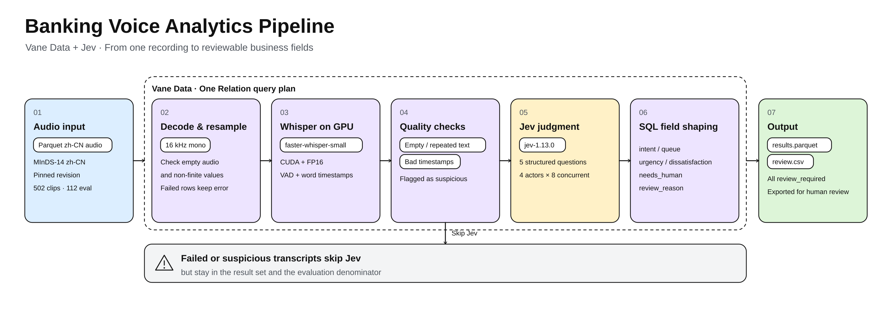
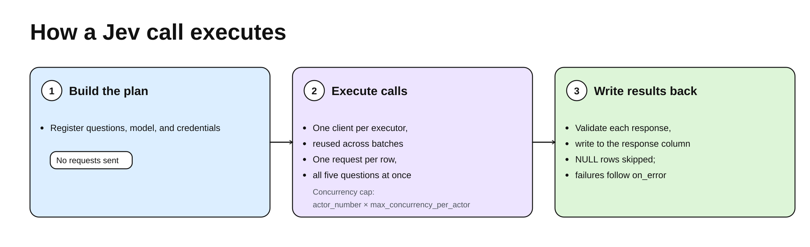

## Summary
The article presents a banking [[VoiceAnalyticsPipeline]] in which [[VaneData]] carries Chinese audio through CPU decoding, GPU Whisper transcription, transcript checks, [[Jev]] judgments, and SQL field shaping in one deferred Relation plan. The reusable contribution is architectural rather than empirical: failed rows remain traceable, external semantic calls receive bounded state and return typed fields, and every result goes to human review, but the example reports no measured Jev accuracy, throughput, cost, or independently calibrated follow-up decisions.

## Key Claims
- Keyword routing fails when callers describe desired outcomes without business vocabulary or mention requests that were already resolved; whole-conversation state and explicit category boundaries are needed for more useful routing.
- One [[VaneData]] Relation plan separates resource roles: CPU tasks decode and resample, a persistent GPU actor reuses Whisper, Jev actors coordinate external calls, and SQL converts responses into stable business fields.
- Transcript checks reject empty or repeated text and invalid timestamps before semantic judgment; failed or suspicious rows skip Jev but remain in the result set and evaluation denominator.
- [[Jev]] asks five typed questions about intent, urgency, dissatisfaction, human follow-up, and input sufficiency, then returns choices, scores, or probabilities rather than generated prose.
- Request construction limits the external service to language, analysis time, and transcript segments, but this is data minimization rather than anonymization because transcripts may still contain personal information.
- Human follow-up and human review are distinct: `needs_human` describes unresolved customer work, while `review_required` governs inspection of the model conclusion, and the example marks every record for review.
- The fixed 112-record evaluation design compares keyword and Jev intent routing on identical Whisper transcripts and retains failures, but ships no scores and does not validate multi-turn calls, speaker separation, non-intent judgments, calibration, or production operations.

## Key Quotes
> "The data processing batch and the model's internal inference batch are two different things." - clarifying that a 128-row Vane batch does not make Whisper transcribe 128 recordings simultaneously.

> "failed records still count in the evaluation denominator." - the safeguard against reporting only successful pipeline outputs.

## Connections
- [[VaneData]] - provides the Relation abstraction, execution plan, resource declarations, batching, and operator scheduling.
- [[Jev]] - performs external typed semantic judgment over transcript state.
- [[VoiceAnalyticsPipeline]] - captures the reusable audio-to-reviewable-business-fields architecture.
- [[TextClassification]] - intent prediction is a bounded multi-class classification problem compared against keyword matching.
- [[SQLFirstBusinessAutomation]] - SQL validates model versions, maps scores and probabilities, assigns queues, and derives review reasons after semantic judgment.
- [[OracleRouting]] - the pipeline separates unresolved customer work from the decision to send uncertain outputs to human review.

## Contradictions
- No direct contradiction was found. The source instead qualifies claims that semantic inference alone makes voice routing production-ready: all outputs require review and no business action is triggered automatically.
- Vendor-reported Jev latency, speed, and price comparisons are not measurements from this pipeline; the example provides neither observed throughput nor cost.
- MInDS-14 supplies short single-caller utterances rather than full support conversations, so it cannot test resolved-versus-open state, agent/customer separation, or complete-call urgency and dissatisfaction judgments.
- The 112-item subset was used during development, may overlap upstream training data, and lacks ground truth for urgency, dissatisfaction, input sufficiency, and human follow-up; the `0.5` follow-up threshold is uncalibrated.
