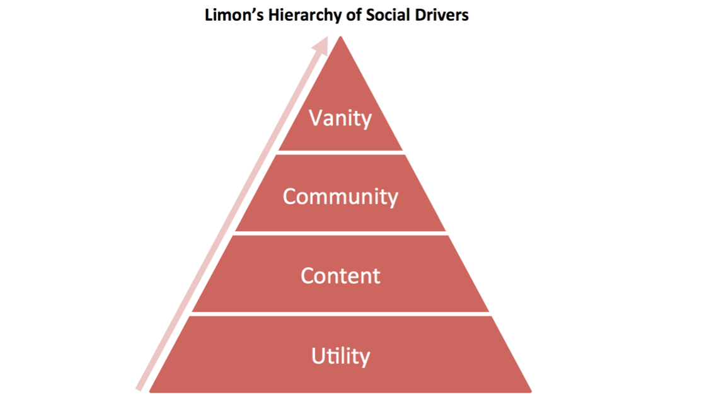
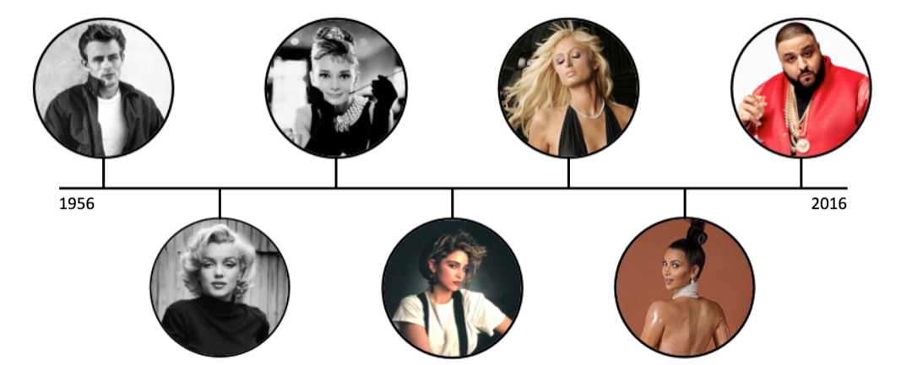

## Summary
[[ChristianLimon]] argues that consumer social networks become harder to replace as their main motivation rises from utility through content and community to vanity, which he defines as concern for how one is perceived. The 2016 essay treats likes, follows, views, comments, self-focused media, and idea sharing as status and affirmation loops, using [[MusicalLy]], [[Flipagram]], [[Twitter]], [[PumpUp]], [[Facebook]], and [[Snapchat]] as period examples. Its central product prescription is to help ordinary users feel locally celebrated, but the hierarchy is an asserted practitioner model rather than comparative evidence that vanity is universally the strongest social driver.

## Key Claims
- [[SocialDriverHierarchy]] orders social-network motivations as utility and tools, content and media, community, then vanity, with higher layers claimed to create stronger and less replicable bonds.
- Social feedback features such as likes, views, follows, retweets, and comments reinforce self-presentation by making recognition visible.
- Media-sharing tools become more differentiated when the user, rather than the underlying song or clip, becomes the focus, as the essay argues through [[MusicalLy]] and [[Flipagram]].
- On [[Twitter]], authors seek affirmation for ideas while people who redistribute them may also seek association with those ideas.
- Vanity loops can support prosocial communities rather than only superficial entertainment; [[PumpUp]] is offered as a health-and-wellness example.
- The essay says [[Facebook]]'s shift toward publisher and business content reduced personal sharing, while [[Snapchat]] benefited by normalizing frequent self-recording and intimate personal updates.
- Changing norms around acceptable self-presentation create product opportunities, but the article supplies cultural examples rather than behavioral or causal measurements.

## Key Quotes
> "Vanity is the single most powerful driver" - the essay's central, unvalidated ranking claim.

> "does this improve on and increase an average person's sense of personal celebrity?" - product-loop test proposed by the author.

## Connections
- [[ChristianLimon]] - author of the hierarchy and product-strategy argument.
- [[SocialDriverHierarchy]] - framework ranking utility, content, community, and vanity as network motivations.
- [[MusicalLy]] - lip-syncing example where the performer becomes more central than the shared song.
- [[Flipagram]] - media-creation example framed as promoting local celebrity.
- [[Twitter]] - example of affirmation and identity-by-association distributing ideas.
- [[PumpUp]] - example of status reinforcement directed toward a wellness community.
- [[Facebook]] - incumbent said to have traded personal sharing for media distribution and advertising inventory.
- [[Snapchat]] - beneficiary said to normalize frequent self-focused video and personal sharing.
- [[ViralLoops]] - visible status and association can motivate redistribution and recruitment.
- [[SocialProof]] - likes, follows, comments, and public affiliation make recognition legible.

## Contradictions
- No direct contradiction is established. The source strengthens existing status-driven growth examples but qualifies them by assertion rather than comparative retention, network-strength, or business evidence; its favorable use of “vanity” is also distinct from [[VanityMetrics]], which concerns misleading measurement rather than self-presentation as user motivation.
