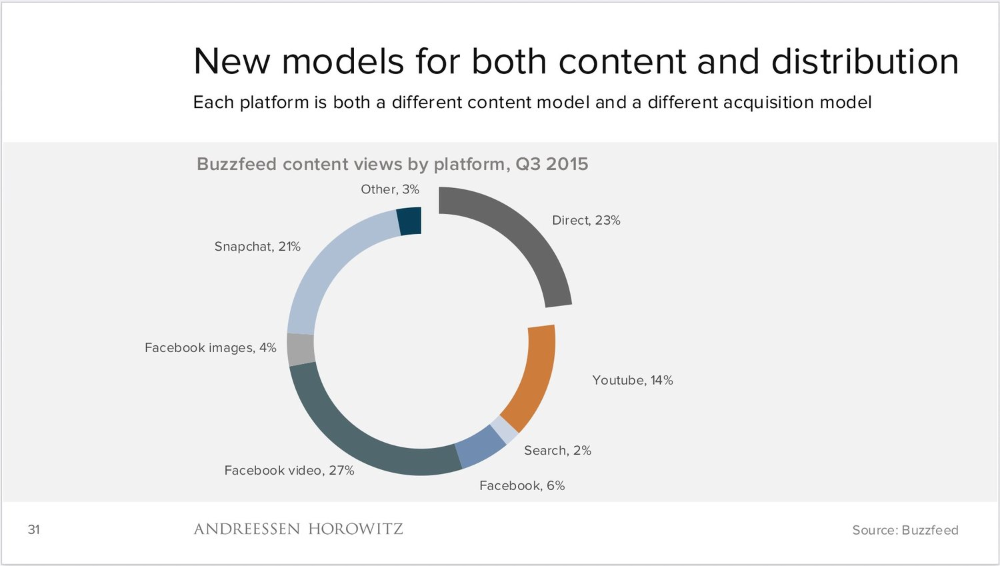

## Summary
[[BenedictEvans]] argues that mobile media was fragmenting into platform-specific combinations of distribution, content format, analytics, advertising, and monetization. His central [[VideoAsContentContainer]] claim is that video files, GIFs, and proprietary runtimes can carry animation, sound, text, interfaces, and advertising as portable units, making “video” less a genre than a richer alternative to plain HTML. The retained BuzzFeed chart grounds this 2016 argument in a Q3 2015 snapshot, while the essay explicitly warns that platform-defined views, time spent, and ad value are difficult to compare.

## Key Claims
- Distribution and content models were proliferating together: each platform acquired audiences differently and favored different formats, editorial choices, and creative possibilities.
- BuzzFeed's Q3 2015 view mix illustrates that fragmentation: Facebook video supplied 27%, direct traffic 23%, Snapchat 21%, YouTube 14%, Facebook 6%, Facebook images 4%, other 3%, and search 2%.
- Algorithmic feeds, manual curation, AMP, Instant Articles, Discover, and native video move delivery, analytics, and monetization under platform-owner control while promising speed, richer presentation, better targeting, or more native advertising.
- [[VideoAsContentContainer]] treats video and GIF-like files as portable wrappers for live action, text, sound, motion, animation, interfaces, and ads rather than as one conventional media genre.
- Google's Instant Apps and platform-hosted content formats pursue a similar goal through different runtimes: experiences richer than plain HTML without requiring a conventional app-store installation.
- Platform-defined “views” are not interchangeable with one another or with television viewing because autoplay, silence, scrolling, skipping, duration, and user intent differ.
- Proprietary, encrypted, integrated streams can make ad removal technically harder, and ad blocking may therefore push publishers further from the open web.
- The broader mobile-runtime question joins technical execution to discovery, engagement, analytics, and revenue: Snapchat Discover and messaging or assistant platforms can function as development environments when viewed from the content surface outward.

## Key Quotes
> “We've gone from delivering video with Flash to delivering Flash with video.” — on video carrying rich animated experiences rather than only live action.

> “The screen itself is the runtime” — on content surfaces acting as mobile development platforms.

## Connections
- [[BenedictEvans]] — author applying a platform-strategy lens to mobile content formats and economics.
- [[VideoAsContentContainer]] — the source's central claim that video can act as a portable, shareable delivery format.
- [[DistributedPublishingStrategy]] — publishers adapt content and acquisition to multiple platform-owned surfaces.
- [[MobileRuntime]] — the essay broadens runtime from code execution to the screen, content format, discovery, and monetization surface.
- [[PlatformDistributionDependence]] — platform owners control reach, rendering, analytics, advertising formats, and audience data.
- [[SocialInteractionMetrics]] — platform-defined views and time spent are difficult to compare across formats and behaviors.
- [[AdBlocking]] — integrated proprietary streams can resist filtering and may accelerate movement away from the open web.
- [[Buzzfeed]] — publisher whose Q3 2015 platform mix supplies the essay's quantitative example.
- [[JonahPeretti]] — BuzzFeed executive credited with making the distribution figures public.
- [[Facebook]] — algorithmic-feed, native-video, in-app-browser, and Instant Articles example.
- [[Snapchat]] — Discover is treated as a curated content format, advertising surface, analytics provider, and runtime.
- [[Google]] — AMP and Instant Apps illustrate platform-controlled fast content and app execution.

## Contradictions
- [[your-media-business-will-not-be-saved-joshua-topolsky-medium]] qualifies format optimism: video, bots, apps, and platform partnerships can distribute good work but cannot repair an undifferentiated media product.
- The chart is a historical BuzzFeed distribution snapshot, not evidence that its platform mix generalized to other publishers or persisted after Q3 2015.
- The essay is a 2016 strategic interpretation. Its examples, platform products, ad technology, metric conventions, and prediction about mobile ad blocking should not be read as current market evidence.
