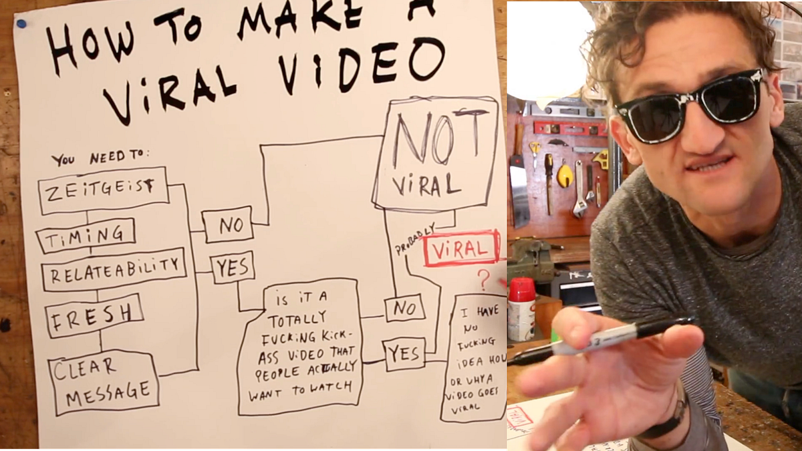

## Summary
[[NathanKontny]] argues that shareable ideas often become interesting by negating a familiar assumption: what seems to be X is presented as non-X. He applies [[MurrayDavis]]'s sociology of interesting propositions to [[CaseyNeistat]] videos and to his own satirical [[TrickAJournalist]] campaign, proposing expectation-breaking as an idea filter rather than a reliable formula for virality. Casey's retained flowchart supplies a complementary checklist—zeitgeist, timing, relatability, freshness, a clear message, and a video people actually want to watch—while also admitting that virality remains uncertain.

## Key Claims
- [[MurrayDavis]] argues that widely interesting propositions often negate an accepted belief: what appears to be X is actually non-X.
- [[CaseyNeistat]]'s cited videos repeatedly violate expectations about permitted behavior, bike-lane safety, client-budget discipline, bicycle locks, and Apple's product support.
- [[NathanKontny]] treats expectation-breaking as a practical creative filter that can increase an idea's impact without making the result predictable.
- Kontny's [[TrickAJournalist]] satire reframed routine mass journalist outreach as obviously abusive automation, then extended the campaign through customer rejection and an unexpected Reddit ad ban.
- Casey's pictured model adds contextual and execution constraints—zeitgeist, timing, relatability, freshness, message clarity, and watchability—rather than reducing virality to surprise alone.
- The source reports exceptional campaign reach but supplies no comparative metrics, conversion evidence, or controlled test isolating expectation violation as the cause.

## Key Quotes
> "What seems to be X is in reality non-X" — Kontny's excerpt of Davis's recurring form for interesting propositions.

> "does this break expectations" — the article's proposed filter for marketing ideas.

## Connections
- [[NathanKontny]] - author and practitioner applying the expectation-breaking lens to his own campaign.
- [[CaseyNeistat]] - filmmaker whose videos provide the article's main creative examples and retained visual framework.
- [[MurrayDavis]] - sociologist whose account of interesting propositions supplies the article's theoretical basis.
- [[TrickAJournalist]] - satirical campaign used as Kontny's practitioner case.
- [[ExpectationBreakingContent]] - concept that captures the article's negation-based idea filter.
- [[ContentLedAcquisition]] - the source treats provocative video, satire, and campaign stories as attention-generating content.
- [[ViralLoops]] - related but distinct product-distribution mechanism; this source concerns content shareability rather than built-in user-to-user propagation.
- [[BrandDistinctiveness]] - violated expectations can make a message or campaign more memorable.

## Contradictions
- The article's simple expectation-breaking recipe is qualified by its own acknowledgement that viral outcomes remain difficult and unpredictable, and by Casey's pictured requirements for timing, relevance, clarity, and watchability.
- No direct contradiction with [[ViralLoops]]: the pages describe different mechanisms, respectively shareworthy content and product-mediated distribution.
