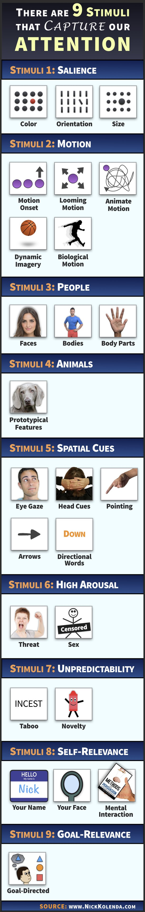

## Summary
[[NickKolenda]] presents [[VisualAttention]] as a competition between limited processing capacity and stimuli selected through bottom-up capture or top-down goals. His practitioner guide groups attention triggers into nine families—salience, motion, people, animals, spatial cues, high arousal, unpredictability, self-relevance, and goal relevance—then translates them into marketing and interface tactics. Its most important qualification is contextual: conspicuous contrast can attract an unguided viewer yet make an advertisement easier to reject when the viewer is pursuing a specific goal.

## Key Claims
- Selective attention is necessary because the visual field contains more information than conscious processing can handle.
- Bottom-up capture is strengthened by feature contrast, motion, socially or biologically meaningful forms, directional cues, arousing threat or sexual content, novelty, and self-related information.
- Salience is relational rather than absolute: a color, orientation, or size becomes conspicuous by differing from its surroundings, and several differences can combine.
- Motion onset, looming, animate or biological motion, and even static imagery that implies movement can accelerate attention.
- Faces, bodies, animals, gaze, head orientation, pointing, arrows, and directional words can guide attention through evolved sensitivities, learned associations, or both.
- Habituation reduces response to predictable placements and requests, while novelty can interrupt routine rejection; novelty must still be balanced with familiarity and favorable evaluation.
- Goal state changes the design rule: low-load browsing leaves more capacity for irrelevant stimuli, while goal-directed viewers preferentially notice target-like information and may screen out salient ad-like elements.

## Key Quotes
> "The world is vast, but our attention is finite." — the guide's premise for selective attention.

> "If people are searching for something, they're using top-down attention. Make your target similar to their goal." — the source's main contextual qualification.

## Connections
- [[NickKolenda]] - author who translates attention research into marketing and interface tactics.
- [[VisualAttention]] - synthesis of the source's bottom-up triggers, top-down selection, and practical limits.
- [[AttentionEconomy]] - the tactics compete for scarce perceptual capacity, but capture alone does not establish value.
- [[BehaviorDesign]] - salience, novelty, self-relevance, and spatial cues are presented as ways to shape what users notice and do.
- [[CognitiveLoadInUXResearch]] - spare perceptual capacity affects whether task-irrelevant stimuli are processed.
- [[ExpectationBreakingContent]] - unexpected combinations and taboo language are special cases of novelty-driven capture.

## Contradictions
- The guide's broad claim that nine stimulus families capture attention "immediately and automatically" is stronger than the heterogeneous studies and examples justify; effects depend on task, perceptual load, context, learned associations, individual differences, and measurement method.
- Its evolutionary explanations often function as plausible stories rather than direct evidence for each modern design tactic, especially claims about sex differences, dominance, pointing, and ancestral threat geometry.
- The top-down section qualifies simple salience advice: high contrast can advertise irrelevance and be deliberately ignored when a viewer has a focused goal.
