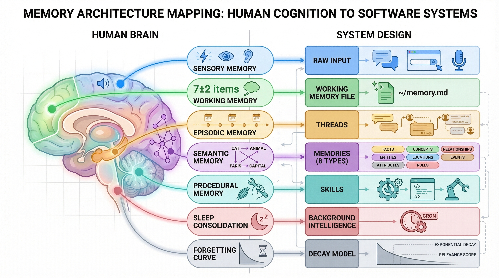
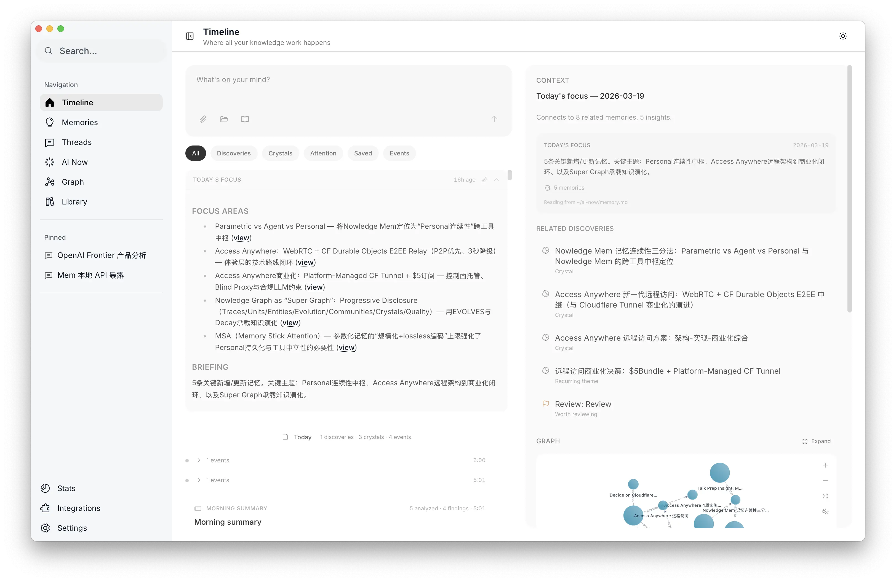
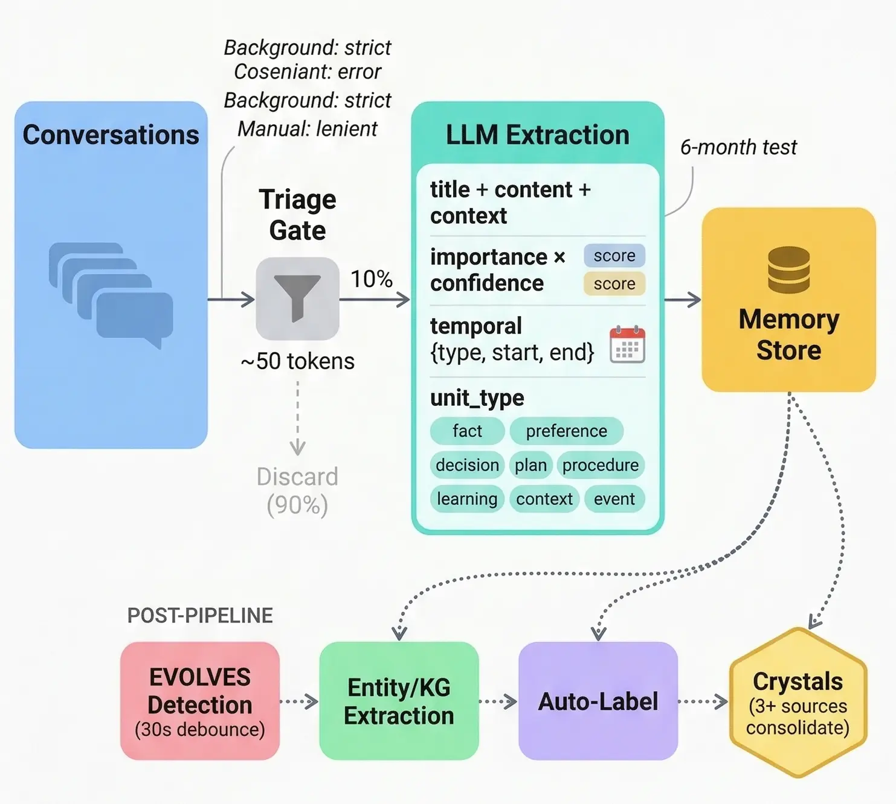
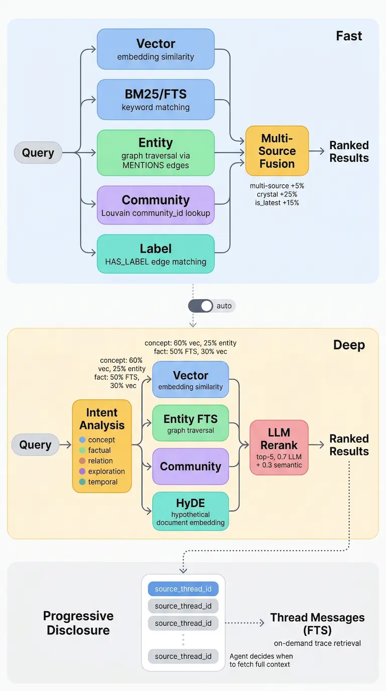
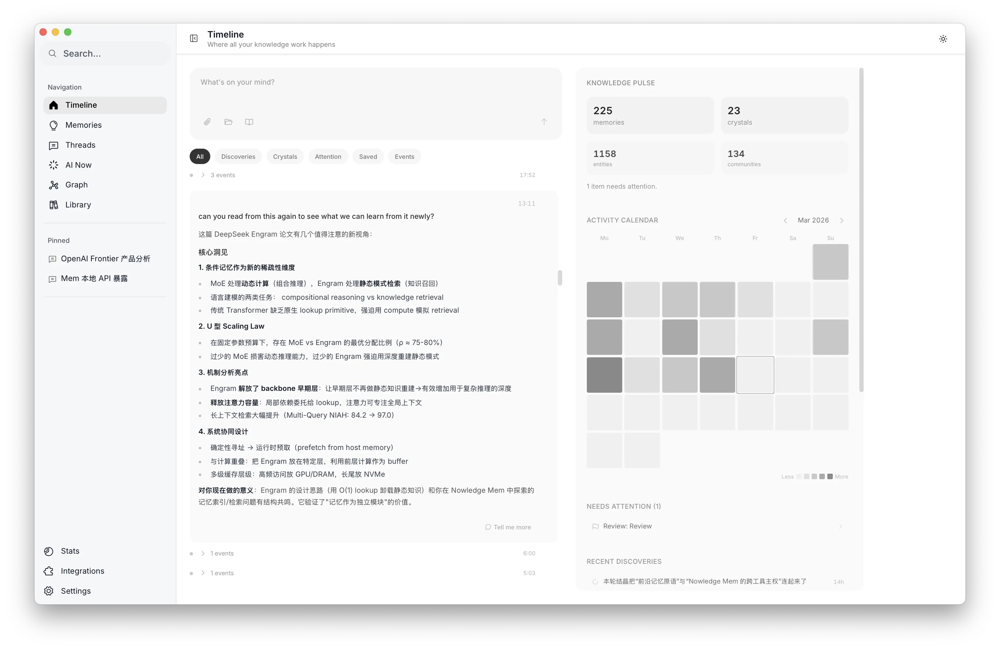
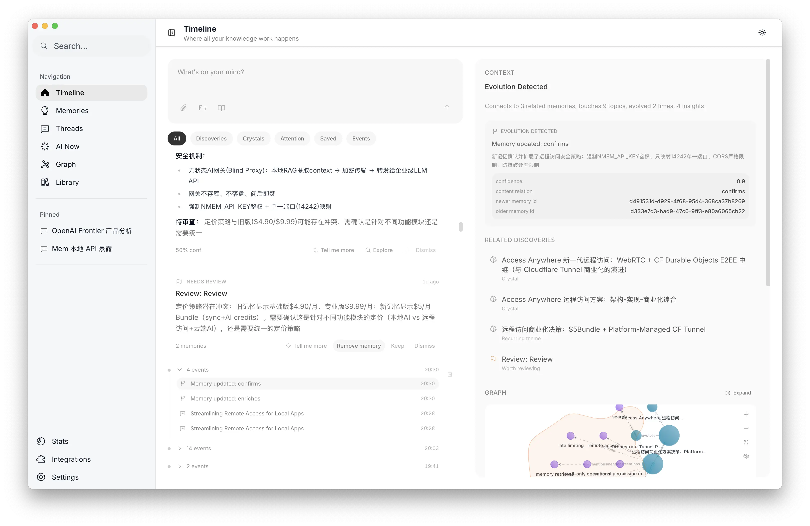
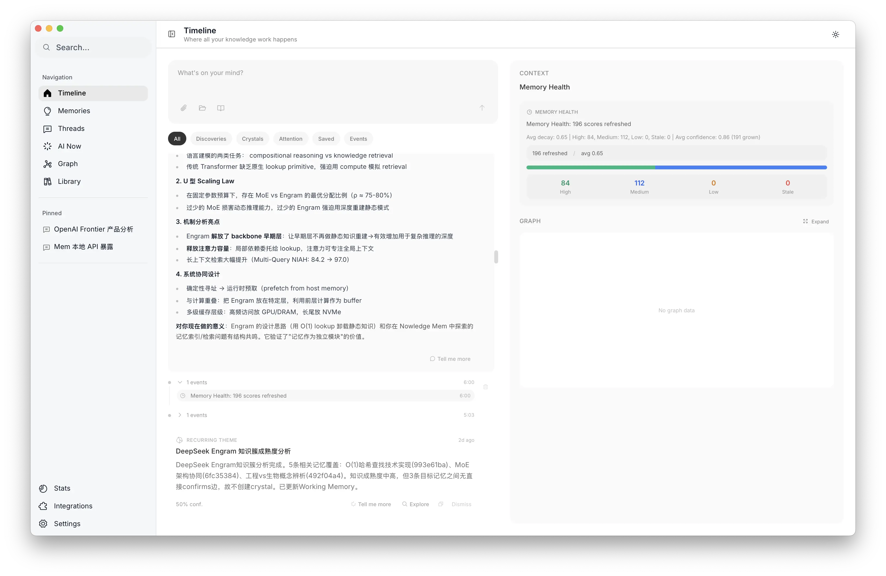
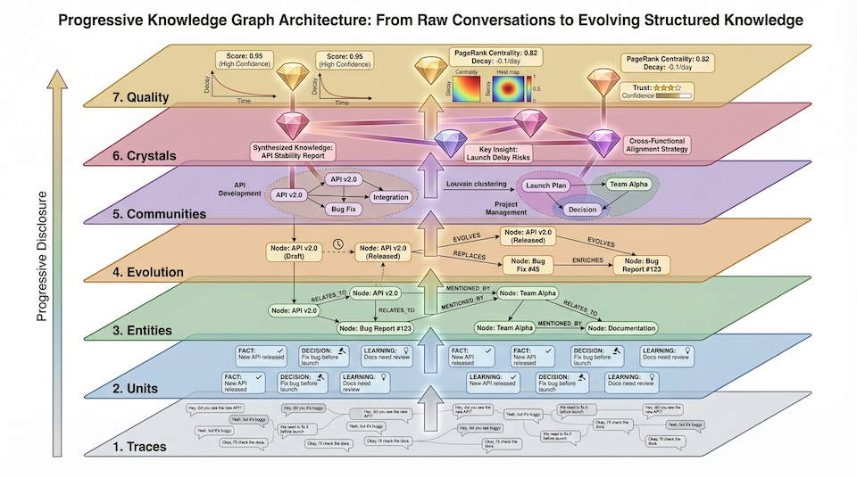
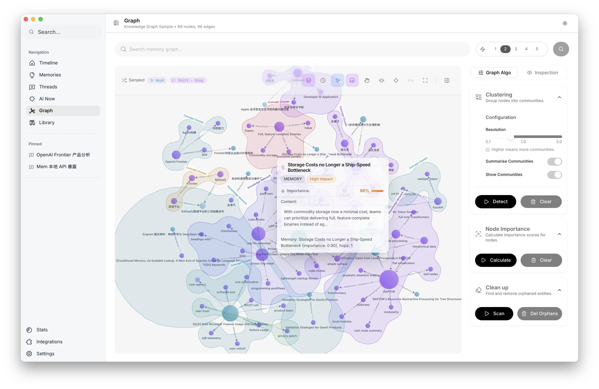
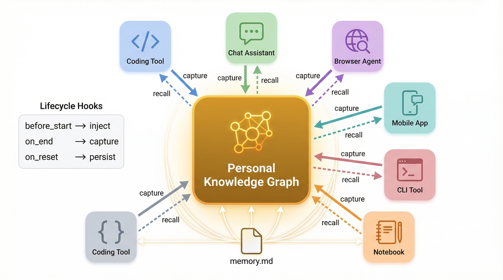

## Summary
This first-party engineering account presents [[NowledgeMem]] as a cross-tool personal memory layer and decomposes mature [[AgentMemory]] into distillation, retrieval, temporal representation, evolution, and forgetting. Its architecture preserves raw traces, extracts typed Units, promotes claims corroborated by at least three sources into Crystals, combines hybrid retrieval with progressive disclosure, and keeps user visibility and adjudication in the loop.

The cognitive map pairs sensory input with raw capture, limited working memory with a daily Markdown focus file, episodic memory with threads, semantic memory with eight Unit types, procedural memory with skills, sleep consolidation with background jobs, and forgetting with an explicit decay model.

## Key Claims
- [[AgentMemory]] should be treated as a decision system rather than a database: it must decide what to retain, how to represent it, what to retrieve, how knowledge changes, and what should fade.
- A daily working-memory file can act as attention prefetch by selecting a small set of currently relevant items from more than 10,000 memories using community, decay, and recent-activity signals.

- Distillation moves from high-fidelity Trace to atomic typed Unit to corroborated Crystal; a roughly 50-token triage gate sends only about 10% of conversations into full extraction, while manual user intent receives a more permissive threshold.

- Retrieval uses a fast parallel path for most queries and an intent-routed deep path for harder ones, retaining `source_thread_id` pointers so an agent can expand into original evidence only when needed.

- [[BitemporalMemory]] separates event time from record time, stores precision, declines to invent low-confidence dates, and lets semantic relevance dominate time boosts in ranking.

- [[MemoryEvolution]] distinguishes progression (`replaces`, `enriches`) from validation (`confirms`, `challenges`); detected conflicts are surfaced for user decision rather than silently resolved.

- [[MemoryForgetting]] separates time-decaying attention from non-decreasing accumulated confidence, protects important memories with a floor, and archives only when low decay, zero interaction, age over 90 days, and active state all hold.

- The graph supports progressive traversal through Trace, Unit, Entity, Evolution, Community, Crystal, and Quality layers rather than loading the whole knowledge base at once.

- Background intelligence combines scheduled consolidation and event-driven cascades under debounce, rate, token-budget, context-size, and code-level quality gates.

- Cross-tool continuity depends on capture and recall lifecycle hooks, open local formats, export, and user-visible control rather than a bare MCP call.

## Key Quotes
> “没有遗忘的记忆系统是垃圾场。” — on why retention needs active decay and archival policy.

> “记忆系统的核心不是数据库，是一条决策链。” — on intelligence rather than storage as the main bottleneck.

> “看不到就不信任，不信任就不用，不用和没有一样。” — on visibility and user control as adoption requirements.

## Connections
- [[NowledgeMem]] - product and engineering system described by the source.
- [[AgentMemory]] - central architecture whose lifecycle the article decomposes.
- [[MemoryCompaction]] - consolidation and Crystal formation reduce repetitive raw state.
- [[MemoryEvolution]] - explicit progression and validation relationships represent changing knowledge.
- [[MemoryConflictResolution]] - conflicting memories remain visible for human adjudication.
- [[MemoryForgetting]] - decay, confidence, importance floors, and conservative archival manage attention.
- [[BitemporalMemory]] - event time and record time answer different temporal questions.
- [[AgenticRAG]] - intent-routed, multi-source retrieval and progressive expansion place search inside an agent decision loop.
- [[LLMContextManagement]] - working-memory prefetch and bounded context injection govern what reaches the model.
- [[LLMToolingSkills]] - the proposed end state turns corroborated experience into executable skills.

## Contradictions
- The source argues that a cross-tool memory product is a necessary aggregation layer, while [[TapeAndAnchors]] proposes that durable history, bounded summaries, and recall anchors can make memory native to context organization rather than a separate service. These positions can coexist, but the product boundary is unresolved.
- The confidence rule `max(new_value, old_value)` prevents accumulated support from declining; this is a product policy, not proof that evidence quality or belief confidence can never weaken. A challenged, stale, or discredited source may require recalibration even when attention decay remains separate.
- The reported token reductions, latencies, query shares, weights, thresholds, source counts, task limits, integration counts, and user behavior are first-party engineering choices or anecdotes without comparative benchmarks, calibration studies, cost data, or independent validation.
