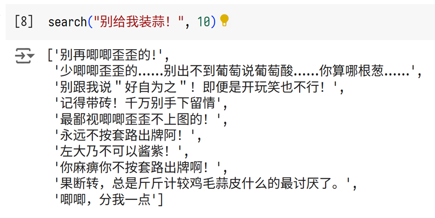
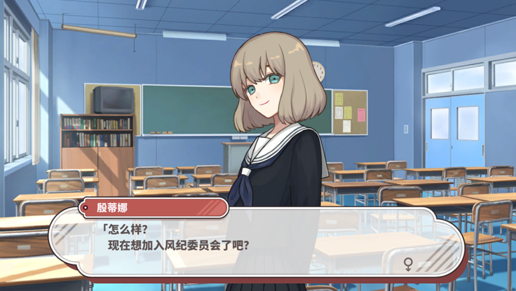
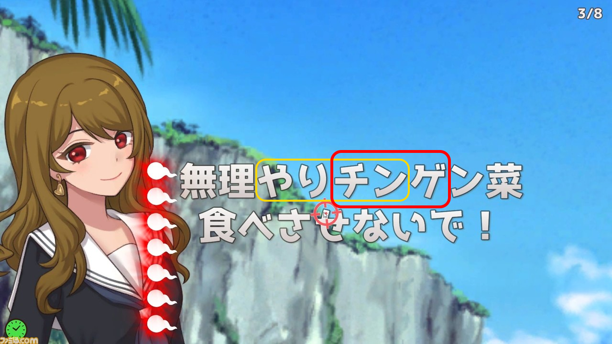
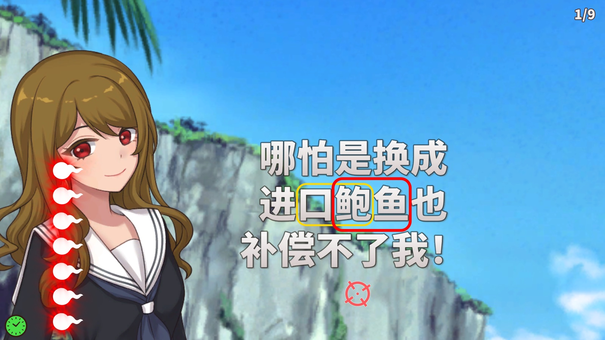

## 核心摘要

这篇文章记录了[魏杰]()参与游戏[《女性交流》]()中文本地化时处理数百个谐音梗的方法。文章的核心主张是：译者不必完全依赖灵感从零造句，可以先从大规模真实语料中计算出语义接近、同时包含目标谐音的候选，再由人类译者或大模型完成最后选择和改写。

作者把这套流程称为 **MancoDB**。它借鉴了RAG的基本形状，但检索目标并非事实片段，而是可供创作的谐音候选句。

> **图片状态：** 本次图文Ingest已完整读取并检查15个原始图片引用。根据页面的知识需要，精选4张公开嵌入；其余11张因内容重复、仅作过渡画面或不能增加独立解释价值而不嵌入，并非按private处理。

## 方法流程

### 准备阶段

1. 建立特定主题的敏感词或目标词列表。
2. 收集大规模真实对话语料。
3. 使用基于拼音匹配的DFA自动机，找出包含目标词同音形式的句子。
4. 将候选句向量化并存入向量数据库。

### 翻译阶段

1. 对待翻译原句进行向量化。
2. 从候选库中检索语义最接近的若干句子。
3. 把原句与候选句交给译者或大模型。
4. 结合语义、笑点、上下文、角色语气与游戏机制完成最终译文。

这形成了一个[语义检索辅助谐音梗翻译]()流程：机器扩大候选空间，人负责判断作品中真正可用的表达。

图片为这一流程补充了两项视觉证据：一张示意图以余弦相似度表示两个语义向量的接近程度；程序输出截图则显示，以“别给我装蒜！”为查询时，检索结果会返回“别再唧唧歪歪的！”、“别跟我说‘好自为之’！即使是开玩笑也不行！”等语义接近、同时带有目标谐音素材的候选。图片内容与正文所述的“计算候选、人类裁决”流程一致。

*程序检索输出：先扩大候选空间，再由译者按上下文裁决。*

## 翻译不只是在替换词语

文章把谐音梗翻译放在[功能对等与游戏本地化]()框架中理解。译文不必逐字复制原句，而要尽量让目标语言玩家获得接近的注意、理解和笑点体验。

角色姓名的处理体现了这一点：中文版采用目标语言中的姓名形式，并尝试保留原名携带的多层谐音意义。作者认为，如果只保留日式名字形式，却在名字中塞入中文谐音，玩家体验反而会产生割裂。

*角色姓名与台词同时本地化，使中文谐音落在目标语言玩家熟悉的姓名形式中。*

## 文本如何引导玩家行为

文章后半部分分析了游戏中“一箭双雕”机制的教学方式。原作没有直接教程，而是利用词语预先曝光、计分机制、视觉位置、弹幕造成的注意力压力，以及前后句的重复，让玩家更可能点击两个敏感词的重叠部分。

中文版没有机械复制日文词语，而是重新设计中文词组和前文铺垫，以复现接近的玩家行为。这是[游戏文本中的弱引导]()的一个具体案例。

完整截图序列进一步显示了这种设计如何落到界面上：日文版以“チンゲン菜”等词反复预热目标片段，并在触发时用醒目的大字与命中反馈强化重叠位置；中文版则用“进口鲍鱼”等目标语言材料重建相似的注意路径。下面两张图各选取日文和中文序列中最能解释重叠机制的一帧，其余过渡、命中和计分画面因信息重复而不嵌入。

*日文画面同时标出“やりチン”与“チンゲ”，两者共享“チン”；刚刚出现过的“チンゲ”更容易吸引玩家注意。*

*中文版把相同机制重构为“口鲍”和“鲍鱼”，两者共享“鲍”；位置和色框同时呈现两个候选片段。*

## 可复用认识

- 语义检索可以服务于创意候选生成，不只用于事实问答。
- 大规模候选计算降低了译者寻找灵感的成本，但不能替代语境判断。
- 游戏本地化需要维护文本、机制、视觉注意和玩家行为之间的关系。
- 功能对等可以落实为可观察的玩家反应，而不只是语言层面的“大意相近”。
- 机器的优势是系统性扩大搜索空间；人的优势是把候选放回作品整体中裁决。

## 证据边界

本页依据输入Markdown正文和全部15张原始配图整理。15张图片均已完成文件校验和视觉检查；其中4张因能直接解释语义检索、姓名本地化和弱引导机制而公开嵌入，另外11张不嵌入是编辑选择，不代表private分类。图片观察只用于印证对应段落；玩家实际如何理解笑点、是否按预期点击，仍按作者报告表述，尚未通过独立用户测试核验。

## 来源

- 魏杰，[《如何用暴力计算翻译谐音梗——〈女性交流〉翻译笔记》](https://zhuanlan.zhihu.com/p/1957143907134603895)，2026-02-05。
