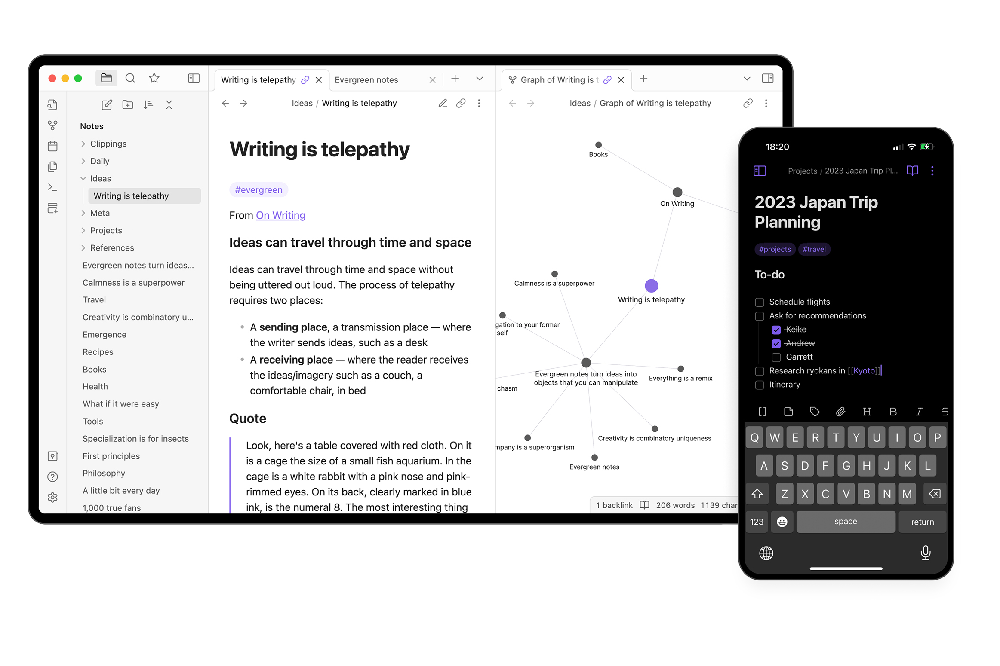

## Summary
[[CaseyNewton]] argues that productivity software is good at collecting and storing information but has made much less progress at improving thought or producing insight. The available article excerpt connects this gap to [[InformationOverload]]: farmers can become paralyzed by crop-software data, while a journalist must monitor several social feeds after Twitter’s fragmentation. The captured file ends at a subscription wall before the article develops its proposed role for generative AI, so that question remains unresolved here.

## Key Claims
- Productivity tools can make work easier without necessarily improving the user’s thinking.
- Note-taking applications primarily optimize capture and storage; accumulation alone does not produce insight.
- More software-generated data can increase analytical burden and lead to paralysis rather than better decisions.
- Fragmented information channels increase the amount of scanning required to follow news and thoughtful discussion.
- Generative AI could make knowledge tools more useful, but the accessible excerpt provides no mechanism or evidence for deciding whether it will.
- The editorial Obsidian image illustrates the product model under discussion: folders, linked evergreen notes, graph relationships, backlinks, tags, tasks, and cross-device access coexist in one interface.

## Key Quotes
> “We’re collecting so much data that you’re almost paralyzed with having to analyze it all.” — a farmer quoted from the Wall Street Journal story discussed by Newton

> “their ability to improve our thinking — they don’t seem to be making much progress at all.” — Newton on productivity software

## Connections
- [[CaseyNewton]] — author framing note-taking as a thinking problem rather than only a storage problem.
- [[TheVerge]] — publisher of the article and host of Newton’s Platformer column.
- [[Obsidian]] — the editorial product example, shown combining linked notes, a relationship graph, and mobile task notes.
- [[PersonalKnowledgeManagement]] — the article distinguishes accumulating material from turning it into useful thought.
- [[InformationOverload]] — excessive collected data and fragmented feeds can make attention and analysis the limiting resources.
- [[AttentionManagement]] — monitoring several social feeds illustrates the attention cost of fragmented information channels.
- [[SecondBrain]] — AI-assisted knowledge systems are raised as a possible answer, but the captured excerpt does not substantiate the possibility.

## Contradictions
- The source qualifies optimistic accounts of AI-assisted note organization in [[PersonalKnowledgeManagement]] and [[SecondBrain]]: it raises AI as a possibility but, in the available excerpt, offers no demonstrated path from better retrieval or storage to better thinking.
- The article body is incomplete because the capture hits a subscription wall after the opening section; claims from the missing sections are not represented.
