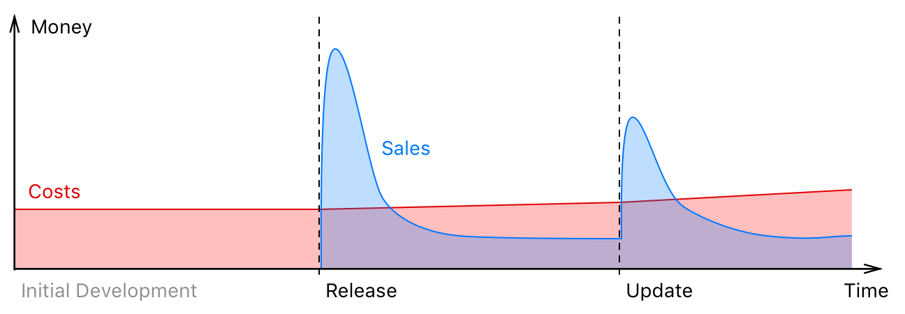
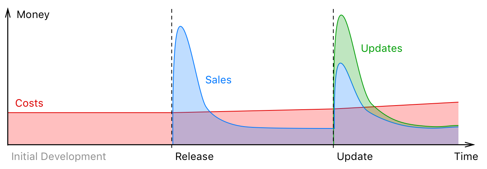
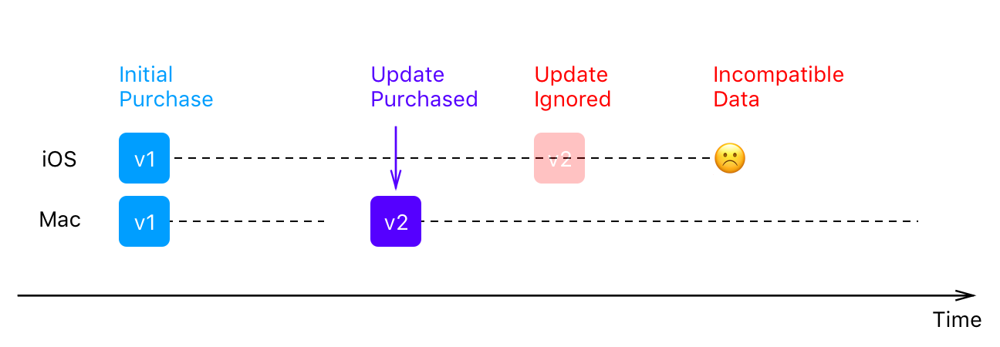
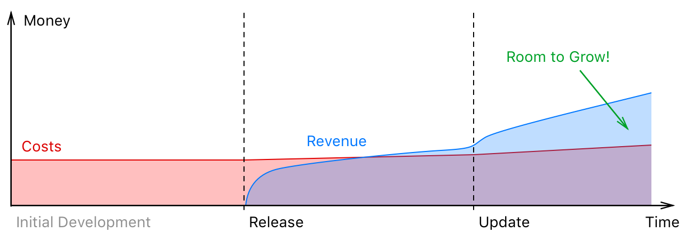

## Summary
The [[Ulysses]] team argues that a complex cross-platform writing app needs recurring revenue to fund continuous maintenance and improvement. Its case against one-time purchases and paid upgrades rests on unstable release-driven sales, incentives to prioritize headline features over quality work, operating-system compatibility demands, and version skew across devices; a single subscription is presented as a way to smooth revenue, unify access, lower initial cost, and preserve read-only document access after cancellation.

## Key Claims
- One-time app sales fund continuing development mainly through new customers, creating dependence on market expansion and recurring publicity-producing releases.
- Release-driven revenue encourages large visible feature packages while making bug fixing, optimization, and internal cleanup harder to market.
- Paid upgrades can enlarge release spikes but retain financial troughs, bundling pressure, upgrade reluctance, grace-period complexity, and eventual compatibility failures.
- Cross-platform paid upgrades are especially awkward for [[Ulysses]] because users may need to buy both Mac and iOS updates to avoid file-format incompatibility.
- [[ProductivityAppSubscriptions]] can combine one entitlement across devices, a full trial, monthly and annual plans, student pricing, earlier incremental features, and steadier funding for maintenance and support.
- After cancellation, Ulysses proposes disabling editing while continuing compatibility updates, reading, and export so users can retrieve their texts.

The first chart depicts costs as a slowly rising line while sales jump at release and update, decay rapidly, and remain below costs between events. It is a conceptual illustration rather than measured Ulysses financial data.

The paid-update variant adds higher green upgrade spikes at updates, but both new and upgrade sales decay toward a level below costs, supporting the article’s claim that upgrade pricing reduces rather than removes release dependence.

The version-skew diagram shows Mac moving from v1 to v2 while iOS remains on v1; a file-format-changing update then produces incompatible data on the device that did not update.

The subscription chart replaces release spikes with a cumulative revenue curve that starts below costs, crosses them, and then grows above them. It visualizes the desired planning stability, not an observed result.

## Key Quotes
> “New users.” — the article’s answer to how post-purchase feature development had been financed.

> “A single subscription will unlock the app on all devices.” — the proposed simplification of Mac and iOS access.

## Connections
- [[Ulysses]] — the multi-platform writing app changing from one-time purchases to recurring access.
- [[ProductivityAppSubscriptions]] — the central business model justified by the article.
- [[SaaSPricing]] — monthly, annual, and student plans lower or segment the initial payment.
- [[SaaSRetention]] — recurring revenue depends on continuing product value and compatibility.
- [[MobileEcosystem]] — annual device and operating-system changes create continuing maintenance work.
- [[AppStore]] — separate Mac and iOS purchasing rules complicate unified paid upgrades.
- [[ContinuousDelivery]] — subscriptions are said to permit smaller, earlier feature releases instead of annual bundles.

## Contradictions
- No direct factual contradiction was found. The source strengthens [[ProductivityAppSubscriptions]] on cost continuity and cross-platform maintenance, while qualifying its value-alignment argument: Ulysses emphasizes developer funding and compatibility more than proof that every user receives value proportional to recurring payments.
