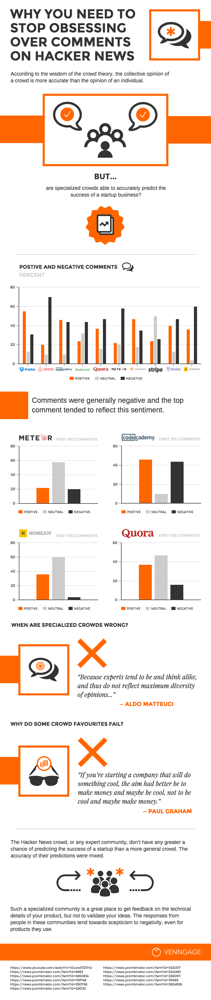

## Summary
Venngage compares early [[HackerNews]] reactions to ten startups with their later outcomes and argues that a specialized public community is useful for technical criticism but unreliable for validating broad startup demand. Its central explanation is that homogeneity, visible prior comments, reputation incentives, and a bias toward technically impressive products weaken the independence and diversity required by [[WisdomOfCrowds]]. The practical recommendation is to prioritize behavior and feedback from actual users, especially paying users, over approval from an expert forum.

## Key Claims
- Across the selected launch threads, comments tended negative: the prose reports roughly half negative, about one-third positive, and the remainder neutral or off-topic.
- Developer-oriented products such as Codecademy and Dropbox received a warmer reception than broader consumer services such as Airbnb, Quora, and Instacart.
- A specialized crowd may share assumptions and influence one another through visible, ranked comments, so its responses are not independent observations of market demand.
- The top comment can anchor later discussion, while public karma and status incentives may discourage dissent from the apparent consensus.
- Hacker News correctly surfaced some business risks, including Homejoy's low pricing and labor-model problems, but reacted skeptically to products such as Airbnb and Meteor that later found users.
- Technical communities are better suited to detailed product criticism than to predicting market success; actual and paying users provide stronger validation through use, retention, and payment.
- Product quality alone does not make a viable startup: marketing, distribution, pricing, operations, and a sustainable business model still matter.

## Key Quotes
> "Such a specialized community is a great place to get feedback on the technical details of your product, but not to validate your ideas." - conclusion distinguishing technical critique from market validation.

> "The people you should be listening to are, first and foremost, users of your product - preferably, paying users." - recommended evidence hierarchy.

## Connections
- [[HackerNews]] - specialized public developer community used as the article's case study.
- [[WisdomOfCrowds]] - theoretical frame whose independence and diversity conditions the article argues are violated.
- [[CustomerLedProductDevelopment]] - actual customer use, payment, and experience are preferred to broad expert approval.
- [[ProductMarketFit]] - forum sentiment is presented as a weak proxy for durable market demand.
- [[Airbnb]] - central case where early safety skepticism did not predict later adoption.

## Contradictions
- The retained infographic conflicts with the prose on several category labels and values. For Meteor, the prose says 22% positive, 58% negative, and 20% neutral, while the chart depicts about 22% positive, 58% neutral, and 20% negative. For Homejoy, the prose says 52% of its 25 comments were negative, while the chart appears to show roughly 5% negative and about 60% neutral.
- The method does not support the broad conclusion that expert communities have no greater predictive accuracy than general crowds: the sample intentionally selects nine successful companies and one failure, analyzes at most the first 100 comments per thread, assumes top comments represent collective opinion, and provides no matched general-crowd comparison.
- Company outcome claims are snapshots from 2015. Later success or failure does not by itself establish whether a launch comment was wrong about a specific product flaw, security concern, or business-model risk.
