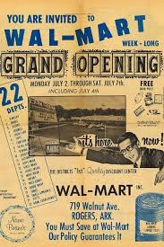
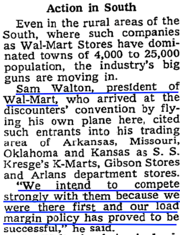
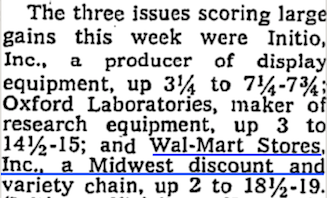

## Summary
[[TrevorMcKendrick]] argues that memorable [[FounderOriginStories]] often compress years of practice, mistakes, rejection, and adaptation into a clean idea-first myth. He contrasts the disputed Netflix late-fee story with [[SamWalton]]'s long retail apprenticeship: Walton lost his first successful store through a bad lease, rebuilt in a smaller town, survived experiments and disasters, reached 15 stores, and only then opened the first [[Walmart]]. The practical lesson is to study the unglamorous beginning of capability development rather than the retrospectively selected beginning of a famous company.

The retained opening advertisement visually supports the first Walmart's low-price positioning: the grand-opening copy emphasizes a 22-department store and promises customer savings.

## Key Claims
- Founder stories can mislead when they turn a long, contingent learning process into a single catalytic idea, as the article argues happened with [[ReedHastings]]' Netflix late-fee story.
- [[SamWalton]] had already spent 15 years operating retail stores when he opened the first [[Walmart]] at age 44, so Walmart's corporate founding is a poor starting point for learning how his capability developed.
- Walton's first Ben Franklin franchise grew sales 3.5 times to $250,000 per year, but his failure to secure a lease-renewal option let the landlord force the successful store to close.
- Walton responded by accepting responsibility, relocating his family, rebuilding, experimenting, and changing direction when wrong; this pattern illustrates [[AdaptivePersistence]] rather than one brilliant idea.
- Even after Walton became a leading independent variety-store operator, outside investors rejected the first Walmart and he financed 95% of it through borrowing secured by his home and other stores.
- Walmart's first store competed through low prices rather than polish, while contemporary press attention remained slight: the article says the New York Times first quoted Walton in 1969 and mentioned the 1970 IPO only briefly.
- Learning from entrepreneurs requires recovering the long pre-success sequence, including false starts and ordinary operational work, rather than copying the endpoint narrative.

## Key Quotes
> "Like most overnight successes, it was about 20 years in the making." - Walton on the history hidden by Walmart's apparent beginning.

> "less afraid of being wrong than anyone I've ever known" - a coworker's description of Walton's willingness to correct course.

The two retained newspaper clippings support the article's claim about limited contemporary attention: the 1969 item uses Walton as one source in a broader discount-store story, while the 1970 market note records Wal-Mart's share-price movement in a short list.

## Connections
- [[TrevorMcKendrick]] - author arguing that founder histories should be reconstructed from the capability-building period.
- [[FounderOriginStories]] - central critique of retrospective, idea-first company narratives.
- [[AdaptivePersistence]] - Walton's repeated improvement, recovery, and willingness to change direction.
- [[RepeatableLearningFromHistory]] - the article separates transferable operating behavior from a polished historical story.
- [[FailureOwnership]] - Walton accepted responsibility for the lease error without treating it as the end of his retail career.
- [[SamWalton]] - main historical case.
- [[Walmart]] - eventual company outcome whose familiar founding date hides Walton's prior experience.
- [[ReedHastings]] - used as the contrasting example of a memorable but disputed origin story.
- [[Netflix]] - company attached to the article's late-fee myth example.

## Contradictions
- No direct contradiction with the wiki's existing startup material. The source strengthens [[RepeatableLearningFromHistory]] by showing that even the apparent starting point of a success story may be selected retrospectively, and it qualifies idea-centered entrepreneurship narratives with a long operating-history case.
