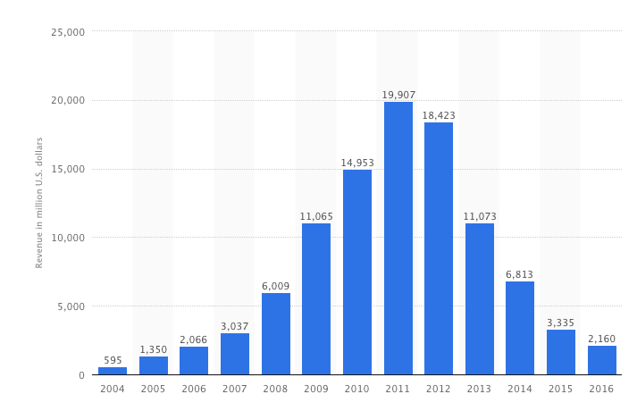
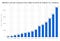
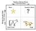
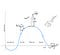
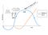
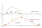
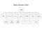

## Summary
The article argues that strong current revenue can conceal a technology product's strategic decline because financial results lag changes in customer needs and competing architectures. Using [[BlackBerry]] and [[Apple]] as its main contrast, it recommends funding uncertain future products, platforms, and experiments from today's cash cows and accepting [[StrategicSelfCannibalization]] before an external challenger forces the transition.

## Key Claims
- [[TechnologySCurve]] makes incumbent performance deceptive: a mature product can be highly optimized and profitable just as a new architecture begins its own improvement curve.
- [[BlackBerry]]'s revenue peaked in 2011, four years after the iPhone launch, so revenue and profit acted as lagging indicators of an already-lost platform transition.
- [[BCGGrowthShareMatrix]] is presented as an allocation rule, not only a classification tool: cash from mature leaders should fund question marks that may become the next stars and cash cows.
- [[InnovatorsDilemma]] arises because new technologies initially look small, weak, and financially unattractive from the incumbent's profitable middle or mature stage.
- Quarterly earnings pressure, functional silos, sales influence, feature expansion, and protecting the current audience can shift an organization from solving customer problems to defending a product.
- Firms can improve their odds through a family of products, an underlying platform, repeated experiments, and [[StrategicSelfCannibalization]] rather than one desperate late bet.
- Apple's willingness to let the iPhone absorb the iPod's function, combined with one P&L and a functional organization, is offered as the positive counterexample.

## Key Quotes
> "The only reason for cash cows to exist is to allow for the birth of future cash cows."

> "If you don't cannibalize yourself, someone else will." - attributed to [[SteveJobs]]

## Connections
- [[BlackBerry]] - cautionary case where strong reported revenue outlasted the underlying strategic advantage.
- [[Apple]] - counterexample presented as willing to replace its own successful products.
- [[TechnologySCurve]] - model for slow, then rapid, then flattening product improvement.
- [[BCGGrowthShareMatrix]] - portfolio model used to route mature-product cash toward uncertain future growth.
- [[InnovatorsDilemma]] - organizational and financial forces that make small disruptive markets unattractive to incumbents.
- [[StrategicSelfCannibalization]] - deliberate willingness to threaten a current cash cow before a competitor does.
- [[Amazon]] - example of a platform builder and a company that funds many experiments rather than one late rescue bet.
- [[Facebook]] - example of a product family used to spread bets across several products.
- [[Slack]] - example of a product seeking platform leverage beyond one application.
- [[TimCook]] - quoted describing Apple's lack of fear about one Apple product cannibalizing another.

## Contradictions
- The claim that BlackBerry was already "dead" in 2007 is useful strategic rhetoric but overstates the timing: the source's own chart shows substantial revenue growth through 2011, while [[blackberry-meditation-at-the-grave-jean-louis-gassee-medium]] separates delayed platform renewal from the company's later hardware exit.
- The article treats S-curves and disruption as broadly predictable but supplies case-based interpretation rather than evidence that every product follows the same curve or that self-cannibalization reliably selects the right successor.
