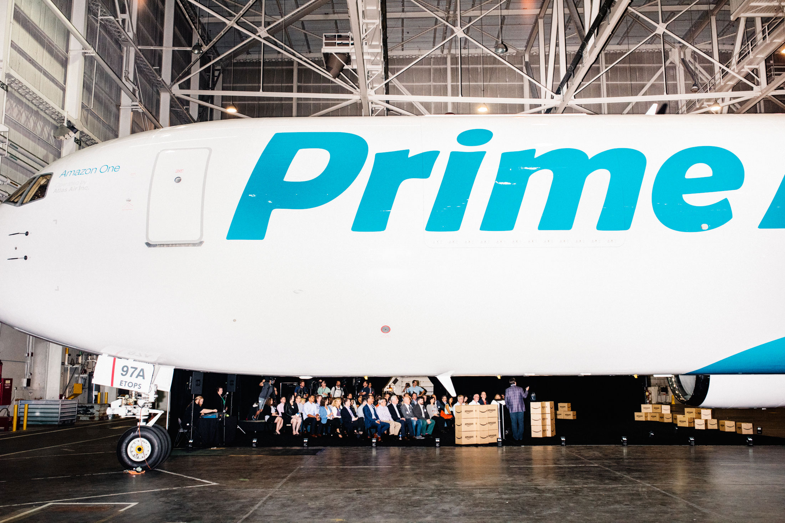

## Summary
[[DevinLeonard]] examines [[Amazon]]'s 2016 buildout of aircraft, truck trailers, sorting centers, delivery stations, local couriers, and freight-forwarding authority as a response to [[AmazonPrime]] growth and carrier capacity limits. The article argues that Amazon was then supplementing rather than replacing [[FedEx]], [[UPS]], and the U.S. Postal Service, but that the same network could improve bargaining power, protect the customer promise, and eventually become an external logistics service. Its strongest reusable lesson is [[LogisticsVerticalIntegration]]: a large buyer may internalize bottlenecked layers while continuing to depend on outside capacity.

## Key Claims
- Prime's fast-delivery promise and rapid volume growth made external parcel capacity, especially during holiday peaks, a strategic constraint rather than a routine procurement issue.
- Amazon assembled a layered logistics network across air freight, trailers, sorting centers, delivery stations, Prime Now hubs, postal handoff, and flexible local couriers.
- Bezos said the network supplemented carrier capacity rather than replacing it, and the article supports that near-term interpretation because Amazon still needed UPS and the Postal Service.
- The 2013 holiday failure showed that peak logistics capacity cannot be created at the last minute; disputed forecasts and unexpectedly concentrated volume can overwhelm even sophisticated carrier networks.
- Amazon's U.K. delivery experience suggested that internalization could remove meaningful parcel growth from an incumbent, although Royal Mail disputed Amazon's account of inadequate carrier capacity.
- A future logistics-as-a-service business was plausible because Amazon had previously commercialized internal capabilities through services such as AWS, but the article's expert forecast placed that possibility 10 to 15 years away.
- Amazon's delivery expansion also created public costs and resistance involving traffic, air pollution, neighborhood siting, and pressure on local retailers.

## Key Quotes
> "We will take all the capacity ... and we still need to supplement it." - [[JeffBezos]] on Amazon's 2016 carrier relationship.

> "I fully expect Amazon to build out a logistics supply chain that others can use." - former Amazon executive John Rossman on the long-term platform possibility.

## Connections
- [[DevinLeonard]] - Bloomberg Businessweek journalist who reported the article.
- [[Amazon]] - ecommerce company building a multi-layer delivery network around its retail volume and customer promise.
- [[JeffBezos]] - Amazon founder who described the network as supplemental while acknowledging the value of better carrier pricing.
- [[AmazonPrime]] - membership promise whose speed, growth, and peak volume drove logistics investment.
- [[FedEx]] - parcel carrier whose CEO publicly dismissed Amazon as a direct threat even as industry observers grew concerned about its leased aircraft.
- [[UPS]] - major Amazon carrier whose network was strained by the disputed 2013 holiday surge.
- [[AmazonCapabilityLedExpansion]] - internal logistics capability could protect retail operations and later become a service for other businesses.
- [[LogisticsVerticalIntegration]] - reusable strategy pattern of internalizing constrained logistics layers without immediately replacing all outside carriers.

## Contradictions
- Amazon and UPS disagreed over responsibility for the 2013 holiday failure: Amazon said orders were tendered on time, while an academic source said Amazon delivered much more volume than agreed on December 23.
- Amazon said U.K. commercial carriers could not support peak volume; Royal Mail disputed that account.
- FedEx CEO Fred Smith publicly called the idea of Amazon challenging FedEx "fantastical," while other industry observers in the article saw aircraft leasing and low-price entry as a credible destabilizing threat.
