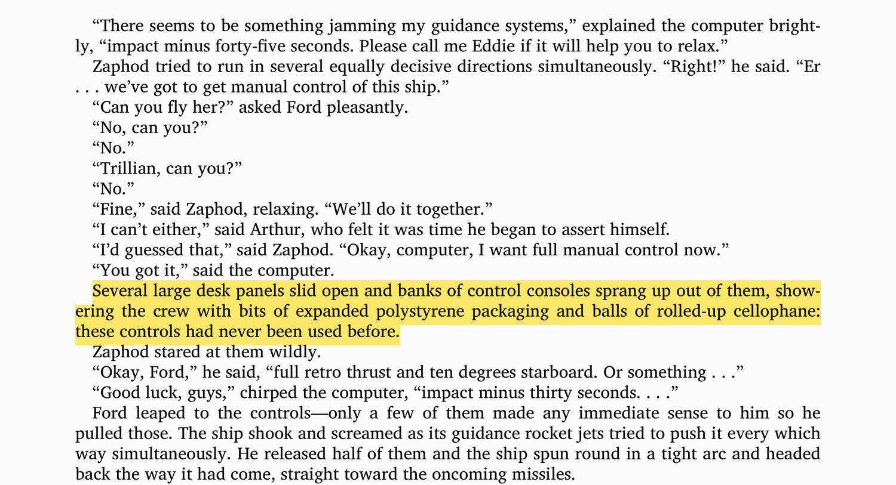

## Summary
[[BenedictEvans]] argues that autonomous-vehicle hardware is likely to commoditize while the strongest winner-takes-all pressures sit in high-definition maps and driving data. More deployed vehicles can improve map freshness, behavioral prediction, and simulation, but [[AutonomousVehicleDataNetworkEffects]] may plateau once enough coverage and rare-case data exist, leaving room for several suppliers, pooled datasets, or neutral coordination layers rather than one inevitable monopoly. The essay therefore treats data ownership and the shape of diminishing returns as the decisive questions for whether automakers buy autonomy as a component or surrender platform value to a technology vendor.

## Key Claims
- Sensors, lidar, batteries, and motors may have manufacturing scale economies without software-style network effects or leverage over the rest of the autonomous stack.
- Driving, city-wide routing and optimization, and on-demand fleet services are technically separable layers, although firms may try to bundle them.
- Prebuilt high-definition maps reduce real-time perception difficulty by giving a vehicle a prior model against which to localize itself and identify road features.
- [[AutonomousVehicleDataNetworkEffects]] arise because each deployed vehicle can refresh maps and collect examples of human road behavior, improving the system used by the whole fleet.
- Real-world driving data also improves controlled simulation by supplying scenarios that can be replayed against new software, while large-scale simulation adds compute and institutional scale advantages.
- [[Tesla]]'s camera-heavy fleet is presented as a 2017 contrarian bet that computer vision would mature faster than cheap, practical lidar; collecting more data helps only if the system can interpret it well enough.
- Data ownership determines who captures the learning loop: an autonomy supplier that receives fleet data may accumulate platform value while participating automakers become more interchangeable.
- The strength of the moat depends on diminishing returns: maps can potentially be pooled, learning methods can reduce data requirements, and autonomy may reach a practical performance ceiling.

The retained excerpt is used as a cautionary analogy: manual controls offer little safety if automation has made them unfamiliar by the time an emergency demands takeover.

## Key Quotes
> "The network effects - the winner-takes-all effects - are in data" - Evans' central claim about maps and driving data.

> "how strong is the network effect?" - the essay's qualification that more data may eventually have diminishing returns.

## Connections
- [[BenedictEvans]] - author applying platform and value-chain analysis to autonomous vehicles.
- [[AutonomousVehicleDataNetworkEffects]] - central concept covering fleet learning through maps, driving data, and simulation.
- [[AutonomousDrivingSafety]] - map priors, sensor fusion, behavior prediction, simulation, and takeover design all affect reliability.
- [[AutomobilitySecondOrderEffects]] - complements the article's market-structure analysis with transport and urban consequences.
- [[Tesla]] - camera-led autonomy strategy used as the main contrarian hardware and data example.
- [[Waymo]] - example of a dedicated autonomy vendor with real-world and simulated driving scale.
- [[Uber]] - example of the on-demand fleet layer, which may have network effects distinct from vehicle autonomy.
- [[Android]] - analogy for automakers creating network value for a technology supplier while their own products commoditize.

## Contradictions
- Qualifies simple winner-take-all accounts: map data can be pooled, autonomy layers can remain interoperable, and additional data may stop producing material gains after a sufficient threshold.
- The essay's 2017 assumptions about lidar cost, computer-vision capability, deployment timing, and Level 5 autonomy are historical forecasts rather than current evidence.
