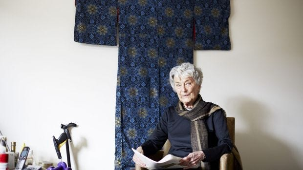

## Summary
A Thrive Global essay argues that [[WorkLifeBalance]] can emerge across seasons or decades rather than through an equal daily allocation of work, family, rest, and personal time. [[IngaClendinnen]] is the central case: she prioritized teaching and raising her sons before beginning serious historical research in her forties, after which she produced a substantial body of work partly informed by motherhood. The essay uses Clendinnen, James Herriot, and J. R. R. Tolkien to suggest that later starts and concentrated life phases can deepen creative work, while offering biographical examples rather than comparative outcome evidence.

## Key Claims
- [[WorkLifeBalance]] need not mean balancing every important role within each day; priority can shift across seasons, years, or decades.
- Trying to build a career and family at the same time may underestimate the difficulty and potential richness of each role.
- [[IngaClendinnen]] began serious research and writing in her forties after her sons had grown, then spent roughly half her life producing an extensive historical body of work.
- Clendinnen's experience of motherhood may have strengthened the embodied insight she brought to her writing about Aztec life and ritual.
- Life and work can inform one another in both directions: Clendinnen's family experience shaped her scholarship, while her study of Aztec warriors later gave her a model for facing grave illness.
- James Herriot and J. R. R. Tolkien provide additional examples of writers whose major work followed decades of accumulated experience.

## Key Quotes
> "Our lives are balanced like seasons, not like spinning tops." - on replacing daily equilibrium with a longer time horizon.

> "Playing a longer game" - on concentrating attention within successive phases of life.

## Connections
- [[WorkLifeBalance]] - the essay's central concept is balance across a whole life rather than equal daily allocation.
- [[IngaClendinnen]] - her transition from family-centered years to historical research is the main biographical case.
- [[CareerPlanning]] - the article adds a life-phase perspective in which meaningful work may begin later without making a career deficient.
- [[SabbaticalCareerExperiment]] - both concepts treat time away from a conventional career path as potentially generative, although Clendinnen's transition was unplanned and lasted decades.
- [[WorkBreaks]] - contrasts short-cycle recovery within a day with role prioritization across years.

## Contradictions
- No direct contradictions found. The essay challenges daily-equilibrium models of work-life balance but does not show that phase-based specialization is feasible, voluntary, or beneficial for everyone.
