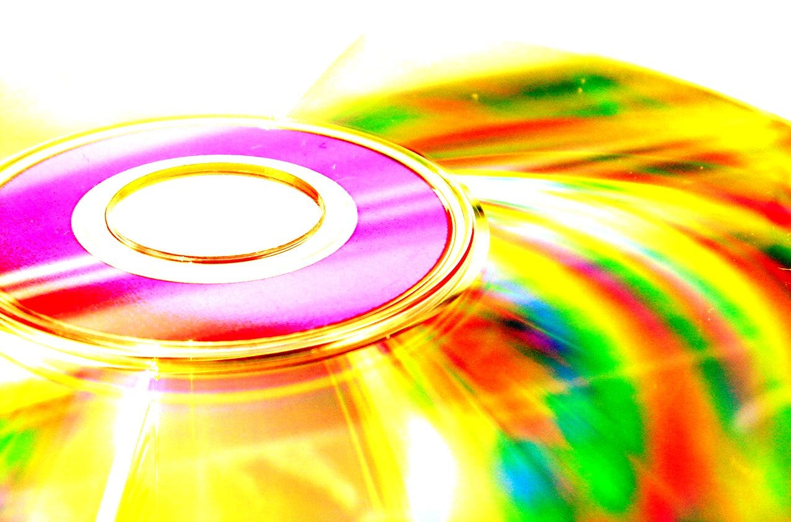
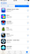
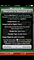

## Summary
The author uses a personal collection of roughly 300 CDs and 150 DVDs, bought for an estimated $7,500, to distinguish value received during use from later resale or practical value. The same decline can affect paid apps: software purchases depend on operating systems, stores, device conventions, and backward compatibility, so an app may still launch while becoming visually awkward or may disappear when its platform no longer supports it.

## Key Claims
- A purchase can deliver substantial value during its useful life even if its resale value later falls close to zero.
- Physical media can become practically obsolete when playback hardware and consumption habits move elsewhere.
- Digital purchases are not automatically more durable than physical collections because apps depend on continuing platform and operating-system support.
- Backward compatibility is finite: old apps may crash, lose access to supporting services, or eventually stop running on newer systems.
- Software can become “worth less” before it becomes unusable because outdated screen sizes, typography, and interface conventions degrade the experience.
- Copying CDs to MP3 preserved access temporarily, but streaming reduced the practical value of those local files without erasing the value previously received.

## Key Quotes
> “I did derive quite a bit of value from those discs in their time.” — the author separating past use value from present resale value

> “Worth less, but not yet worthless.” — the author on old mobile apps that still launched on a newer iPhone

## Connections
- [[DigitalPurchaseDurability]] — purchases retain usefulness only while compatible hardware, software, services, and access paths continue to exist.
- [[DigitalProductTimelessness]] — the dated apps show that continued execution is weaker than durable design or usefulness.
- [[ProductEvolution]] — platform change can improve current products while stranding old versions and interface assumptions.
- [[PlatformDistributionDependence]] — app ownership remains dependent on platform-controlled compatibility and distribution infrastructure.
- [[Apple]] — described as comparatively willing to end compatibility with older software.
- [[IOS]] — the operating-system context in which early apps still ran with visibly dated layouts.
- [[Android]] — named alongside iOS as a platform that may endure for decades but not forever.
- [[AppStore]] — the purchase history used to revisit early acquired apps.

## Contradictions
- No direct contradiction found. The source qualifies simple ownership language by showing that paid access does not guarantee indefinite compatibility, resale value, or continued practical use.
