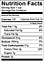

## Summary
[[TaylorSingletary]] presents [[DeveloperDocumentation]] as an audience-centered product surface rather than a static text archive. Good documentation makes the developer the protagonist, favors active and actionable instruction, links atomic topics into a coherent system, supports scanning, begins from tested product experience, and improves through maintenance and observed support problems. The retained nutrition-label image makes the reference-design analogy concrete: dense facts can remain glanceable through consistent labels, compact grouping, and plain language.

## Key Claims
- Documentation should tell a task-oriented story in which the reader is the actor and intended beneficiary.
- Active voice, concrete actions, examples, exercises, and inline tools make technical material easier to use, although over-abstracted turnkey solutions can weaken understanding and supportability.
- Atomic topics and deliberate cross-linking create a reusable web of explanation; FAQs can hold crisp canonical answers when a full document is unnecessary.
- Important warnings and concepts need visual hierarchy because developers skim, revisit, and learn in different ways.
- Authors should test the product before documenting it, outline around audience and purpose, and feed discoveries about ambiguity or limitations back into product work.
- Documentation requires continuing maintenance: repair stale material, thread new concepts through older pages, archive failed approaches, and observe recurring questions as effectiveness signals.
- Reference pages should make pertinent details discoverable at a glance through compact layouts, consistent labels, and plain language.

## Key Quotes
> "If it isn't testable, make it testable." - on earning the experience needed to document a product.

> "Readers are most engaged when they star in the story you're telling." - on reader-centered narrative.

## Connections
- [[TaylorSingletary]] - author drawing on developer-relations work at LinkedIn, Twitter, Clever, and Slack.
- [[DeveloperDocumentation]] - central practice joining narrative, action, linking, reference design, testing, and maintenance.
- [[ExplanatoryWriting]] - documentation uses audience framing, concrete examples, structure, visual emphasis, and revision.
- [[DeveloperExperience]] - documentation affects onboarding, task completion, error recovery, mastery, and support burden.
- [[Slack]] - the author's employer context when the article was written.
- [[LinkedIn]] - earlier developer-relations experience named by the author.
- [[Twitter]] - earlier developer-relations experience named by the author.

## Contradictions
- No direct contradiction found. The article strengthens the wiki's audience-centered explanation and developer-experience material, while adding a caution that overly complete abstractions can hide platform mechanics and make technical support harder.
