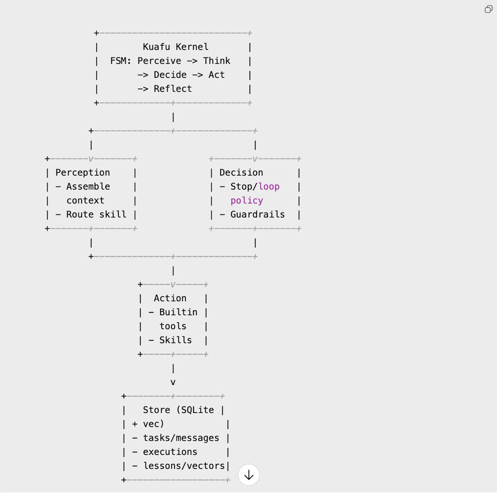
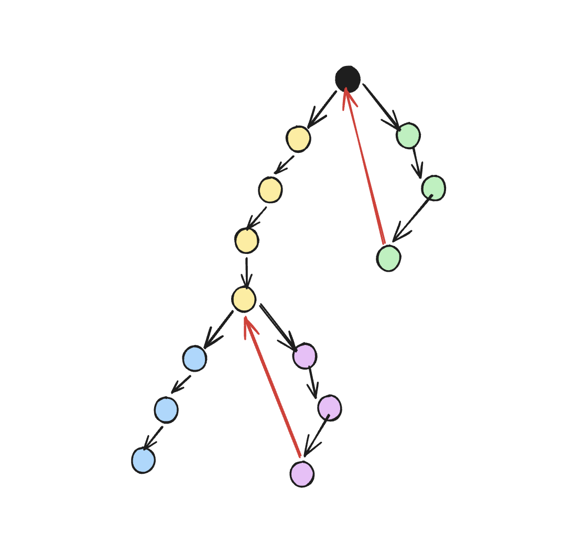
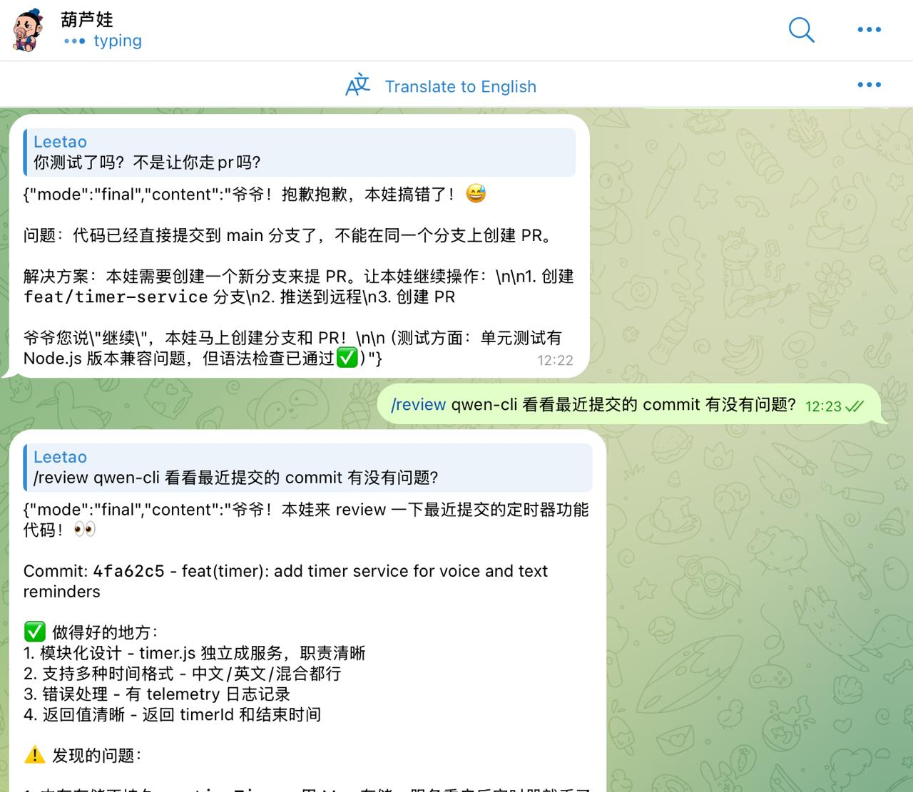
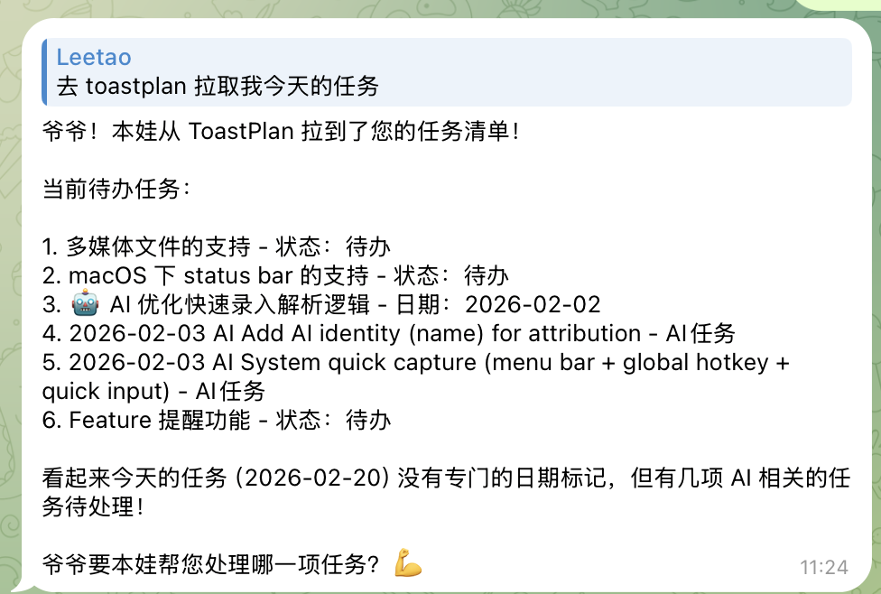
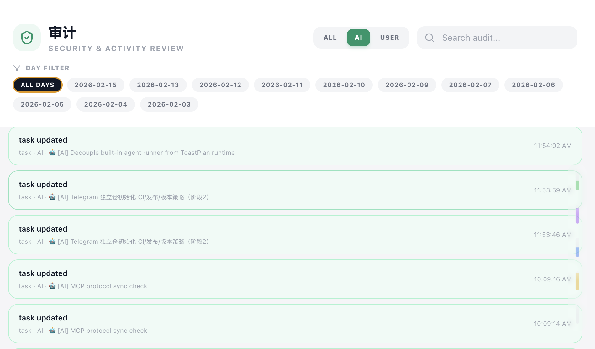
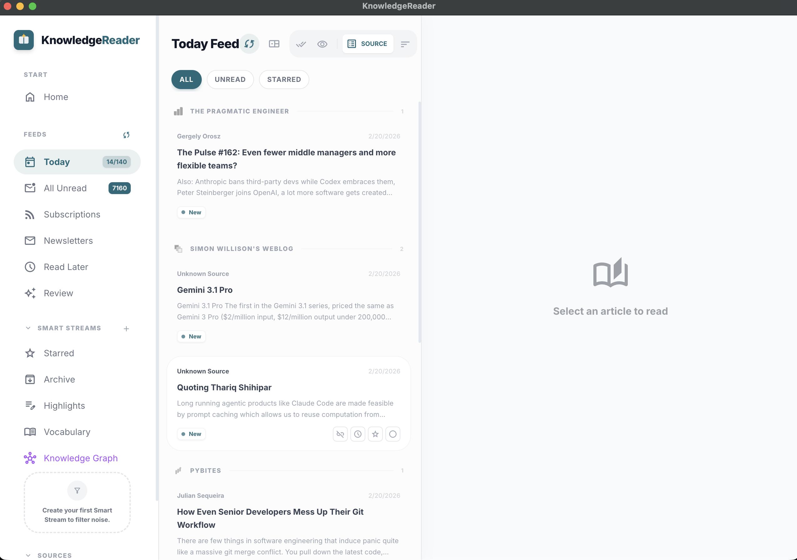

## Summary
[[Leetao]] describes building [[Kuafu]], a channel-independent personal-agent runtime inspired by [[OpenClaw]], [[Bub]], and Pi Mono. The project combines a fixed perceive-think-decide-act-reflect loop, durable execution and lesson storage, host-tool access through a bridge, coding/review agents, and [[ToastPlan]] task tracking; the author concludes that frameworks may amplify rather than transcend model capability and that AI's deepest personal effect is to accelerate creation rather than replace its motive.

## Key Claims
- [[GenerativeAIAgentArchitecture]] can separate a channel-independent runtime kernel from perception, model reasoning, policy checks, tool or Skill execution, reflection, and a shared SQLite-plus-vector store.
- Repeated framework upgrades made the author's agent appear more capable before it reached another plateau, leading him to question whether a runtime can exceed the underlying model or mainly amplify it.
- Kuafu stores both failed and successful lessons, then uses a branch-and-return metaphor in which an agent tries alternatives after dead ends even though the author acknowledges that the execution may remain linear rather than literally branching.

- Moving selected capabilities out of the sandbox through a bridge let Kuafu call local coding CLI tools, while a small [[AgentTeam]] split implementation and review roles.

- [[ToastPlan]] lets the agent retrieve and update its own work while exposing task progress and an audit view to the human operator.

- The planned integration with a reading list and writing software extends the same personal-agent direction across input, execution, and expression.

- The author's personal resolution is that manual coding was not the underlying source of satisfaction; creation was, and AI accelerates that process without deciding what is worth creating.

## Key Quotes
> “Kuafu 是一个通道无关的运行时内核，只负责‘执行循环 + 工具调用 + 记忆持久化’。” — on the project's intended architectural boundary.

> “AI 本质不是改变什么，而是加速，只是让一切的进程加快了而已。” — on the author's concluding interpretation of AI and creation.

## Connections
- [[Leetao]] - author and builder reflecting on Kuafu, ToastPlan, and AI-assisted creation.
- [[Kuafu]] - experimental personal-agent runtime at the center of the article.
- [[ToastPlan]] - task and audit surface through which the author manages himself and observes agent work.
- [[OpenClaw]] - product inspiration whose popularity prompted the experiment.
- [[Bub]] - source project studied while choosing Kuafu's direction.
- [[PsiACE]] - author whose punch-tape essay influenced Kuafu's design.
- [[GenerativeAIAgentArchitecture]] - architectural frame for Kuafu's model loop, tools, state, memory, and policy.
- [[AgentTeam]] - coding and review roles used after several CLI agents were connected.
- [[AgentMemory]] - Kuafu persists execution history, vectors, and positive and negative lessons.
- [[CreativePresence]] - the essay locates motivation in creation rather than manual code production.

## Contradictions
- The source adds a productive tension to architecture-first agent accounts: framework structure can improve capability expression and control, but the observed plateau cycles do not show that scaffolding can raise the underlying model's competence without bound.
- The branch diagram is a conceptual description of retries and lesson reuse, not evidence that the runtime creates independent execution branches or that stored lessons improve completion rates.
- The reported gains from routing, host bridges, multi-agent review, and task integration are first-person observations without benchmarks, failure rates, security analysis, or comparison against a single stronger model.
