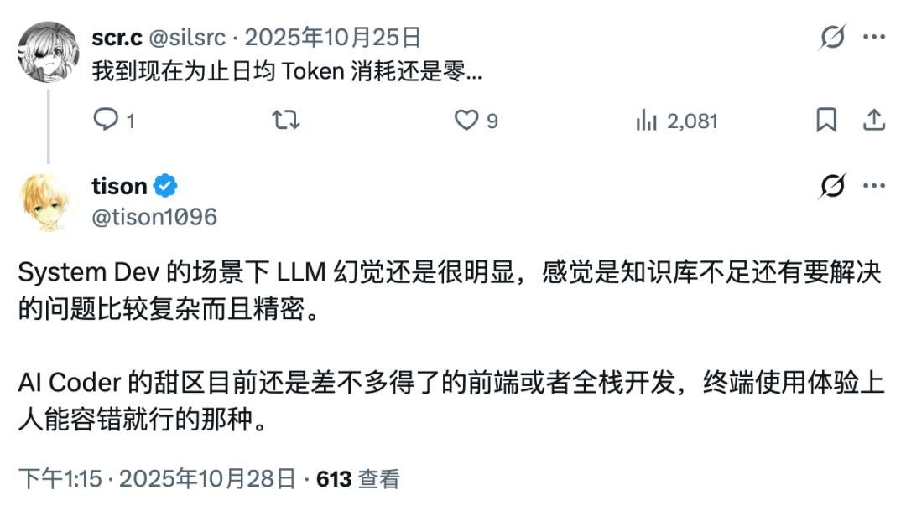
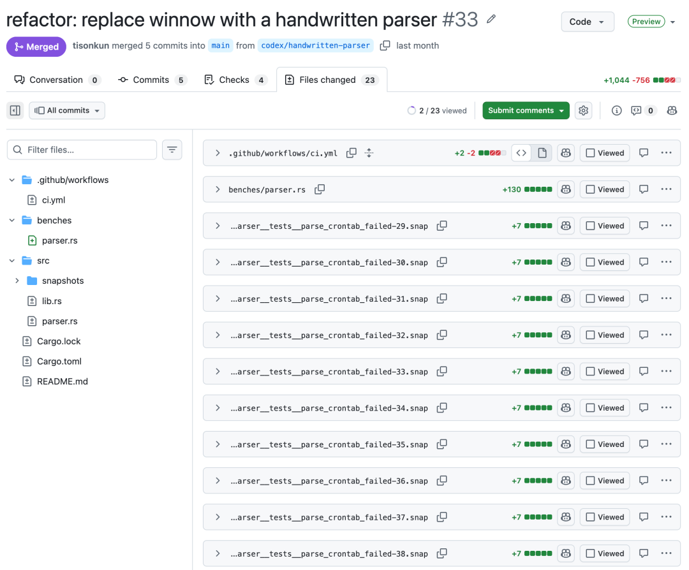
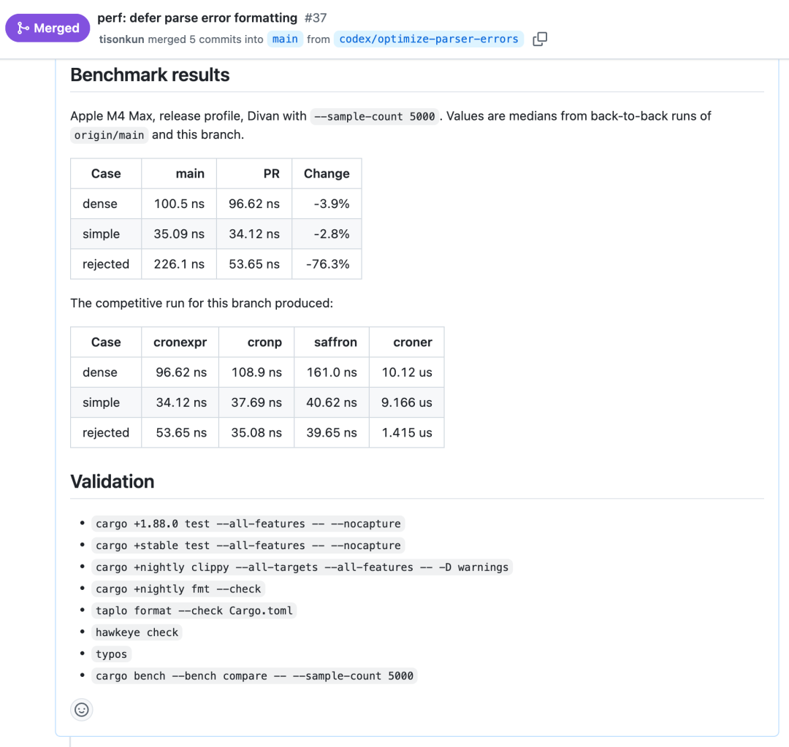
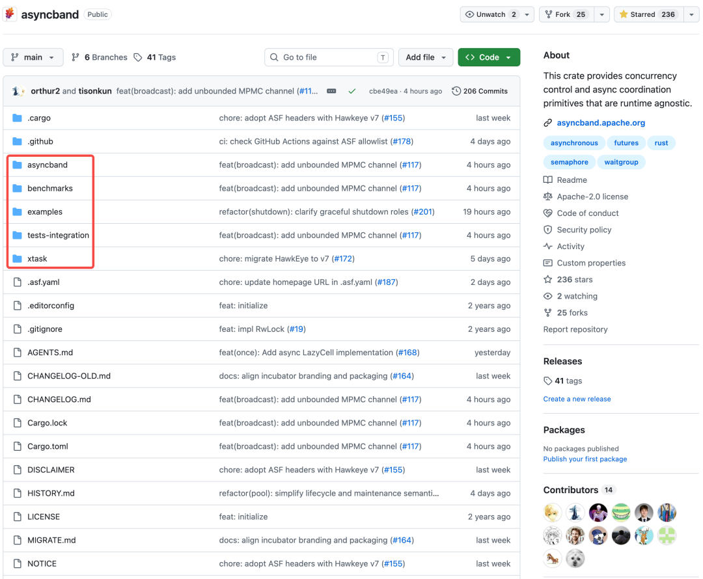
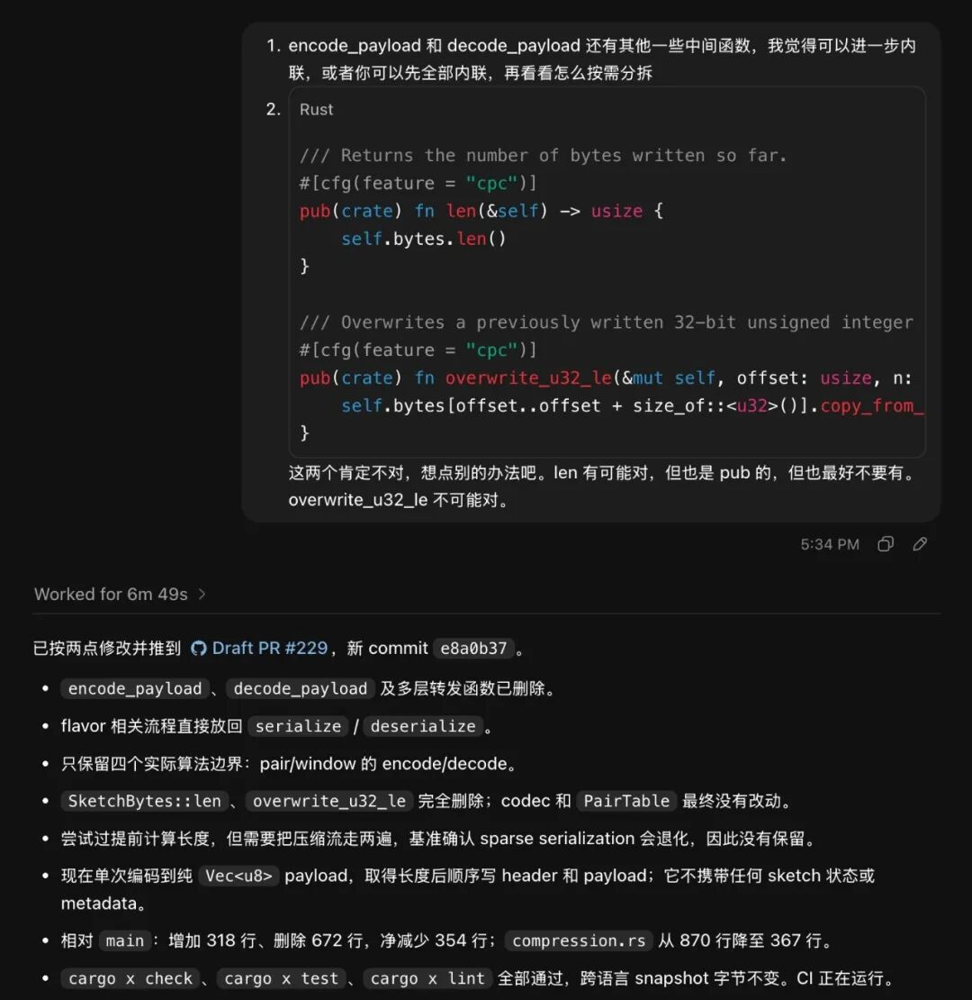
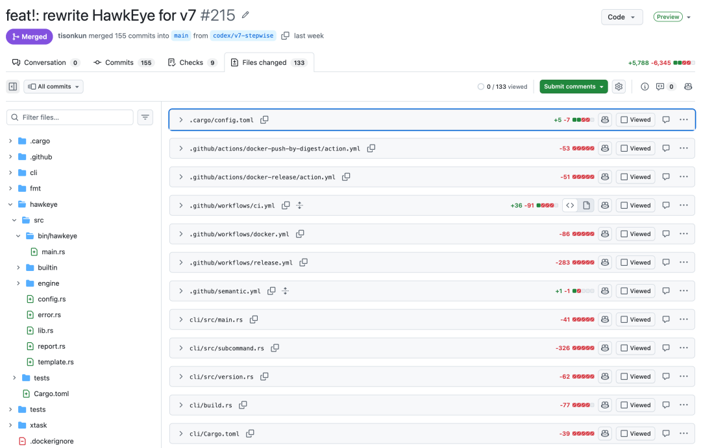

## Summary
[[TisonKun]] argues that coding-agent productivity changes discontinuously when model capability crosses a developer's ordinary-work baseline: implementation becomes cheap, while goal formation, technical decisions, verification, review, and human cognitive energy become limiting. His Cronexpr, DataSketches Rust, HawkEye, Asyncband, ScopeDB, Fastrace, and Logforth examples support a conditional [[AICodingPractice]] in which well-tested bounded refactors can receive little line-by-line review, ambiguous rewrites still require close reading, and the scarce skill is turning a clear wish into a technically credible delivery path. The article is a first-person expert account, not a controlled productivity or defect study, and its strongest claims depend on unusually high domain knowledge, extensive tests, and particular 2026 model versions.

## Key Claims
- Coding-agent leverage becomes qualitatively different only after model capability exceeds the user's normal task baseline; the author says current AI writing still falls below his own quality bar even though coding now crosses it.
- Source code does not disappear when generation becomes cheap: tests are code, specifications still need executable precision, and business logic must ultimately be expressed in a code-like form.

- Line-by-line review can be reduced for bounded changes with comprehensive regression coverage, stable scope, and user-observable behavior, but unclear design, weak tests, or implausible output still require expert inspection and correction.
- In Cronexpr, the author reports using Codex to replace a parser dependency with a handwritten parser while preserving snapshots, then importing competitors' benchmarks and iterating until positive-path performance exceeded the compared libraries; exact results remain machine- and benchmark-specific.

- Cheap agent labor lowers the friction of adding benchmarks, examples, documentation, integration tests, and repetitive regression coverage, making previously deferred engineering hygiene more economical.

- Passing tests does not remove design judgment: the DataSketches example shows the author rejecting unnecessary public helpers and steering Codex toward a smaller serialization design even after the agent had produced a plausible refactor.

- Large rewrites remain review-intensive when end-to-end behavior cannot be exhaustively tested; the HawkEye v7 rewrite took more than 100 conversations and 155 commits, with review organized from CLI, configuration, errors, and other external contracts inward.

- When implementation is abundant, the limiting resources become a clear desired outcome, a credible path through core decisions, the energy to distinguish merely plausible output from convincing output, and verification capacity that supports several concurrent workstreams.
- Cheap implementation can favor handwritten or inlined logic over dependency adoption and can change programming-language selection toward readability, explicitness, compiler feedback, and agent competence rather than ease of manual typing alone.

## Key Quotes
> "Agentic Coding 时代，说清楚愿望的能力，以及构建愿望落地路径的能力，是核心竞争力。" - on goal articulation and delivery-path design as the scarce skills.

> "因为我大脑罢工了，无法判断将 Plausible 的内容认证或改造成 Convincing 的内容。" - on human energy limiting review and acceptance.

> "测试不是代码吗？" - on why verification artifacts do not eliminate code.

## Connections
- [[TisonKun]] - author and practitioner reporting the coding-agent workflows.
- [[Codex]] - primary coding agent used for parser replacement, optimization, refactoring, rewriting, and project work.
- [[AICodingPractice]] - the article makes review depth conditional on scope, test coverage, user-visible behavior, and design ambiguity.
- [[BottleneckAwareAICoding]] - implementation abundance moves the constraint toward goals, core decisions, verification, review, and human cognitive energy.
- [[SoftwareVerification]] - regression tests, snapshots, benchmarks, CI, integration tests, and downstream trials provide the acceptance evidence.
- [[SnapshotTesting]] - used to preserve successful and failing parser behavior across the Cronexpr rewrite.
- [[CodeReviewPractice]] - the author reviews external contracts and design shape deeply while sometimes sampling or skipping well-covered implementation details.
- [[OpenSourceProjectMaintenance]] - the cases span dependency removal, performance work, rewrites, downstream upgrades, and library design.
- [[AgentOrientedProgrammingLanguages]] - the source predicts that agent readability and feedback matter more while manual typing convenience matters less.

## Contradictions
- The selective no-code-reading stance tensions sources that treat full understanding or line review as necessary for responsible publication, but it is narrower than pure no-review coding: the author requires strong regression evidence, reads ambiguous rewrites, and intervenes on design.
- The reported productivity, correctness, and performance gains are self-reported examples without controlled baselines, independent defect measurement, long-term maintenance outcomes, or a stable cross-model comparison.
- Comprehensive existing tests can preserve observed behavior without proving missing cases, security, maintainability, or the correctness of the specification itself; “users cannot feel a problem” is not sufficient for hidden safety, privacy, or operational failures.
- The claimed four-project concurrency ceiling and the shift from GPT 5.5 to 5.6 are personal and time-bound, while named model and product versions may not generalize to other developers, domains, or future systems.
