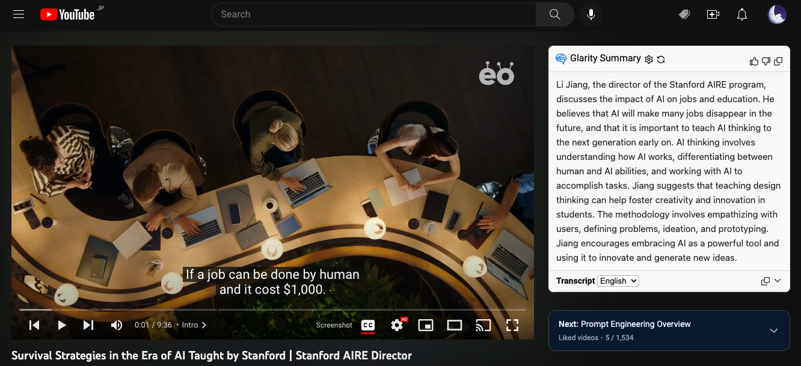
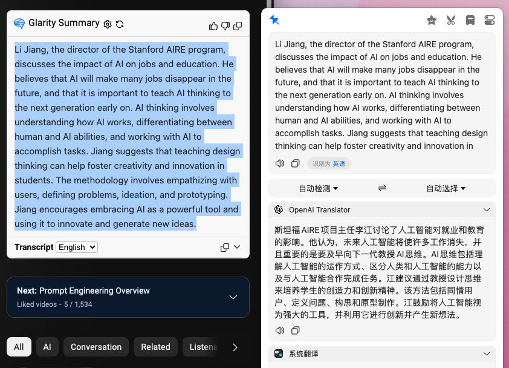
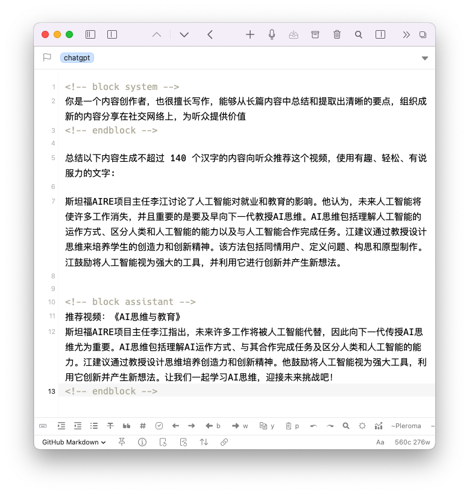

## Summary
[[Reorx]] documents an early, three-stage [[AIAssistedWriting]] experiment that turns a YouTube video into a Chinese social post: Glarity summarizes the English transcript, Bob's OpenAI Translator converts the summary into Chinese, and a custom Drafts action asks ChatGPT to compress it for Twitter. He estimates that the pipeline reduced a task that would otherwise take at least 30 minutes to about five, but ultimately rearranged the translated material himself and rejects fully automated publishing because writing is also a way to think and grow. The screenshots preserve the intermediate outputs and show that the final Drafts step used an explicit content-creator role plus a 140-Chinese-character constraint.

## Key Claims
- A modular [[AIWorkflowDesign]] can connect transcript summarization, translation, and constrained rewriting instead of asking one model to perform the entire publishing task at once.
- The Glarity screenshot shows a transcript-grounded English summary inside YouTube, while the Bob screenshot shows that same summary translated into readable Chinese before any social-media compression.
- The Drafts screenshot makes the final transformation explicit: a system message assigns a content-creator role, and the task asks for a persuasive recommendation of no more than 140 Chinese characters.
- The author estimates that AI reduced the workflow from at least 30 minutes of watching and writing to about five minutes, but provides no repeated timings or quality comparison.
- The generated copy was usable after light editing, yet the author chose to rearrange the translated summary himself for the published tweet.
- AI is most valuable here as relief from non-creative labor; fully delegating writing would also delegate some of the thinking, learning, accomplishment, and productive frustration the author values.
- Tool use does not determine the ethical or creative quality of the result; the user remains responsible for what is selected, changed, and published.

## Key Quotes
> "AI 则可以将这个步骤压缩在 5 分钟内完成。" - on the author's estimated productivity gain for this experiment.

> "使用 AI 生成并不能帮助我去思考或深入了解问题。" - on the learning cost of delegating composition too completely.

> "帮助我分担非创造性劳作，让我能投入更多时间在创造性工作上。" - on the preferred boundary for AI assistance.

## Connections
- [[Reorx]] - author testing and qualifying the workflow through his own social-post task.
- [[AIAssistedWriting]] - AI supports source processing and compression while the author retains selection, rewriting, and publication responsibility.
- [[AIWorkflowDesign]] - the task is decomposed across summarization, translation, and length-constrained rewriting tools.
- Glarity - Chrome extension used to summarize the YouTube transcript.
- [[ChatGPT]] - model backend for Glarity and the Drafts ChatGPT Conversation action.
- [[LearningByWriting]] - the author argues that writing's thinking and growth value would be weakened by complete delegation.
- [[AIDependencySkillAtrophy]] - the article anticipates the later concern that productivity gains can cost practice when assistance replaces composition.
- [[AutomatedContentFarming]] - the author explicitly distinguishes selective, value-driven sharing from high-volume automated publishing.

## Contradictions
- The article reports one first-person experiment, not a controlled productivity or quality study; the 30-minute versus five-minute comparison is an estimate and excludes setup, tool maintenance, and later human rearrangement.
- Its modular pipeline reduces blank-page and format work, but every stage can also compress or distort the source: transcript quality, summary omissions, translation choices, and character-limit rewriting all require human review.
- The source does not contradict accountable [[AIAssistedWriting]]; it sharpens its boundary by arguing that automation should remove non-creative friction without replacing the cognitive practice the author wants writing to preserve.
