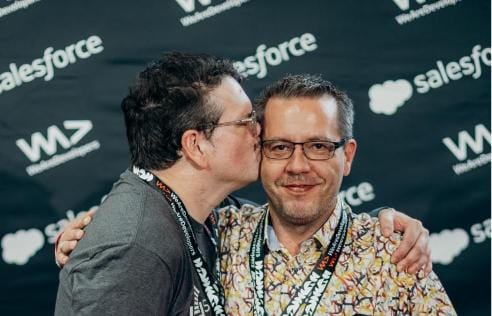
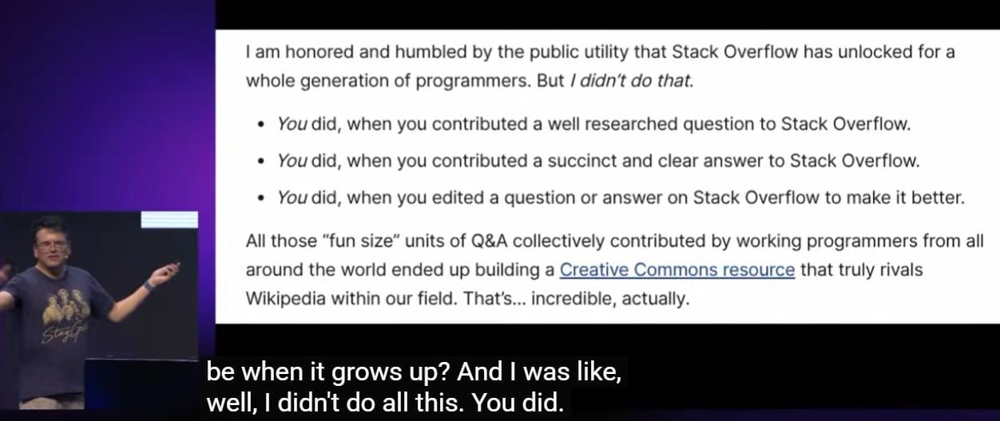
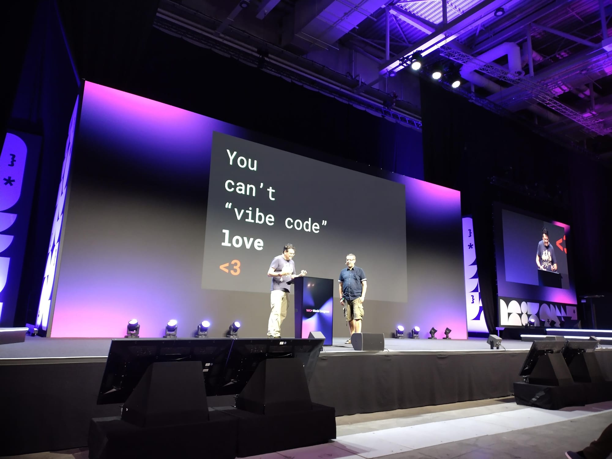

## Summary
[[JeffAtwood]] uses his friendship with [[BenDumkeVonDerEhe]] and their shared [[StackOverflow]] history to argue that AI can improve programming lookup without replacing the public participation that creates reusable knowledge and human relationships. He welcomes LLMs' ability to answer common questions and map differently worded duplicates to existing answers, but asks whether private model conversations will replenish the [[PublicKnowledgeCommons]] or sustain the communities on which models and programmers depend.

## Key Claims
- LLMs can advance [[StackOverflow]]'s lookup goal by answering common programming questions quickly and routing differently phrased duplicates toward existing answers.
- Duplicate detection is a material benefit because finding a genuinely new question becomes harder as a Q&A archive grows.
- Stack Overflow's utility was collectively produced by people who asked, answered, and edited small units of programming knowledge under a Creative Commons license.

- Private conversations with LLMs may consume public knowledge without producing durable, searchable contributions for the next learner or training corpus.
- Technical communities create more than answer retrieval: public contribution can produce learning, recognition, friendship, employment, gratitude, and a sense of shared purpose.
- The phrase "you can't vibe code love" marks a limit of [[VibeCoding]] as a social metaphor: generated output does not itself reproduce the relationships and mutual care behind a knowledge commons.

## Key Quotes
> "We did it together" - on contributors collectively building Stack Overflow's public resource.

> "You can't 'vibe code' love." - on the human relationships that code generation does not reproduce.

## Connections
- [[JeffAtwood]] - author, presenter, and Stack Overflow cofounder reflecting on the community's legacy.
- [[BenDumkeVonDerEhe]] - co-presenter whose participation and career embody the article's human argument.
- [[StackOverflow]] - public Q&A archive presented as both an LLM input and a contributor-built commons.
- [[PublicKnowledgeCommons]] - central concern about how reusable knowledge is created, licensed, maintained, and replenished.
- [[VibeCoding]] - title metaphor contrasting rapid generation with relationship and community formation.
- [[ForumCommunityDesign]] - durable, searchable public discussion is the architecture threatened by a shift toward private answers.
- [[TechCommunityParticipation]] - public technical participation can generate learning, relationships, visibility, and work opportunities.

## Contradictions
- The source qualifies but does not reject AI-assisted programming: it calls LLM duplicate mapping and fast answers transformative benefits while challenging the assumption that private use will sustain the public inputs and relationships behind them.
- The concern about depleted future training data is prospective rather than measured; the article supplies no contribution-rate, traffic, model-training, licensing, or community-health dataset.
