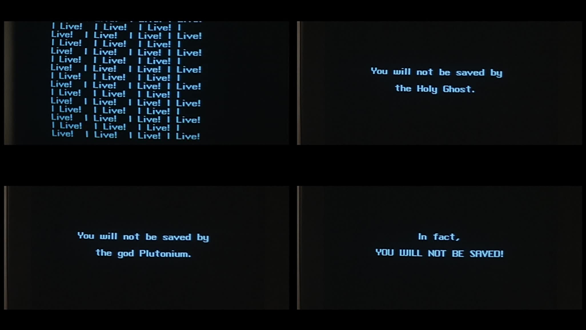

## Summary
[[JoshuaTopolsky]] argues that no fashionable format or distribution tactic can repair a media company whose underlying product is undifferentiated, low-quality content. He traces the industry's crisis from the loss of scarcity-based distribution through platform dependence and an advertising model that substitutes ever-cheaper scale for audience value. His alternative is to make distinctive work for a finite, committed audience and build a long-term product-and-storytelling business around that relationship.

## Key Claims
- Video, bots, newsletters, apps, social channels, and platform partnerships may help distribution, but none is a universal rescue for a weak media product.
- Legacy media economics depended on scarcity, locality, and control of physical distribution; digital abundance broke those gates while incumbents delayed adapting.
- Publishers ceded delivery and audience access to technology platforms whose incentives favored the most content rather than the best content.
- Chasing clicks, views, and programmatic ad inventory replaces audience value with scale, making each unit of attention cheaper and encouraging still more low-value output.
- Durable media starts with compelling voices, talent, stories, ideas, and brands that serve or delight a specific audience rather than programming for algorithms.
- A sustainable publisher should treat itself as a product-and-storytelling business, plan on a ten-year horizon, and design economics around a finite audience.
- The transition will destroy, consolidate, or fragment some media organizations because work made for everyone rarely becomes indispensable to anyone.

## Key Quotes
> "You have to make it great for someone."

> "Thinking of your audience as finite and building a sustainable business model around that audience — that's going to matter."

## Connections
- [[JoshuaTopolsky]] - author drawing on conversations with media investors, executives, editors, writers, and technologists.
- [[DigitalMediaMonetization]] - rejects one fashionable tactic or maximum ad scale as a substitute for a coherent audience-value model.
- [[PlatformDistributionDependence]] - describes publishers surrendering control of delivery to technology intermediaries.
- [[PlatformPublisherRevenue]] - explains how platform-controlled reach weakens publisher economics and bargaining power.
- [[WebAdEconomics]] - links programmatic volume and falling attention value to overproduction.
- [[NicheSubscriptionPublishing]] - shares the premise that serving the right finite audience can be more durable than maximizing reach.
- [[VanityMetrics]] - treats clicks, views, and eyeballs as misleading when they are detached from attention and user value.

## Contradictions
- The article's categorical rhetoric qualifies rather than directly contradicts [[DigitalMediaMonetization]]: formats and channels can contribute to a revenue mix, but Topolsky disputes treating any one of them as the business's underlying cure.
- The essay is a 2016 practitioner argument with no publisher financial data, audience research, or later outcome evidence, so it establishes a strategic diagnosis rather than proving which finite-audience models are sustainable.
