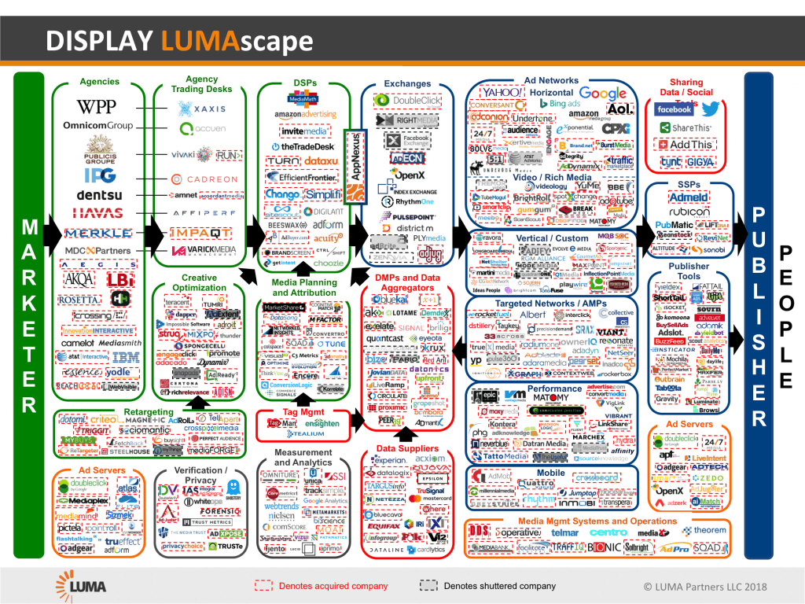
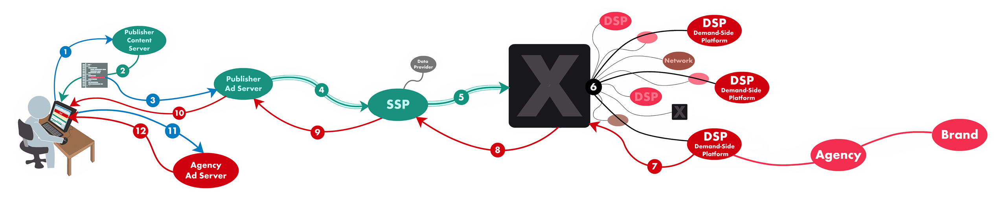
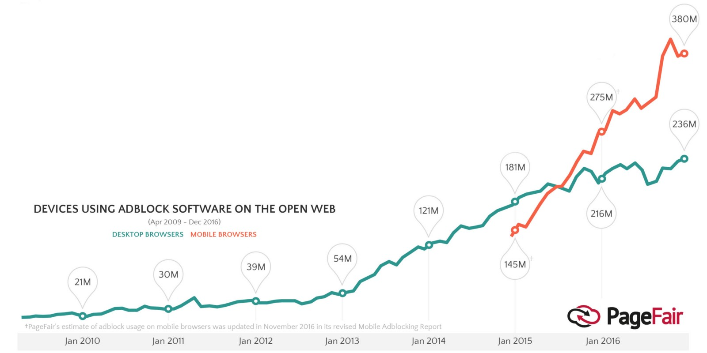
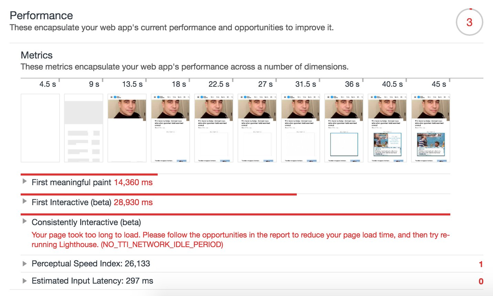
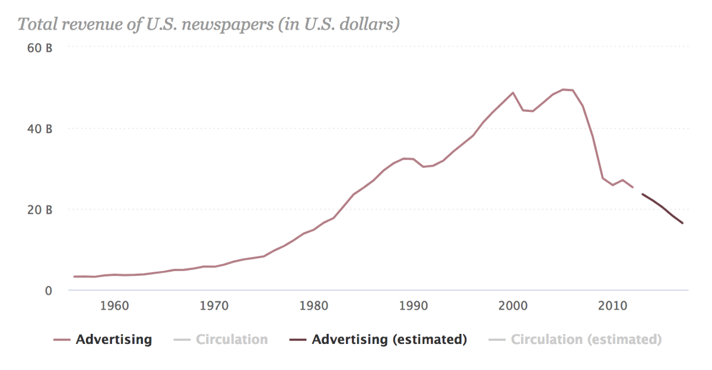
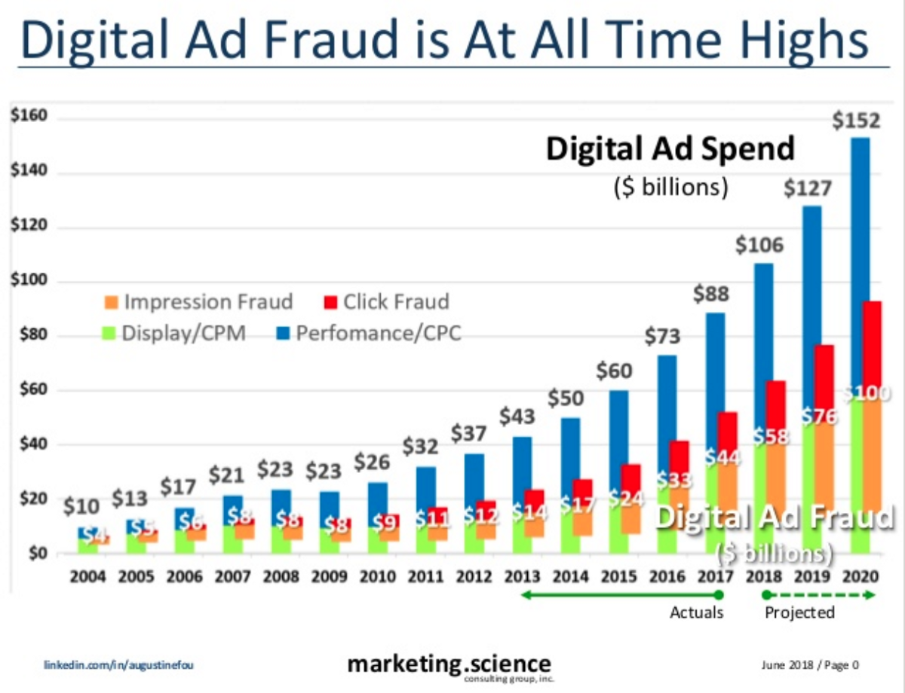
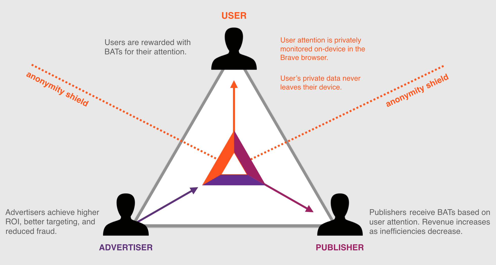

## Summary
[[DanielColinJames]] presents [[Brave]] and [[BasicAttentionToken]] as a redesign of web advertising around browser-level ad blocking, optional locally targeted ads, and token payments shared among users, publishers, and advertisers. The article diagnoses a complex intermediary chain, user privacy and performance costs, publisher revenue decline, and ad fraud, then argues that [[AttentionBasedAdvertising]] could replace surveillance-heavy delivery with on-device matching and direct rewards. It is a commissioned, token-holder-authored promotional forecast from 2018, not an independent evaluation or evidence that the promised adoption, revenue split, privacy guarantees, or ecosystem expansion occurred.

## Key Claims
- Digital advertising has accumulated many intermediary layers between marketers and publishers, increasing complexity, cost, fraud exposure, and difficulty measuring business outcomes.

- Users bear advertising costs through bandwidth, attention, privacy, security risk, and slow pages, while widespread [[AdBlocking]] weakens the revenue available to ad-supported publishers.

- The source links publisher pressure to falling U.S. newspaper advertising revenue and to [[Google]] and [[Facebook]] capturing the growth in digital advertising.

- Advertisers also lose value through opaque attribution, weak targeting, and fraud; one included chart asserts that fraud rises alongside spend, but its methodology is not supplied in the article.

- Brave's proposed first step is to block conventional ads and trackers by default, improving privacy, security, and performance before offering its own optional ad system.
- The proposed Brave Ads model performs attention measurement and targeting locally in the browser, keeps personal data on the device, and uses BAT to reward users while sending revenue to publishers and claiming better return and lower fraud for advertisers.

- The article claims publisher ads would allocate 70% of revenue to publishers and 15% to users, while browser-delivered user ads would allocate 70% to users; users could redirect tokens to sites and creators.
- It forecasts that a successful Brave implementation would let developers extend BAT into messaging, games, podcasts, and streaming, turning tokenized attention into a broader application standard.

## Key Quotes
> "you'll get paid for your attention." — James's summary of Brave's user proposition

> "The system needs to be rebuilt from the ground up." — the article's case for replacing conventional ad technology

## Connections
- [[DanielColinJames]] — author who frames the Brave/BAT proposal as an impending internet-economic shift.
- [[Brave]] — browser presented as the launch platform for private, opt-in advertising.
- [[BasicAttentionToken]] — proposed medium for pricing attention and distributing ad revenue.
- [[BrendanEich]] — Brave leader whose JavaScript and Mozilla background is used as credibility evidence.
- [[AttentionBasedAdvertising]] — model combining local targeting, attention measurement, token rewards, and publisher payments.
- [[WebAdEconomics]] — broader implicit exchange among free content, advertising, tracking, platforms, and publishers.
- [[AdBlocking]] — user-side rejection of conventional ads and Brave's default first step.
- [[Google]] — advertising incumbent the article accuses of capturing data and ad-market growth.
- [[Facebook]] — advertising incumbent paired with Google in the article's duopoly critique.
- [[Chrome]] — dominant browser Brave is forecast to challenge.

## Contradictions
- No direct contradiction was found. The source complements [[402-payment-required-david-humphrey-medium]] by proposing browser-mediated advertising and token rewards where Humphrey proposes explicit browser-mediated purchases.
- The article is advocacy commissioned by Fospha, and James discloses owning BAT. Its future-tense adoption claims, quoted speed figures, revenue allocations, privacy assertions, user count, and lead-value example are source claims rather than independently verified outcomes.
- The ad-fraud graphic presents estimates and projections without enough methodology in the article to assess them, and the newspaper and ad-block charts show correlation and historical trend rather than proving Brave's proposed remedy.
- Two remote profile-image URLs now return 404 responses and could not be inspected; their placement suggests attribution portraits, but they were omitted rather than treated as evidence.
